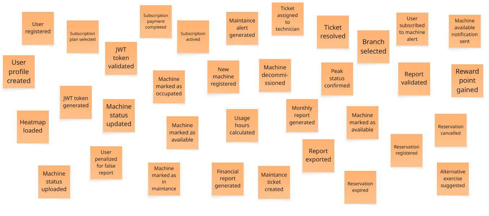
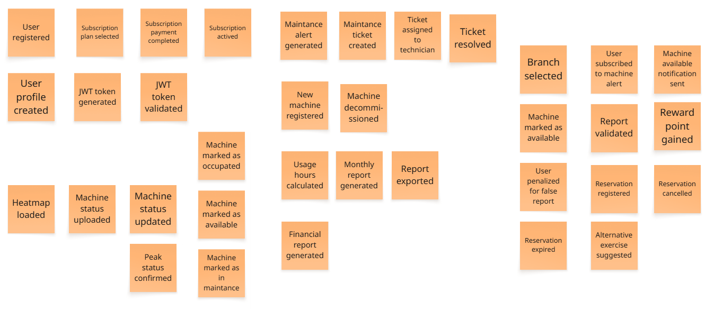
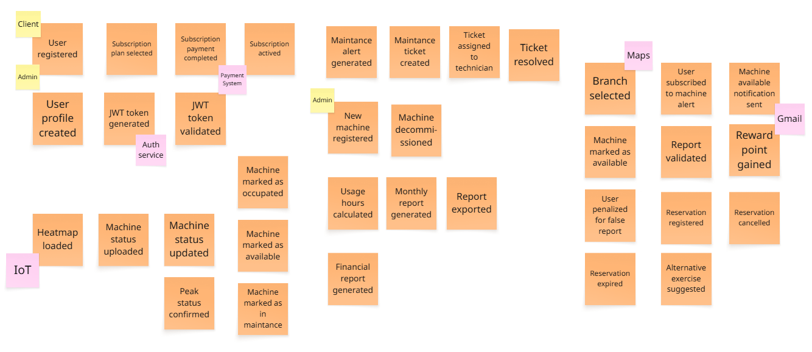

# Capítulo II: Requirements Elicitation & Analysis
## 2.1. Competidores.

En este apartado se evalúan las estrategias de los competidores de Qlic y se comparan sus fortalezas y debilidades.

### 2.1.1. Análisis competitivo. 
| Categoría | Criterio | FitNode Analytics | Fitco | GYMMaster | Virtuagym |
| :--- | :--- | :--- | :--- | :--- | :--- |
| **Perfil** | **Overview** | Plataforma B2B2C con IoT Edge y visión computacional para telemetría pasiva, generación de mapas de calor en vivo y mantenimiento predictivo de maquinaria deportiva. | Software de gestión integral, enfocado en automatizar la facturación, membresías y reservas manuales de clases. | Sistema ERP global diseñado para la gestión de gimnasios con un enfoque crítico en la automatización del control de acceso físico. | Plataforma integral de coaching, gestión de clubes y retención, que combina la administración del recinto con la creación de rutinas 3D y reservas manuales. |
| **Perfil** | **Ventaja competitiva** | Manejo independiente de hardware y recolección de datos, además que no exige al usuario reservar manualmente cada máquina. | Ecosistema maduro de facturación electrónica adaptado a la región y alta familiaridad por parte de los administradores B2B. | Permite el funcionamiento continuo (24/7) de gimnasios sin necesidad de personal de recepción, bloqueando el paso a usuarios deudores. | Ofrece un ecosistema de software extremadamente profundo que hiper-personaliza el entrenamiento del usuario mediante avatares y gamificación social. |
| **Perfil de Marketing** | **Mercado objetivo** | Cadenas de gimnasios medianas y grandes en Lima, y centros deportivos universitarios que sufren por altas congestiones y presupuestos ajustados. | Centros de fitness, centros de yoga, academias de artes marciales y gimnasios que buscan digitalizar su administración básica. | Franquicias de gimnasios comerciales, locales 24 horas y centros deportivos que priorizan la reducción extrema de costos en personal. | Cadenas de gimnasios premium, entrenadores personales independientes y corporaciones que buscan un compromiso total y seguimiento nutricional del usuario. |
| **Perfil de Marketing** | **Estrategias de marketing** | Oferta de pilotos gratuitos de 30 días instalando hardware IoT en zonas críticas, para demostrar el retorno de inversión con datos tangibles. | Estrategias agresivas de Inbound Marketing, webinars para dueños de gimnasios y alianzas estratégicas con pasarelas de pago locales (Niubiz, Culqi). | Posicionamiento SEO agresivo a nivel internacional, demostraciones guiadas de software y venta combinada de su hardware. | Fuerte comunidad en redes sociales, educación gratuita para entrenadores y un modelo freemium en su aplicación móvil para captar usuarios masivamente. |
| **Perfil de Producto** | **Productos & servicios** | Dashboard gerencial B2B para decisiones de CAPEX/OPEX y aplicación web Angular B2C con visualización de aforo en tiempo real. | Plataforma ERP web alojada en la nube para gerencia y aplicación móvil B2C de marca blanca para que los usuarios aparten sus cupos manualmente. | Software Cloud complementado con hardware propietario: lectores RFID, escáneres biométricos de huella dactilar y torniquetes de acceso. | Software de gestión administrativa, motor de creación de rutinas con animaciones 3D, seguimiento de dieta y módulo de reserva de áreas/máquinas. |
| **Perfil de Producto** | **Precios & costos** | Modelo SaaS B2B con membresía mensual desde $69 USD/mes (Basic), $109 USD/mes (Mid), $189 USD/mes (Platinum). | Modelo SaaS con tarifas escalonadas: plan Lite desde $59 USD/mes, Core a $99 USD/mes y Growth a $169 USD/mes. | Costo mensual de licencia desde $89 USD/mes (Foundation), $129 USD/mes (Advanced), $209 USD/mes (Professional), en software only, con software + door accesses va desde $129 USD/mes (Foundation), $169 USD/mes (Advanced), $249 USD/mes (Professional). | Plan base desde $29 USD/mes. Estructura modular donde planes superiores encarecen la solución con precios personalizados. |
| **Perfil de Producto** | **Canales de distribución** | Web y Móvil | Web y Móvil | Web y Móvil | Web y Móvil |
| **Análisis SWOT** | **Fortalezas** | Elimina la incertidumbre del usuario mostrando disponibilidad en vivo y reduce el OPEX por reparaciones. | Interfaz de facturación probada, integración contable robusta y comunidad educada en reservas. | Control de aforo exacto y en tiempo real, erradicación de morosidad mediante barreras físicas. | Excelente gamificación comunitaria y alta capacidad para retener al cliente mediante motivación digital. |
| **Análisis SWOT** | **Debilidades** | Dependencia de la estabilidad de la red Wi-Fi del local y complejidad logística en la instalación física. | Carencia de telemetría de hardware; la medición de ocupación depende de la acción voluntaria del cliente. | Ceguera intramuros: el sistema ignora por completo qué máquinas se usan o si están averiadas. | Su sistema de reservas asume que la máquina está operativa; no detecta averías físicas reales. |
| **Análisis SWOT** | **Oportunidades** | Capitalizar el Churn Rate del 30-40% causado por la inoperatividad de equipos y frustración de filas. | Expandir sus módulos abriendo su API a startups de IoT para ofrecer datos de uso de máquinas. | Desarrollar sensores internos para complementar su dominio de las puertas o adquirir empresas de analítica. | Evolucionar su motor de rutinas para recomendar ejercicios dinámicamente según saturación real. |
| **Análisis SWOT** | **Amenazas** | Gimnasios con maquinaria de última generación con telemetría propietaria preinstalada. | Surgimiento de startups que eliminen el tedioso proceso de reservar manualmente. | Barreras arancelarias para importar hardware especializado y soporte técnico lento. | Exceso de funciones que puede abrumar a usuarios que solo buscan entrenar rápido. |

### 2.1.2. Estrategias y tácticas frente a competidores.

Desarrollar estrategias y tácticas efectivas para enfrentar a nuestros competidores requiere de un enfoque cuidadoso y planificado. A continuación se presentan algunas estrategias y tácticas que podrían ser consideradas para tener una ventaja competitiva frente a otras alternativas:

**Diferenciación por telemetría pasiva y automatización:** A diferencia de competidores como Virtuagym o Fitco, que dependen de que el usuario reserve manualmente una máquina o clase , SpotTrack se diferencia al eliminar la interacción manual mediante el uso de hardware IoT Edge. Esta ventaja permite recolectar datos reales de uso de forma pasiva, ofreciendo un mapa de calor en vivo que refleja la realidad del local sin errores humanos. Además, se aplicará un modelo B2B SaaS con planes escalables desde los $69 USD mensuales, facilitando el acceso a gimnasios medianos y grandes en Lima.

**Optimización de la rentabilidad y soporte preventivo:** 
Mientras que los sistemas tradicionales presentan una "ceguera intramuros" al ignorar si una máquina está averiada , nuestra táctica principal de acercamiento será demostrar el ahorro directo en el OPEX. Al migrar de un mantenimiento correctivo (que es de 3 a 5 veces más costoso) a uno preventivo y predictivo , los administradores logran maximizar la vida útil de sus activos. Para asegurar la adopción, se ofrecerá un piloto gratuito de 30 días instalando hardware en zonas críticas (como el área de cardio), demostrando el retorno de inversión con datos tangibles antes del cierre de venta.

**Innovación tecnológica enfocada en la privacidad y eficiencia:**
SpotTrack se posicionará como líder en tecnología Edge Computing, procesando el reconocimiento de imágenes directamente en el dispositivo para enviar únicamente paquetes ligeros de datos (JSON) a la nube. Esta táctica no solo evita la saturación de la red Wi-Fi del gimnasio —una de las debilidades identificadas frente a la competencia — sino que garantiza la privacidad total al no grabar ni transmitir video de los usuarios. Esto permite ofrecer un dashboard gerencial con métricas claras y alertas automáticas que superan la funcionalidad de los ERP tradicionales que solo gestionan accesos y membresías.

## 2.2. Entrevistas.
### 2.2.1. Diseño de entrevistas.

#### Segmento objetivo 1:
1. Para empezar, cuéntame un poco sobre ti: ¿Cómo te llamas?, ¿a qué te dedicas y hace cuánto tiempo entrenas en un gimnasio?
2. ¿Con qué frecuencia asistes al gimnasio durante la semana y en qué horarios sueles ir?
3. ¿Por qué prefieres (o te ves obligado a ir en) esos horarios?
4. ¿Cómo describes el ambiente y la cantidad de personas en tu gimnasio durante las horas en las que sueles entrenar?
5. ¿Llevas una rutina estricta (ej. hoy toca pecho/espalda) o decides qué hacer cuando llegas?
6. Cuéntame sobre la última vez que llegaste al gimnasio y estaba demasiado lleno. ¿Cómo adaptaste tu rutina?
7. ¿Qué es lo que más te frustra cuando la máquina o equipo que necesitas usar está ocupado por mucho tiempo?
8. ¿Alguna vez has tenido que cambiar completamente tu entrenamiento porque encontraste equipos con el cartel de "fuera de servicio"? ¿Cómo lidiaste con esa situación?
9. ¿Sientes que pierdes tiempo durante tus sesiones de entrenamiento? Si es así, ¿en qué momentos específicos ocurre?
10. ¿El estado o la disponibilidad de las máquinas ha influido alguna vez en tu decisión de renovar o cancelar tu membresía en un gimnasio?
11. Si tuvieras una herramienta para mejorar la gestión de tu tiempo dentro del gimnasio, ¿qué cambiarías?
12. Imagina que, antes de salir de tu casa o de la universidad/trabajo, pudieras revisar en tu celular un semáforo o mapa que te indique qué máquinas específicas están libres, ocupadas o en mantenimiento en ese momento. ¿En qué medida cambiaría tu forma de entrenar?
13. ¿Qué información exacta te resultaría más útil ver en una pantalla o aplicación mientras estás dentro del recinto para no perder el ritmo de tu rutina?

### 2.2.2. Registro de entrevistas.

#### Entrevistado 1

| Campo | Detalle |
| :--- | :--- |
| **Nombre** | Joan Steffano Quispe Gamez |
| **Ocupación** | Estudiante universitario (UPC) |
| **Frecuencia** | 3 a 4 veces por semana |
| **Horario** | Nocturno (Post-clases) |
| **Contexto** | Entrena de noche debido a su alta carga académica. |
| **Link** | https://upcedupe-my.sharepoint.com/:v:/g/personal/u202414928_upc_edu_pe/IQDwUfqEP6J8Sr_AMTcZaW80AVugegqiYVjdOyG2RY3agzs?e=dymEnS&nav=eyJyZWZlcnJhbEluZm8iOnsicmVmZXJyYWxBcHAiOiJTdHJlYW1XZWJBcHAiLCJyZWZlcnJhbFZpZXciOiJTaGFyZURpYWxvZy1MaW5rIiwicmVmZXJyYWxBcHBQbGF0Zm9ybSI6IldlYiIsInJlZmVycmFsTW9kZSI6InZpZXcifX0%3D |

#### Entrevistado 2

| Campo | Detalle |
| :--- | :--- |
| **Nombre** | Fabián Suárez |
| **Ocupación** | Estudiante y trabajador |
| **Frecuencia** | 3 a 4 días a la semana (interdiario) |
| **Duración** | Entre 1 a 2 horas |
| **Contexto** | Adapta sus entrenamientos según su carga laboral y académica. |
| **Link** | https://upcedupe-my.sharepoint.com/:v:/g/personal/u202414928_upc_edu_pe/IQA_G4YvOVSuSrJJqjakOjOpAQnSD43pUj6g0topSDxpyg8?e=8sTjzL&nav=eyJyZWZlcnJhbEluZm8iOnsicmVmZXJyYWxBcHAiOiJTdHJlYW1XZWJBcHAiLCJyZWZlcnJhbFZpZXciOiJTaGFyZURpYWxvZy1MaW5rIiwicmVmZXJyYWxBcHBQbGF0Zm9ybSI6IldlYiIsInJlZmVycmFsTW9kZSI6InZpZXcifX0%3D |

### 2.2.3. Análisis de entrevistas.

#### Entrevista 1
#### Hábitos y Entorno:
Joan suele asistir en **"hora punta"**, lo que implica una saturación casi total del local. Aunque su intención es seguir una planificación rigurosa, la falta de disponibilidad de equipos lo obliga a **improvisar constantemente**, alterando el orden de su rutina según las máquinas que se van liberando.

#### Frustraciones Principales (Pain Points):
* **Pérdida de tiempo efectiva:** Esperas prolongadas para usar máquinas o necesidad de buscar pesas desordenadas entre series.
* **Interrupción del ritmo:** El enfriamiento muscular por las esperas rompe la intensidad del entrenamiento y extiende su permanencia en el gimnasio más de lo previsto.
* **Infraestructura deficiente:** La presencia de equipos "fuera de servicio" le genera frustración al tener que buscar sustitutos de última hora (ej. cambiar poleas por prensa).

#### Fidelización y Retención:
Joan manifiesta que la saturación constante y el mantenimiento deficiente de los equipos son factores determinantes para su permanencia; afirma que **preferiría migrar a otro gimnasio** si estas condiciones persisten.

#### Entrevista 2:
#### Hábitos y Entorno:
Fabián organiza sus sesiones con una **división muscular estricta** (ej. martes de brazos, jueves de pecho/piernas). Generalmente entrena en horarios de baja afluencia, lo que le permite cumplir su rutina sin interrupciones. Sin embargo, en temporadas de alta demanda (como el verano), opta por **flexibilizar su entrenamiento**, priorizando el área cardiovascular sobre las pesas para evitar aglomeraciones.

#### Frustraciones Principales (Pain Points):
* **Corte de flujo muscular:** Debido a que entrena zonas específicas por día, la indisponibilidad de una máquina crítica rompe el ritmo de su sesión, afectando la efectividad que busca.
* **Ineficiencia al compartir equipos:** Considera que alternar máquinas con otros usuarios es una fuente de pérdida de tiempo, principalmente por la necesidad de ajustar pesos y esperar tiempos de descanso ajenos.

#### Fidelización y Retención:
A diferencia de otros usuarios, Fabián muestra una **fidelidad estable** hacia su centro actual; indica que ni la saturación ocasional ni el estado técnico de los equipos son factores que lo llevarían a cancelar su membresía.

## 2.3. Needfinding.
### 2.3.1. User Personas.
### 2.3.2. User Task Matrix.
### 2.3.3. User Journey Mapping.
### 2.3.4. Empathy Mapping.
## 2.4. Big Picture EventStorming.

En esta sección se presenta el proceso de Big Picture Event Storming realizado por el equipo, con el propósito de comprender el dominio del negocio de manera general y visualizar sus procesos más relevantes. A través de una sesión colaborativa, se identificaron los principales eventos del dominio, los actores involucrados y sus relaciones, permitiendo obtener una primera visión integral del funcionamiento del sistema. Este modelado de alto nivel ayudó a reconocer flujos clave del negocio, así como posibles problemas, oportunidades y puntos de mejora dentro del contexto del proyecto.

Para realizar el Big Picture Event Storming se utilizaron 3 pasos importantes:

- **Step 1: Generating Domain Events**  
  En esta primera etapa se reconocieron los eventos más importantes del dominio del negocio, es decir, aquellos sucesos significativos que reflejan un cambio relevante dentro del sistema. Estos eventos fueron redactados en pasado, ya que representan hechos que ya ocurrieron, y sirvieron como punto de partida para entender el comportamiento general del negocio.

  

    
  
  

- **Step 2: Sorting Domain Events (chronologically)**  
  Luego, los eventos identificados se organizaron de manera cronológica, con el fin de representar el flujo general de las actividades del negocio. Esta secuencia permitió observar con mayor claridad cómo se conectan los distintos sucesos y cómo evolucionan los procesos dentro del dominio.

    

    
  
  
  

- **Step 3: Adding Actors and External systems**  
  Finalmente, se añadieron los actores y sistemas externos que intervienen en los procesos del negocio. Esto permitió identificar quiénes participan en cada interacción y qué elementos externos influyen en el desarrollo de los eventos, brindando así una visión más completa del contexto en el que opera el sistema.

    
  
  

## 2.5. Ubiquitous Language.