# Capítulo IV: Product Design
## 4.1. Style Guidelines.
Para garantizar la consistencia visual, la accesibilidad y una experiencia de usuario (UX) coherente en todas las plataformas de SpotTrack (Landing Page, Dashboard B2B y Web App B2C), se ha definido la siguiente guía de estilos. Esta guía no solo estandariza los componentes de la interfaz, sino que también alinea la identidad visual con los objetivos del negocio.
### 4.1.1. General Style Guidelines.
La legibilidad es fundamental para una plataforma que muestra datos analíticos complejos y mapas de calor en tiempo real. Se ha establecido una jerarquía tipográfica limpia y moderna:

Tipografía Primaria: Utilizada para títulos (H1, H2, H3) y elementos de gran énfasis visual. Posee un carácter geométrico y dinámico que transmite modernidad tecnológica y agilidad deportiva. (Pesos utilizados: SemiBold, Bold).

Tipografía Secundaria: Utilizada para párrafos, etiquetas de la interfaz, tablas de datos y botones. Se caracteriza por su alta legibilidad en tamaños pequeños y pantallas móviles, garantizando que el usuario pueda escanear la información rápidamente. (Pesos utilizados: Regular, Medium, SemiBold).

Paleta de Colores
La selección cromática de SpotTrack está construida sobre un contraste de alto impacto que refleja innovación tecnológica y energía deportiva, utilizando los siguientes colores base:

Primary Dark / Neutral (#000000 - Negro Absoluto): Usado para fondos estructurados, modo oscuro del dashboard, textos principales y contenedores de gráficos.

Transmite autoridad, elegancia, fuerza y alta tecnología. En interfaces analíticas y de monitoreo constante (como el dashboard gerencial), el negro reduce drásticamente la fatiga visual y permite que los datos y los mapas de calor resalten de manera inmediata.

Primary Accent / Brand (#00ccb2 - Verde Azulado / Teal): Usado para los Call to Action (CTAs) principales, enlaces, indicadores de progreso y elementos interactivos primarios.

Es un color que fusiona la tranquilidad y fiabilidad tecnológica del azul con el crecimiento, salud y balance del verde. Transmite claridad, eficiencia e innovación. En el contexto del gimnasio, da una sensación de frescura y fluidez (ideal para indicar máquinas disponibles o acciones confirmadas).

Secondary Accent / Highlight (#f5bc36 - Amarillo Anaranjado / Dorado): Usado para destacar alertas preventivas, notificaciones importantes, botones secundarios de alta prioridad y estados de "Reserva" en el mapa de calor.

Representa vitalidad, energía, movimiento y el dinamismo puro del sector fitness. Capta la atención del ojo humano de inmediato, por lo que es perfecto para advertencias de mantenimiento predictivo o cuellos de botella en el aforo, comunicando precaución sin llegar a la agresividad de un rojo puro.

Logo
El logotipo de SpotTrack Analytics se compone de un isotipo acompañado de un logotipo tipográfico.

Isotipo: Representa un "nodo" estilizado que simula el flujo de datos e interconexión (Edge IoT), utilizando contrastes entre el #00ccb2 y el #f5bc36 sobre fondos oscuros (#000000) para proyectar dinamismo.

Tipografía del Logo: De trazos gruesos, limpios y modernos, estableciendo una presencia sólida en el mercado B2B, denotando confianza y robustez tecnológica.

### 4.1.2. Web Style Guidelines.

Para la construcción de las interfaces en código (Angular / CSS), se ha definido un sistema de diseño atómico estricto que rige la estructura y disposición de los elementos.

Grid System
El diseño se basa en un layout estructurado para mantener la alineación perfecta en resoluciones de escritorio y su correcta adaptabilidad a dispositivos móviles.

Columnas: Sistema de 12 columnas.

Ancho de Gutter: 24px.

Spacing System
Se utiliza una escala de espaciado predecible basada en múltiplos de 4 y 8 píxeles para mantener el ritmo vertical y horizontal

## 4.2. Information Architecture.
### 4.2.1. Organization Systems.

Para estructurar el ecosistema de SpotTrack de forma práctica, utilizamos una categorización principal basada en la audiencia. Al final del día, toda la arquitectura de la información se rige por un modelo de **jerarquía visual (visual hierarchy)**, priorizando el contenido de mayor a menor importancia según lo que cada tipo de usuario necesita ver primero al entrar.

**Plataforma Administrativa (Dashboard B2B)**
Su estructura jerárquica se divide de frente por módulos operativos (Inventario, Tickets, Estadísticas). Dentro de estos, los datos se categorizan por tópicos (para agrupar las máquinas según la sucursal) y de forma cronológica (para ordenar las alertas predictivas y el historial de horas de uso de más reciente a más antiguo).

**Aplicación Móvil (Web App B2C)**
Diseñada para la inmediatez. La jerarquía visual coloca el mapa de calor en tiempo real como el componente absoluto y principal de la pantalla, subordinando opciones secundarias (como el perfil o recompensas) a menús de navegación. El catálogo de máquinas aplica una categorización directa por tópicos (ej. "Fuerza", "Cardio") para que el cliente filtre y encuentre lo que busca sin dar tantas vueltas.

**Landing Page Comercial**
Sigue una jerarquía visual descendente (top-down) para guiar la lectura. El flujo arranca con lo más importante arriba (Hero Section con la propuesta de valor) y decanta hacia los detalles específicos más abajo (features, tabla de precios y formulario de contacto). El texto y las tarjetas están categorizados explícitamente según la audiencia, separando qué gana el dueño del gimnasio y qué gana el usuario final.
https://miro.com/app/board/uXjVHcq90QA=/?share_link_id=360970048482

### 4.2.2. Labeling Systems.

Para garantizar la simplicidad y reducir la carga cognitiva de los usuarios, se utilizará un vocabulario directo, estandarizado y libre de jerga técnica compleja. Las etiquetas representan acciones claras o agrupaciones lógicas de información.

Para el Dashboard Administrativo (B2B):

    "Resumen": En lugar de "Dashboard Principal" o "Métricas Generales". Agrupa los KPIs de alto nivel.

    "Activos": En lugar de "Inventario de Máquinas Físicas".

    "Monitoreo IoT": Agrupa el estado de la red y conexión de sensores.

    "Mantenimiento": En lugar de "Gestión de Tickets y Reparaciones". Agrupa las alertas y órdenes de trabajo.

    "Reportes": Agrupa la analítica histórica y mapas de calor estáticos.

    "Finanzas": En lugar de "Calculadora de Impacto Financiero y ROI".

Para la Aplicación Móvil (Cliente B2C):

    "Mapa en Vivo": Representa la vista de disponibilidad en tiempo real.

    "Rutinas": Agrupa las sugerencias de ejercicios alternativos.

    "Reservar": Acción directa para bloquear temporalmente un equipo.

### 4.2.3. SEO Tags and Meta Tags

Para asegurar un posicionamiento orgánico adecuado y una correcta indexación, se definen las siguientes etiquetas principales.

Landing Page (Sitio Público)

    Title: SpotTrack | Gestión Inteligente y Telemetría para Gimnasios

    Description: Optimiza la gestión de tu gimnasio con telemetría IoT. Reduce costos de mantenimiento, evita aglomeraciones y mejora la retención de tus clientes con mapas de calor en tiempo     real.

    Keywords: software para gimnasios, telemetría deportiva, mantenimiento predictivo gimnasios, sensores IoT fitness, gestión de activos deportivos, mapa de calor gimnasio, SpotTrack.

    Author: SpotTrack

Web Application (Portal de Acceso Administrativo)

    Title: SpotTrack Dashboard | Acceso Administrativo
    
    Description: Panel de control gerencial para la gestión de activos, monitoreo de hardware IoT y resolución de tickets de mantenimiento en tiempo real.
    
    Keywords: spottrack admin, login spottrack, gestión interna, dashboard gimnasios.
    
    Author: SpotTrack

### 4.2.4. Searching Systems.

Dada la alta densidad de datos (cientos de máquinas, múltiples sedes, histórico de tickets), el sistema de búsqueda es fundamental para la operatividad.

Opciones de Búsqueda y Filtros (Dashboard Administrativo):

Búsqueda Global (Barra de texto): Ubicada en el encabezado (Header). Permite búsquedas difusas ingresando el ID del equipo, nombre de la máquina o descripción de un ticket.

Filtros de Contexto (Faceted Search): * Por Sede: Dropdown global para cambiar la vista de datos entre diferentes sucursales.

Por Estado: Checkboxes rápidos para aislar máquinas (ej. Solo mostrar equipos 'En Mantenimiento' o 'Desconectados').

Por Categoría: Filtros por tipo de equipamiento (Cardio, Fuerza, Funcional).

### 4.2.5. Navigation Systems.

El sistema de navegación está diseñado para ser predecible y jerárquico, minimizando la cantidad de clics necesarios para alcanzar cualquier objetivo.

Landing Page (One-Page Scroll Navigation):

Navegación global superior fija (Sticky Top Navbar) que permite saltos rápidos (Anchor links) a las secciones clave: Inicio, Soluciones, Precios, Contacto. Incluye un Call to Action persistente ("Login") que redirige a la Web App.

Dashboard Administrativo (Desktop Web):

Navegación Estructural Permanente: Se utilizará un Sidebar (menú lateral izquierdo) persistente que contiene las etiquetas de los módulos principales (Activos, IoT, Mantenimiento, etc.). Esto permite al administrador saltar entre contextos sin perder su ubicación.

Navegación Local: Pestañas (Tabs) dentro de cada módulo para separar vistas internas (ej. dentro de "Mantenimiento", pestañas para Pendientes, En Progreso, Completados).

Aplicación Móvil (Clientes):

Bottom Navigation Bar: Barra inferior persistente con 3 o 4 íconos de acceso rápido a las funciones críticas para el usuario en movimiento (ej. Mapa, Rutinas, Perfil). Facilita el uso con una sola mano.

## 4.3. Landing Page UI Design.
### 4.3.1. Landing Page Wireframe.

### 4.3.2. Landing Page Mock-up.

## 4.4. Web Applications UX/UI Design.
### 4.4.1. Web Applications Wireframes.

.png){width=600px}

.png){width=600px}

{width=600px}

.png){width=600px}

.png){width=600px}

{width=600px}

.png){width=600px}

.png){width=600px}

.png){width=600px}

%20CONFIGURAR%20UMBRAL.png){width=600px}

.png){width=600px}

.png){width=600px}

.png){width=600px}

.png){width=600px}

.png){width=600px}

.png){width=600px}

.png){width=600px}

### 4.4.2. Web Applications Wireflow Diagrams.

.png) 
.png)

.png)
.png)

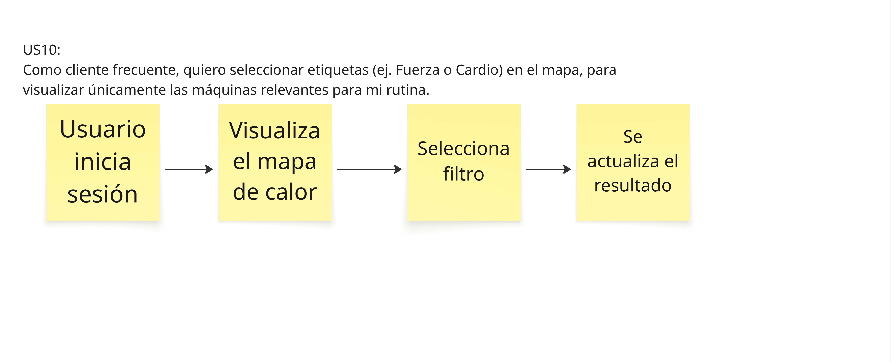

.png)
.png)
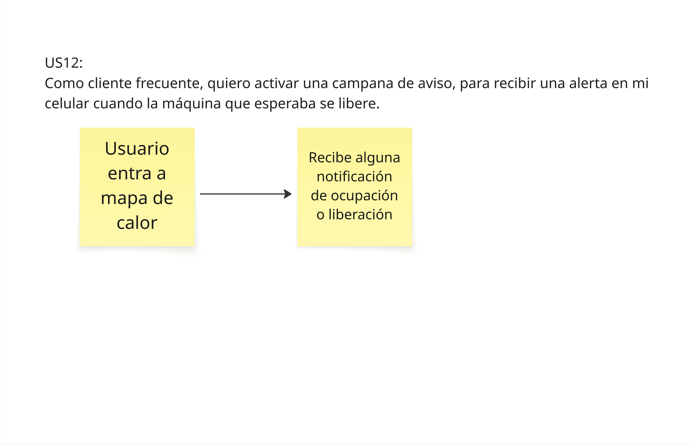
.png)
.png)

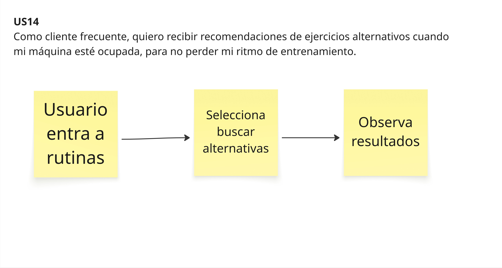
.png)
.png)
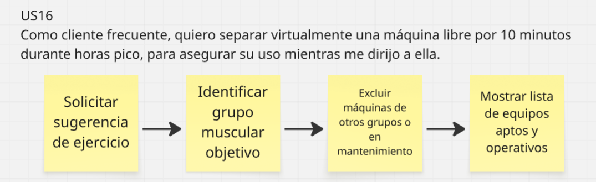

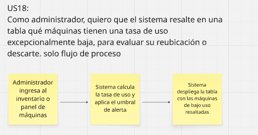
.png)
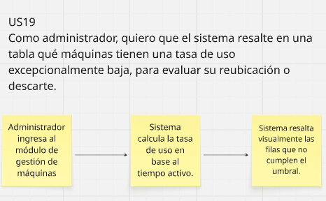

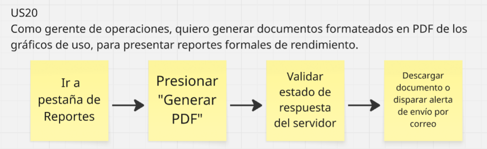
.png)

.png)

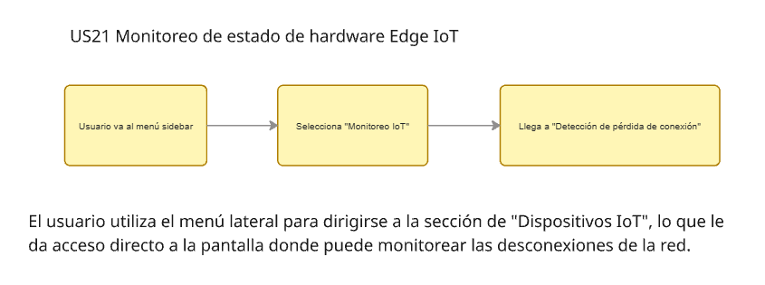
.png)
.png)

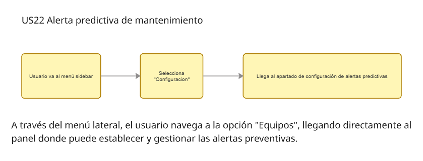
%20CONFIGURAR%20UMBRAL.png)
.png)
%20CONFIGURAR%20UMBRAL.png)
.png)

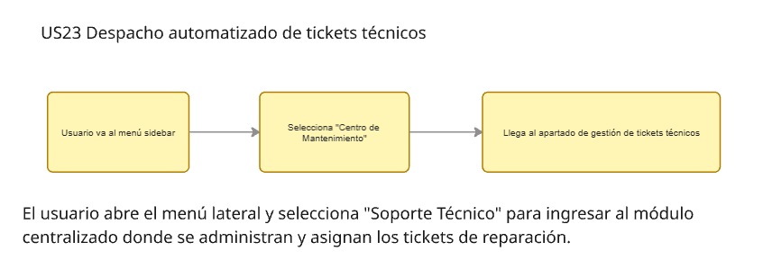
.png)
.png)

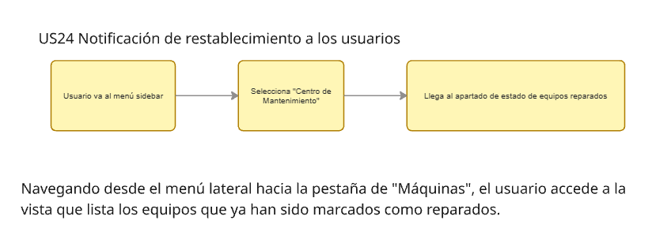
.png)
.png)

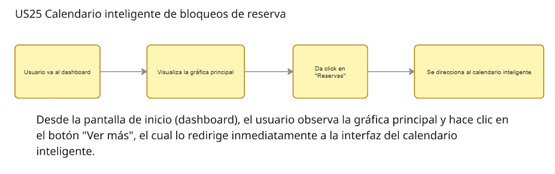
.png)
.png)

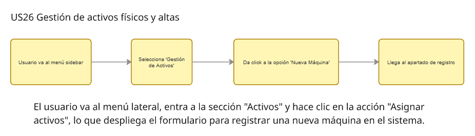
.png)
.png)

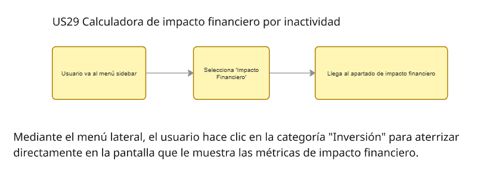
.png)
.png)

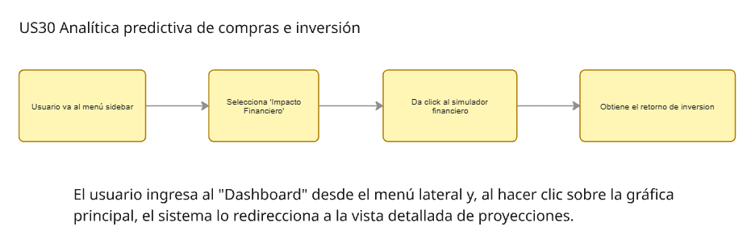
.png)
.png)

### 4.4.2. Web Applications Mock-ups.

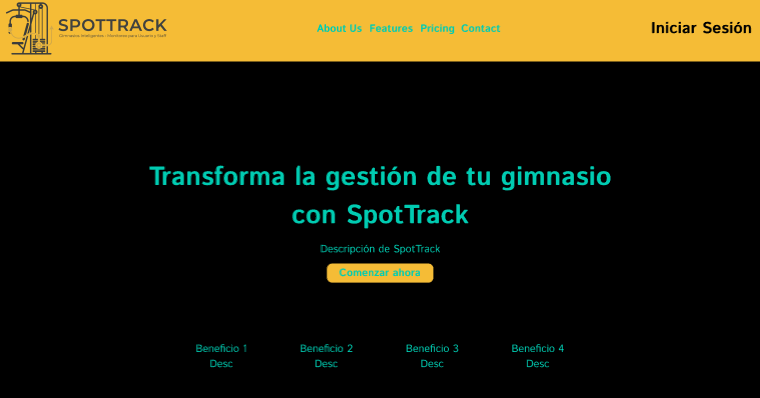

.png)
.png)

.png)
.png)

.png)
.png)
.png)
%20CONFIGURAR%20UMBRAL.png)
.png)
.png)
.png)
.png)
.png)
.png)
.png)
.png)

### 4.4.3. Web Applications User Flow Diagrams.

## US07: Inicio de sesión con validación JWT

.png){ width=90% }
.png){ width=50% }

* **Happy Path:** El usuario se autentica ingresando credenciales válidas. El sistema verifica el token JWT y evalúa el rol de la cuenta. Los administradores son redirigidos directamente al dashboard analítico, mientras que los clientes acceden al mapa de disponibilidad en tiempo real.
* **Unhappy Path:** Si las credenciales son incorrectas, la interfaz despliega una alerta visual de error. Si se intenta procesar el formulario con campos vacíos, el frontend bloquea la petición y exige completar la información requerida.

---

## US08: Gestión de preferencias y perfil

.png){ width=90% }
.png){ width=50% }

* **Happy Path:** Mediante el menú lateral, el usuario accede a "Mi Perfil" para consultar su plan actual, métricas y puntos acumulados. Puede actualizar configuraciones como el idioma de la interfaz. Al guardar, la plataforma registra y aplica los cambios instantáneamente.
* **Unhappy Path:** Ante un fallo de red o un error de validación en el backend durante el guardado, los cambios se descartan de forma segura. La UI mantiene el estado previo de la configuración y notifica al usuario sobre el fallo.

---

## US09 y US10: Mapa de calor y filtros de equipamiento

{ width=90% }
{ width=50% }

* **Happy Path:** Dentro del mapa de disponibilidad, el usuario interactúa con los chips de filtrado. Al seleccionar "Fuerza", el renderizado aísla y muestra únicamente ese tipo de equipamiento. Alternar a "Cardio" refresca la vista instantáneamente con la nueva categoría.
* **Unhappy Path:** Si la combinación de filtros aplicada no arroja resultados (ej. todas las máquinas de la categoría están en mantenimiento o no existen en la sede actual), la interfaz maneja la excepción mostrando un *empty state* limpio.

---

## US11: Cambio de sucursal para revisión de aforo

.png){ width=90% }
.png){ width=50% }

* **Happy Path:** El usuario despliega el selector de sucursales y elige una ubicación distinta (ej. "Gimnasio Norte"). El sistema valida la jerarquía de su membresía y, al confirmar acceso multisede, carga el mapa de disponibilidad de la nueva ubicación.
* **Unhappy Path:** Si un usuario con plan "Basic" intenta acceder a la telemetría de una sede no incluida en su paquete, el sistema interrumpe la navegación y levanta un modal de "Sede Premium", funcionando como un punto de upsell para mejorar la membresía.

---

## US12: Notificaciones push de resolución de disponibilidad

.png){ width=90% }
.png){ width=50% }

* **Happy Path:** El usuario visualiza una máquina en estado ocupado (rojo) y suscribe una alerta de disponibilidad. Cuando el hardware IoT detecta que el equipo ha sido liberado, el sistema despacha una notificación push al dispositivo y el nodo en el mapa pasa a verde.
* **Unhappy Path:** Si la máquina continúa ocupada prolongadamente o es reclamada de inmediato por un usuario con mayor prioridad en la cola, el estado visual se mantiene en rojo y la notificación queda en espera o se informa de un cambio de estado a mantenimiento.

---

## US13: Reporte de máquina

{ width=90% }
{ width=50% }

* **Happy Path:** El usuario levanta un ticket reportando un fallo en un equipo específico. El sistema procesa el reporte, valida su legitimidad cruzando la telemetría, confirma la recepción y recompensa al usuario sumando +25 puntos a su perfil.
* **Unhappy Path:** Si el algoritmo de seguridad detecta un comportamiento anómalo (spam de reportes o falsos positivos recurrentes), la solicitud es rechazada. El sistema aplica una penalización automática, bloqueando la capacidad del usuario para emitir nuevos reportes durante 48 horas.

---

## US14: Motor de sugerencia de rutinas alternativas

.png){ width=90% }
.png){ width=50% }

* **Happy Path:** Al encontrarse con una máquina inhabilitada u ocupada dentro de su rutina programada, el usuario solicita alternativas. El motor de recomendación mapea el grupo muscular y devuelve una lista de ejercicios biomecánicamente equivalentes (ej. sustituir press de banca por flexiones) utilizando el equipo disponible.
* **Unhappy Path:** Si la base de datos no logra resolver una equivalencia factible para ese ejercicio dadas las restricciones actuales del entorno, la UI presenta un *empty state* comunicando que temporalmente no hay rutinas alternativas disponibles.

## 4.5. Web Applications Prototyping.

https://upcedupe-my.sharepoint.com/:v:/g/personal/u202414928_upc_edu_pe/IQB69P8G4G2dQKd17O9Wj0ugAVQ5T99voYxAnWVz-UJhSYI?nav=eyJyZWZlcnJhbEluZm8iOnsicmVmZXJyYWxBcHAiOiJTdHJlYW1XZWJBcHAiLCJyZWZlcnJhbFZpZXciOiJTaGFyZURpYWxvZy1MaW5rIiwicmVmZXJyYWxBcHBQbGF0Zm9ybSI6IldlYiIsInJlZmVycmFsTW9kZSI6InZpZXcifX0%3D&e=zbX1cQ
