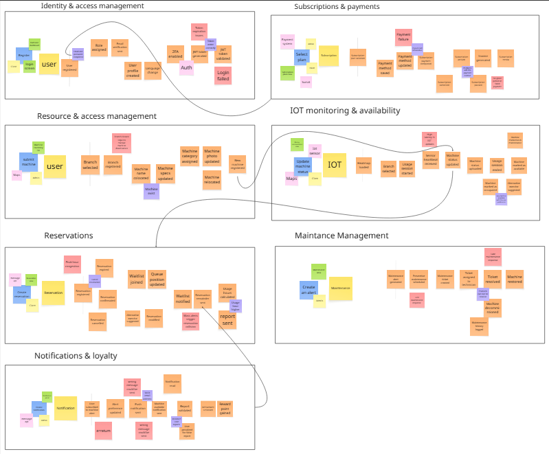
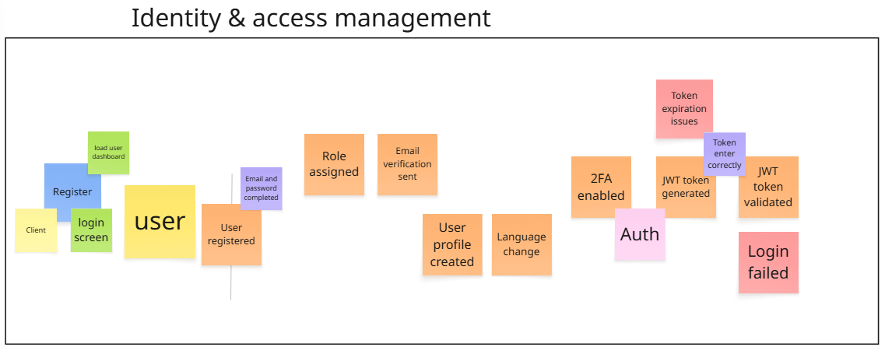
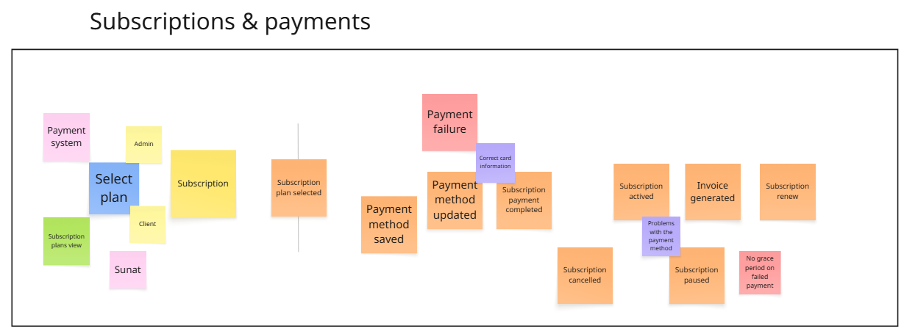
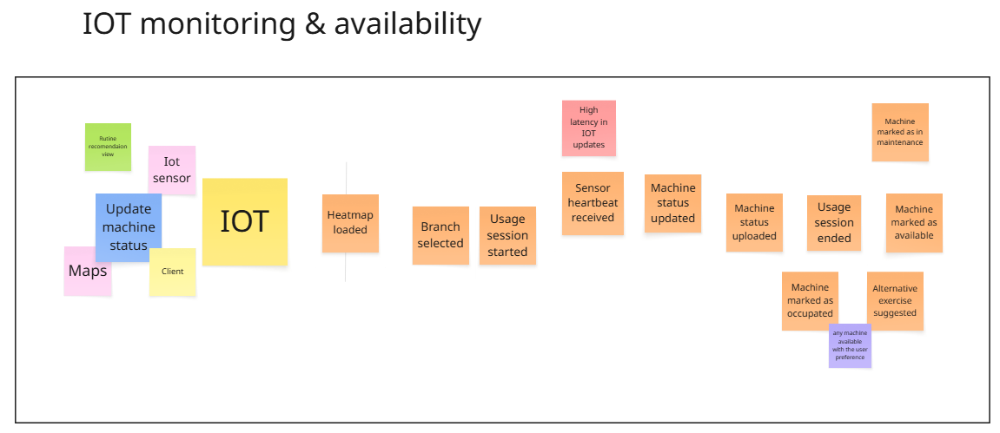
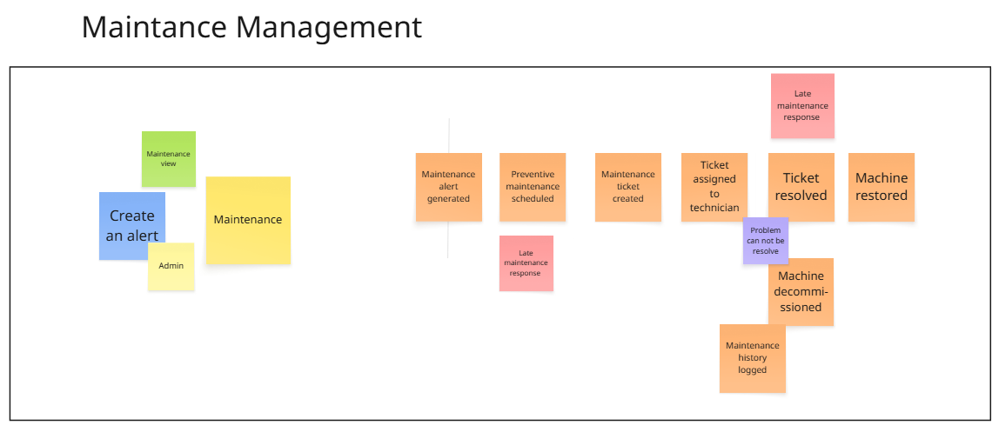
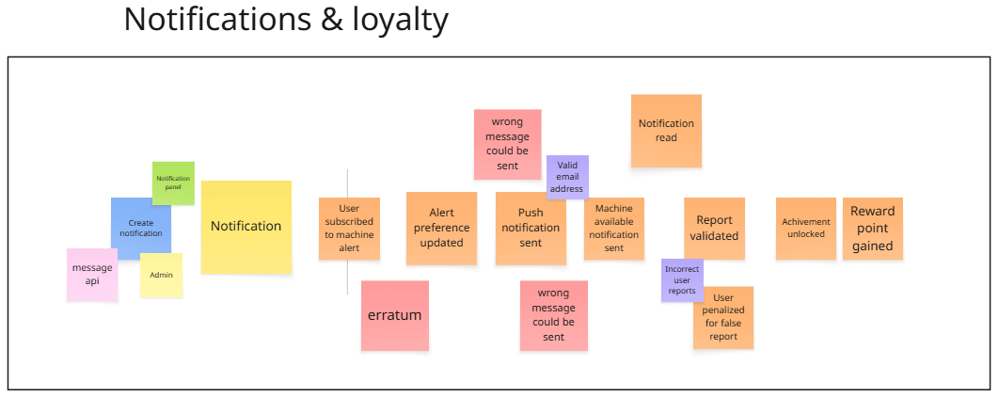
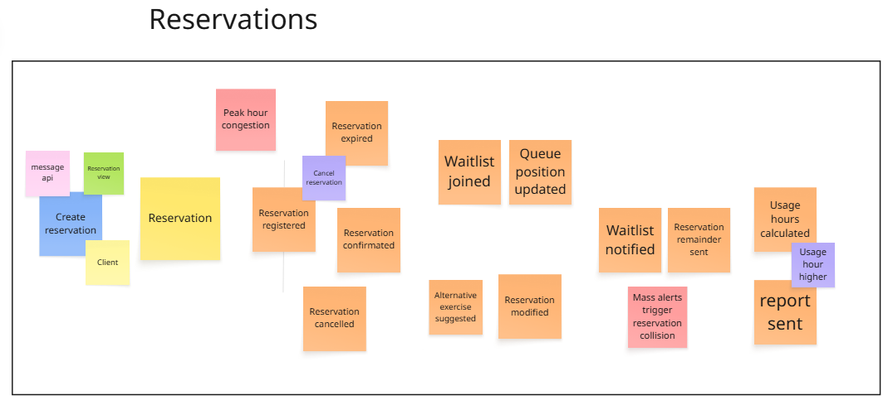
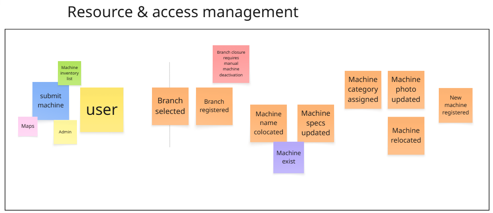
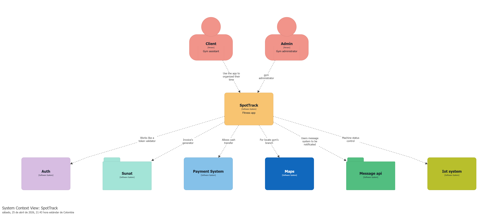
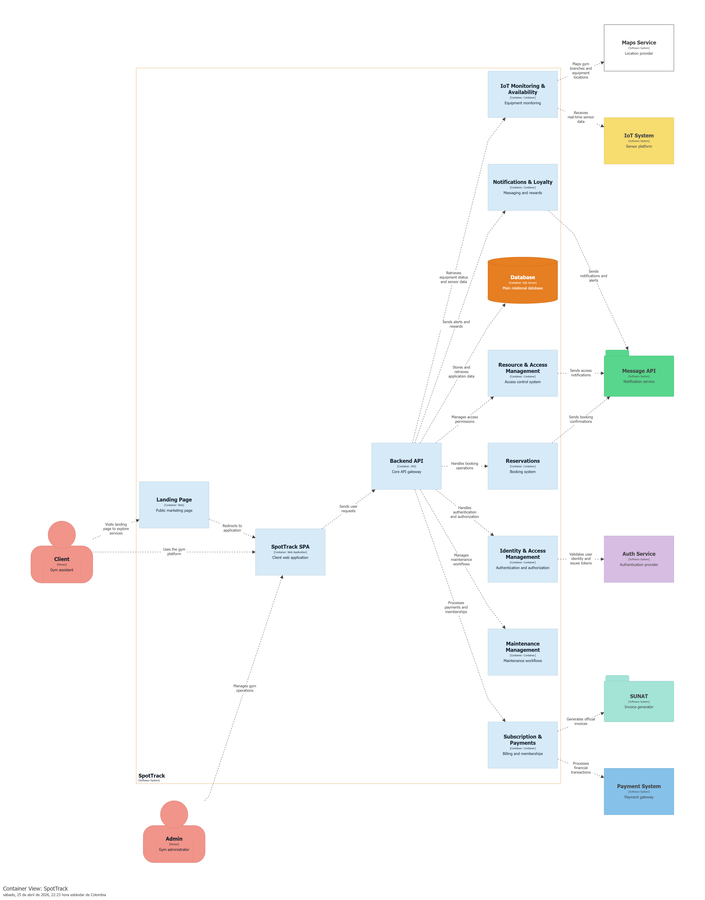

## 4.6. Domain-Driven Software Architecture.
### 4.6.1. Design-Level Event Storming.

  <align>
    
  
  

#### 4.6.1.1. Identity & Acess management

  <align>
    
  
  

#### 4.6.1.2. Subscription & Payments

  <align>
    
  
  

#### 4.6.1.3. IOT Monitoring & Availability

  <align>
    
  
  

#### 4.6.1.4. Maintenance Management

  <align>
    
  
  

#### 4.6.1.5. Notification &  Loyalty

  <align>
    
  
  

#### 4.6.1.6. Reservations

  <align>
    
  
  

#### 4.6.1.7. Resource & Access management

  <align>
    
  
  

### 4.6.2. Software Architecture Context Diagram.

  <align>
    
  
  

### 4.6.3. Software Architecture Container Diagrams.

  <align>
    
  
  

### 4.6.4. Software Architecture Components Diagrams.

## 4.7. Software Object-Oriented Design.
### 4.7.1. Class Diagrams.

  

  <align>
    
  
  

  

  <align>
    
  
  

## 4.8. Database Design.
### 4.8.1. Database Diagrams.

  <align>
    
  
  