## 4.6. Domain-Driven Software Architecture.
### 4.6.1. Design-Level Event Storming.

  <align>
    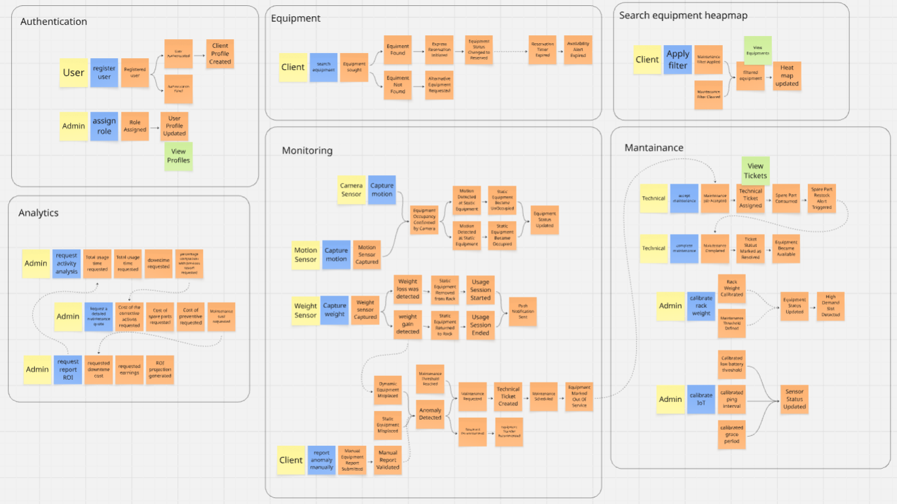
  
  

### 4.6.2. Software Architecture Context Diagram.

  <align>
    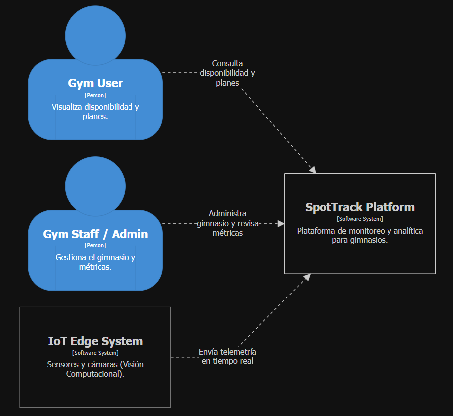
  
  

### 4.6.3. Software Architecture Container Diagrams.

  <align>
    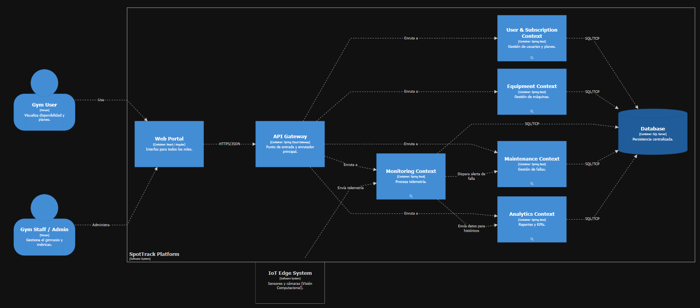
  
  

### 4.6.4. Software Architecture Components Diagrams.

#### 4.6.4.1. Monitoring Component Diagram

  <align>
    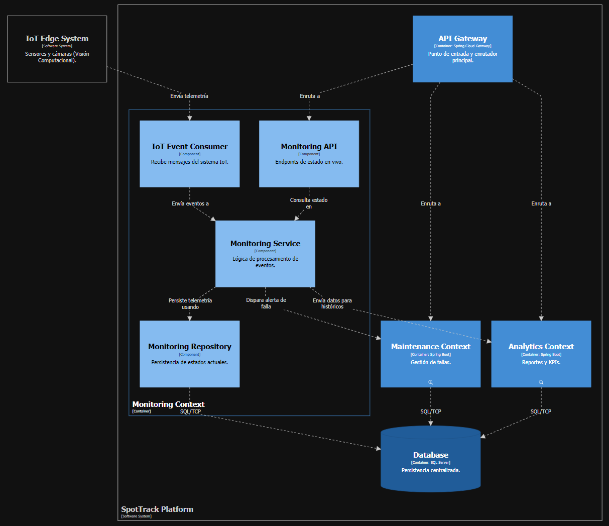
  
  

  #### 4.6.4.2 User and subscription Component Diagram

  <align>
    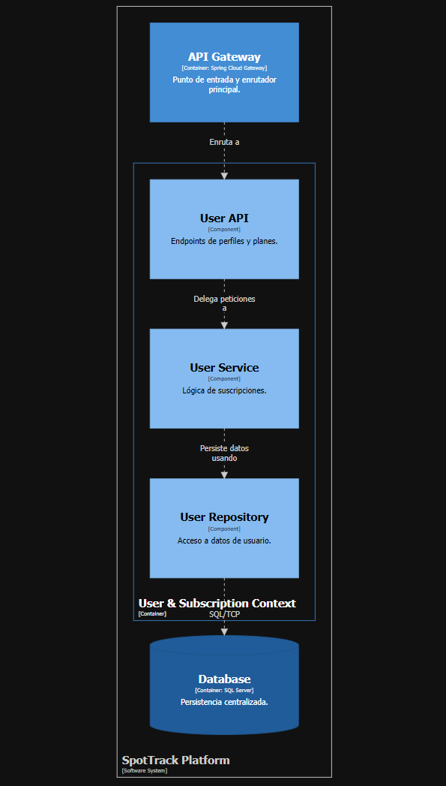
  
  

  #### 4.6.4.3. Equipment Component Diagram

  <align>
    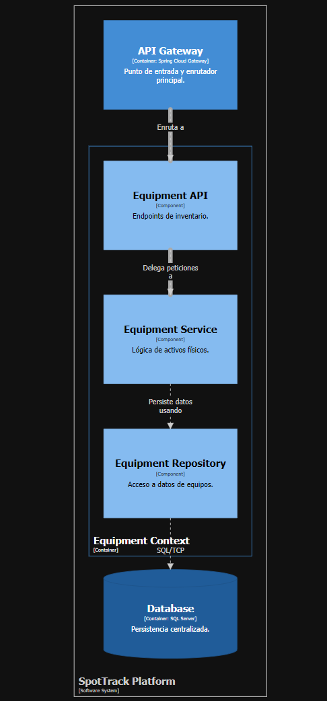
  
  

#### 4.6.4.4. Maintance Component Diagram

  <align>
    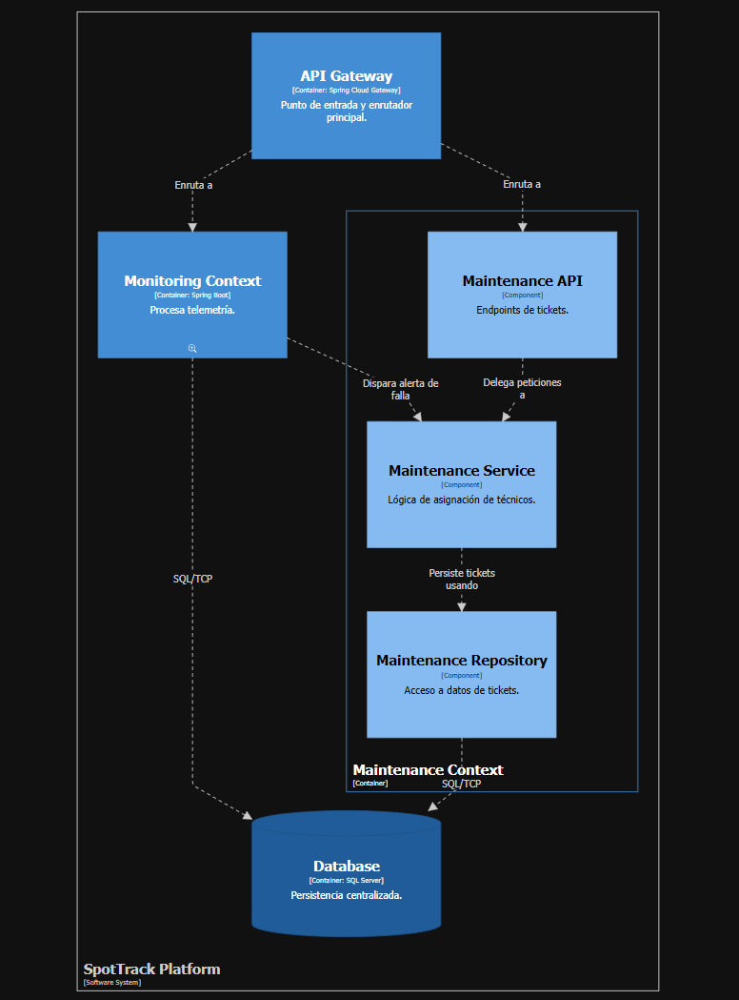
  
  

  #### 4.6.4.5. Analytics Component Diagram

  <align>
    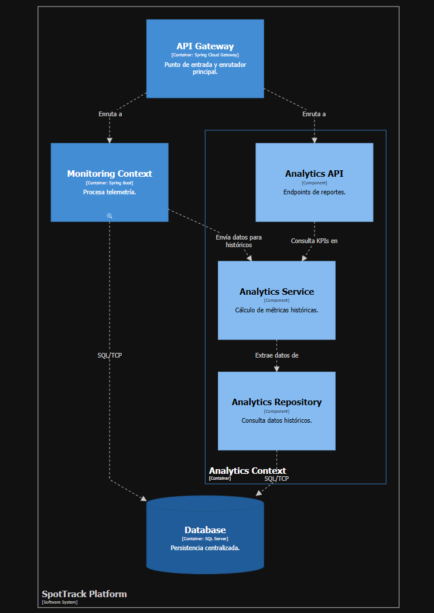
  
  

## 4.7. Software Object-Oriented Design.
### 4.7.1. Class Diagrams.

  

  <align>
    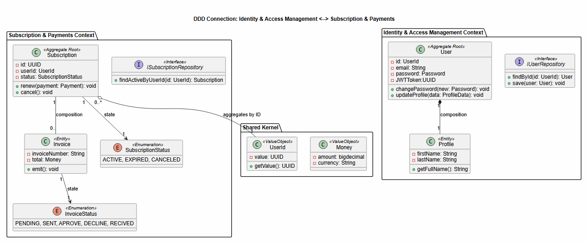
  
  

  

  <align>
    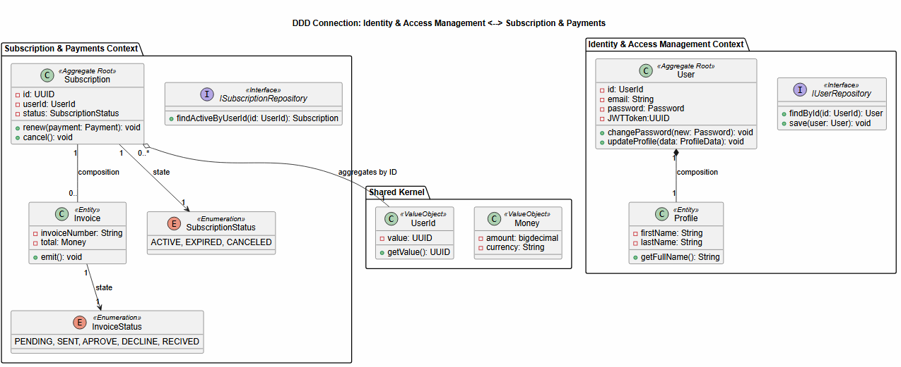
  
  

## 4.8. Database Design.
### 4.8.1. Database Diagrams.

  <align>
    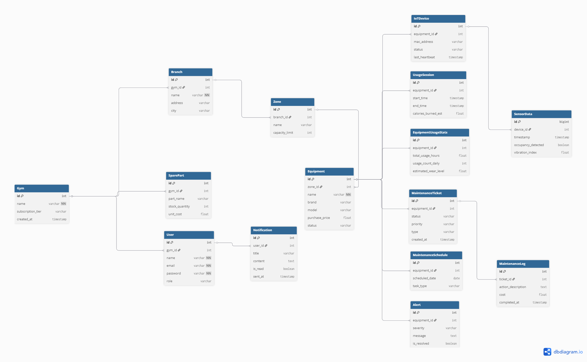
  
  