## Capítulo V: Product Implementation, Validation & Deployment

### 5.1. Software Configuration Management

En la siguiente sección, detallaremos las herramientas, convenciones, referencias y configuraciones empleadas a lo largo del desarrollo de la plataforma FitNode Analytics. Estas decisiones establecen las bases para mantener la consistencia técnica durante todo el ciclo de vida del proyecto.

#### 5.1.1. Software Development Environment Configuration

En este apartado, se detallan las herramientas, plataformas y lenguajes utilizados por el equipo para el desarrollo técnico y operativo del proyecto. Los productos se clasifican en las siguientes categorías:

1. Project Management
2. Product UX/UI Design & Architecture
3. Software Development
4. Software Deployment

**1. Project Management:**
* **WhatsApp y Discord:** Canales principales para la comunicación síncrona, coordinación de reuniones diarias (Daily Stand-ups) y resolución de bloqueos técnicos.

**2. Product UX/UI Design & Architecture:**
* **Miro:** Plataforma de pizarra colaborativa empleada para la creación de los Scenario Maps (As-is y To-be) y flujos de procesos iniciales.
* **PlantUML (PUML):** Herramienta de modelado bajo el enfoque *Diagram-as-Code*, utilizada para estructurar la arquitectura del sistema mediante el modelo C4 y diagramas de clases UML.
* **Figma:** Software de diseño colaborativo utilizado para la elaboración de wireframes y prototipos interactivos de alta fidelidad para la Landing Page y la aplicación.
* **UXPressia:** Herramienta especializada para el diseño y documentación de los Customer Journey Maps y Personas, garantizando un enfoque centrado en el usuario.
* * **Trello:** Herramienta de gestión visual basada en tableros Kanban. Se utiliza para organizar el Product Backlog, planificar los Sprints y realizar el seguimiento detallado de las tareas del equipo.

**3. Software Development:**
* **JetBrains WebStorm:** Entorno de desarrollo integrado (IDE) utilizado para la codificación de la Landing Page y el Frontend de la aplicación web.
* **GitHub:** Plataforma central para el control de versiones distribuido y la gestión colaborativa del código fuente.
* **HTML:** Lenguaje de marcado utilizado para definir la estructura semántica y el contenido de la Landing Page.
* **CSS:** Hojas de estilo aplicadas para la maquetación responsiva (Flexbox/Grid), el diseño visual y las animaciones de la interfaz.
* **JavaScript:** Lenguaje de programación nativo utilizado para implementar la lógica de internacionalización (traducción de idiomas) y la interactividad del lado del cliente.
* **Vue.js:** Framework progresivo de JavaScript seleccionado para la construcción de la Frontend Web Application.
* **ASP.NET Core (C#):** Framework utilizado para el desarrollo de la API RESTful y la gestión de la lógica de negocio en el Backend.

**4. Software Deployment:**
* **GitHub Pages:** Servicio utilizado para el alojamiento gratuito y despliegue público de la Landing Page estática.

#### 5.1.2. Source Code Management

Para la gestión del código fuente, se utiliza GitHub como plataforma central de control de versiones y colaboración. Se han establecido repositorios independientes para asegurar la modularidad del proyecto.

**Organización en GitHub:** `https://github.com/upc-pre-202610-1asi0730-12144-bytesquad`
* **Repositorio del Informe:** `https://github.com/upc-pre-202610-1asi0730-12144-bytesquad/bytesquad-report`
* **Repositorio de la Landing Page:** `https://github.com/upc-pre-202610-1asi0730-12144-bytesquad/bytesquad-website`
* **Repositorio del Frontend:** `https://github.com/upc-pre-202610-1asi0730-12144-bytesquad/bytesquad-webapp`
* **Repositorio del Backend:** `https://github.com/upc-pre-202610-1asi0730-12144-bytesquad/bytesquad-platform`

**Ramificación: GitFlow**

Se ha adoptado el modelo **GitFlow** para gestionar el flujo de trabajo, utilizando ramas efímeras que permiten un desarrollo paralelo y organizado. Las ramas base son:

* **`main`:** Rama de producción. Contiene exclusivamente código estable y versiones finales desplegadas.
* **`develop`:** Rama de integración. Aquí se consolidan todas las nuevas funcionalidades antes de pasar a la rama principal.
* **Feature Branches:** Ramas temporales creadas para el desarrollo de tareas específicas. Siguen la nomenclatura `feature/task-name` y se eliminan tras ser integradas en `develop`.

**Ejemplo de Ramas Feature para la Landing Page:**
* **`feature/landing-structure`:** Maquetación base del HTML semántico y configuración inicial de estilos CSS.
* **`feature/internationalization`:** Implementación de la lógica JavaScript para el cambio dinámico de idioma (i18n).
* **`feature/pricing-animations`:** Desarrollo de la sección de precios, incluyendo el resaltado del plan ideal y animaciones `@keyframes`.
* **`feature/login-integration`:** Creación del módulo de inicio de sesión (`login.html`) y su vinculación con el header.
* **`feature/form-validation`:** Implementación de validaciones de negocio en el formulario de contacto mediante JavaScript.

**Estilo de commits: Conventional Commits**

Para mantener un historial de cambios legible y estandarizado, el equipo sigue la convención **Conventional Commits**. Cada mensaje de commit debe comenzar con un prefijo que categorice el cambio:

* **`feat`:** Introducción de una nueva funcionalidad.
* **`fix`:** Corrección de un error o fallo.
* **`docs`:** Modificaciones exclusivas en la documentación o el informe.
* **`style`:** Cambios de formato, punto y coma, espacios, etc. (no afectan la lógica).
* **`refactor`:** Reestructuración de código que no añade funciones ni corrige errores.
* **`chore`:** Actualización de tareas de compilación, configuraciones de herramientas o dependencias.

#### 5.1.3. Source Code Style Guide & Conventions

En esta sección se definen las reglas básicas de escritura de código que el equipo sigue para mantener el proyecto ordenado y fácil de leer.

**Principios generales**
* **Idioma estándar:** Todo el código fuente y los comentarios técnicos se escriben en inglés.
* **Legibilidad:** Se utilizan nombres claros y descriptivos para variables y funciones, evitando abreviaturas confusas.
* **Organización:** Se separa estrictamente la estructura visual, los estilos y la lógica de programación.

**HTML**
* Los archivos terminan en `.html`.
* Se utilizan etiquetas semánticas como `<header>`, `<section>`, `<nav>` y `<footer>` para estructurar la página de forma lógica.
* Se incluye el atributo `alt` en las imágenes para mejorar la accesibilidad.
* Todos los atributos utilizan comillas dobles (`"`).

**CSS**
* Los archivos terminan en `.css`.
* Los selectores y las clases se nombran en minúsculas y separados por guiones medios (ejemplo: `.pricing-card`, `.btn-primary`).
* Se agrupan los estilos relacionados (por módulos) y se separan con comentarios para facilitar su búsqueda.
* Se define una paleta de colores base utilizando variables globales en el `:root` para mantener la consistencia en todo el diseño.

**JavaScript**
* Los archivos terminan en `.js`.
* Las variables y funciones se escriben usando el formato `camelCase` (ejemplo: `changeLanguage`, `currentLang`).
* Se evita por completo el uso de `var`. Se prioriza `const` para valores fijos y `let` para valores que van a cambiar.

**Vue.js (Frontend Web Application)**
* Los componentes deben nombrarse utilizando `PascalCase` (ejemplo: `MachineCard.vue`).
* Se seguirán las reglas básicas recomendadas por la guía oficial (**Vue Style Guide**) para mantener el orden en el código.

**C# y ASP.NET Core (Backend)**
* Las clases y métodos se nombran utilizando `PascalCase` (ejemplo: `MaintenanceController`).
* Todas las interfaces deben comenzar con la letra "I" mayúscula (ejemplo: `ITelemetryService`).
* Se respetarán las convenciones estándar de codificación de Microsoft para C#.

#### 5.1.4. Software Deployment Configuration

En esta sección se describe la configuración necesaria para desplegar cada uno de los componentes del proyecto: Landing Page, Frontend Web Application y RESTful Web Services. El objetivo es garantizar que el código fuente almacenado en nuestros repositorios de GitHub se integre y publique de manera funcional, segura y accesible para los usuarios finales.

**Despliegue de Landing Page**

La Landing Page promocional de SpotTrack fue desarrollada utilizando HTML5, CSS3 y Vanilla JavaScript. Para su publicación, se optó por **GitHub Pages**, un servicio de hosting nativo, seguro y optimizado para sitios web estáticos.

**Pasos de despliegue ejecutados:**

* Se creó el repositorio `SpotTrack-website` dentro de la organización de GitHub del equipo.
* Se integró el código fuente (HTML, CSS, JS) y los recursos multimedia (imágenes, iconos) mediante comandos Git.
* Desde los ajustes del repositorio (Settings > Pages), se habilitó el despliegue automático apuntando a la raíz (`/`) de la rama `main`.
* GitHub Actions procesó la solicitud y publicó el sitio web asignándole un certificado SSL gratuito y una URL pública.

* **Repositorio:** `https://github.com/upc-pre-202610-1asi0730-12144-bytesquad/bytesquad-webapp`
* **URL desplegada:** ``

### 5.2. Landing Page, Services & Applications Implementation
En esta sección se explica y evidencia el proceso de implementación, pruebas, documentación y despliegue del Landing Page, Web Services y Frontend Web Applications.

#### 5.2.1. Sprint 1

##### 5.2.1.1. Sprint Planning 1

| Sprint 1 | Sprint 1                                                                                                                                                           |
| :--- |:-------------------------------------------------------------------------------------------------------------------------------------------------------------------|
| **Sprint Planning Background** |                                                                                                                                                                    |
| Date | 18-04-2026                                                                                                                                                         |
| Time | 20:45                                                                                                                                                              |
| Location | Via Discord                                                                                                                                                        |
| Prepared By | Gamero Miranda, Lui Mathias                                                                                                                                        |
| Attendees (to planning meeting) | Cataño Zarate Jesus Miguel, Gallardo Morales Carla Alejandra, Fernández Linares Alvaro Sebastian, Gamero Miranda Lui Mathias, Espinoza Orrego Valentino Andre      |
| Sprint 1 Review Summary | Durante este sprint se asignaron las responsabilidades individuales y se discutieron los requerimientos técnicos y visuales para el desarrollo de la Landing Page. |
| Sprint 1 Retrospective Summary | El equipo concluyó que el flujo de trabajo fue efectivo, logrando un código funcional y un despliegue exitoso de la Landing Page sin bloqueos mayores.             |
| **Sprint Goal & User Stories** |                                                                                                                                                                    |
| Sprint 1 Goal | Desarrollar y desplegar la Landing Page estática del proyecto, aplicando HTML, CSS y Vanilla JS para presentar la propuesta de valor de SpotTrack.                 |
| Sprint 1 Velocity | 42                                                                                                                                                                 |
| Sum of Story Points | 42                                                                                                                                                                 |

##### 5.2.1.2. Aspect Leaders and Collaborators

| Team Member (Last Name, First Name) | GitHub Username | Requirements & Analysis | Landing Page Development | Configuration & Deployment |
| :---: | :---: |:-----------------------:|:------------------------:|:--------------------------:|
| Cataño Zarate, Jesus Miguel | jcus1510  |            C            |            C             |             C              |
| Espinoza Orrego, Valentino Andre | valentinoespinoza13  |            L            |            C             |             C              |
| Fernández Linares, Alvaro Sebastian | ORION-tech-c  |            C            |            C             |             C              |
| Gamero Miranda, Lui Mathias | lug07m  |            C            |            L             |             C              |
| Gallardo Morales, Carla Alejandra | Carlsss28 |            C            |            C             |             L              |

##### 5.2.1.3. Sprint Backlog 1

En esta sección se detallan las tareas asignadas para el Sprint 1 y el link del tablero de trello.

**Link del tablero:** https://trello.com/b/6LoJKkoI/sprint-backlog

| User Story ID | Id | Description | Estimation (hours) | Assigned to | Status (To-do / InProcess / To-Review / Done) |
| :--- | :--- | :--- | :--- | :--- | :--- |
| US-01 | S-01 | Diseñar la estructura HTML5 con semantic tags para la sección principal (Hero Section). | 4h | Gamero Miranda, Lui Mathias | Done |
| US-01 | S-02 | Implementar la lógica Vanilla JS para el cambio de idioma (i18n) en el navbar y botones. | 2h | Gamero Miranda, Lui Mathias | Done |
| US-01 | S-03 | Ajustar el estilo CSS usando Flexbox para destacar el CTA y adaptarlo a móviles. | 3h | Fernández Linares, Alvaro | Done |
| US-02 | S-04 | Diseñar la estructura de tarjetas HTML para la sección "About Us" y "Experiences". | 3h | Gamero Miranda, Lui Mathias | Done |
| US-02 | S-05 | Redactar diccionarios JS (EN/ES) explicando los beneficios B2B y B2C del producto. | 2h | Espinoza Orrego, Valentino | Done |
| US-02 | S-06 | Aplicar estilos corporativos utilizando las variables CSS globales (`:root`). | 3h | Fernández Linares, Alvaro | Done |
| US-03 | S-07 | Maquetar el componente CSS Grid para mostrar las características (Features) de IoT. | 4h | Gallardo Morales, Carla | Done |
| US-03 | S-08 | Añadir transiciones CSS (`hover` state) y manipular el DOM para la navegación. | 4h | Fernández Linares, Alvaro | Done |
| US-03 | S-09 | Integrar íconos vectoriales de FontAwesome dentro de las grillas de información. | 3h | Gamero Miranda, Lui Mathias | Done |
| US-04 | S-10 | Diseñar la estructura HTML de la sección de suscripciones (Planes Basic, Mid y Platinum). | 4h | Gamero Miranda, Lui Mathias | Done |
| US-04 | S-11 | Estilizar con animaciones `@keyframes` el plan "Mid" para resaltarlo como opción popular. | 2h | Fernández Linares, Alvaro | Done |
| US-05 | S-12 | Implementar la estructura del formulario B2B en el archivo principal y en `login.html`. | 3h | Gamero Miranda, Lui Mathias | Done |
| US-05 | S-13 | Añadir manipulación de eventos en JS (`preventDefault`) para el envío de formularios. | 3h | Gallardo Morales, Carla | Done |
| US-05 | S-14 | Verificar la subida de los commits a GitHub y asegurar la integridad de ramas GitFlow. | 2h | Cataño Zarate, Jesus | Done |

#### 5.2.1.4. Development Evidence for Sprint Review

| Repository        | Branch  | Commit Id                              | Commit Message                | Commit Message Body          | Commit on (Date) |
|-------------------|---------|----------------------------------------|-------------------------------|------------------------------|------------------|
| SpotTrack-website | develop |cd7207c544f9ec13272766754d752cdc7ba9a871|feat:add-landing-1             |feat:add-landing-1            | 26/042026        |
| SpotTrack-website | develop |ce6d742d7e1f835abc6ce1e5489513f11a057640|docs: update del main en el landingpage |docs: update del main en el landingpage | 26/042026        |
| SpotTrack-website | develop |614e9f04f22d42fd1852086b91e8c4574a1fbe21|added-some-sections-to-index   |added-some-sections-to-index  | 26/042026        |
| SpotTrack-website | develop |e69be6fe7671b3e2e832f7f230ffe8a58dee1eca|feature:add footer and contact |feature:add footer and contact| 26/042026        |
| SpotTrack-website | develop |f34a15c79dd45c8f97c8bd460e58be220d23fe4b|landing:add login              |landing:add login             | 26/042026        |

| Repository       | Branch  | Commit Id                                | Commit Message                                                      | Commit Message Body                                                   | Committed on (Date) |
|------------------|----------|------------------------------------------|---------------------------------------------------------------------|------------------------------------------------------------------------|---------------------|
| spottrack-webapp | develop  |                                          | docs:analytics section added                                        | docs:analytics section added                                          | 2026-05-14 |
| spottrack-webapp | develop  | 54e1fb69ab26386f1d811d3311e5252c6258073f | Merge pull request #12 from SpotTrack/feature/maintenance-section   | docs: maintenance section added                                       | 2026-05-14 |
| spottrack-webapp | develop  | b85561c985b4ece85457bf62e362e0fb398e9cb1 | Merge pull request #14 from SpotTrack/feature/configuration         | add feature/configuration                                             | 2026-05-14 |
| spottrack-webapp | develop  | c77f3b370222b4324be01c45b29a071e389fc52c | add feature/configuration                                           | add feature/configuration                                             | 2026-05-14 |
| spottrack-webapp | develop  | 1144f26cb339b4aff1d1bd89126e7d54df66de41 | docs: maintenance section added                                     | docs: maintenance section added                                       | 2026-05-14 |
| spottrack-webapp | develop  | dc2ab8560a6b4cde84196a355dd04c287ebb46ba | Merge pull request #10 from SpotTrack/feature/client-home-view      | feat: add-client-home                                                 | 2026-05-14 |
| spottrack-webapp | develop  | 325d312445e74d15b19e753b4427b2a8f84340fc | Merge pull request #11 from SpotTrack/feature/profiles              | add feature/profiles                                                  | 2026-05-14 |
| spottrack-webapp | develop  | 1aafc318356a05a906e69f275c27b55128d01316 | add feature/profiles                                                | add feature/profiles                                                  | 2026-05-14 |
| spottrack-webapp | develop  | 521931e4dca607548ad93fb7f23eece976b4c2a5 | Merge pull request #9 from SpotTrack/feature/iot-section            | docs: iot section added                                               | 2026-05-14 |
| spottrack-webapp | develop  | a2788e5f9c5dd1fa9ffd0e9637ead421c5273a4b | docs: iot section added                                             | docs: iot section added                                               | 2026-05-14 |
| spottrack-webapp | develop  | 7b7e32b1268e894c73bbd2b7ba9ec8b80d0ea5ee | Merge pull request #8 from SpotTrack/feature/alert                  | add feature/alerts                                                    | 2026-05-14 |
| spottrack-webapp | develop  | 95c5a755a5f62bdb39dcacf45357e55807c5c6fd | add feature/alerts                                                  | add feature/alerts                                                    | 2026-05-14 |
| spottrack-webapp | develop  | 6dcabecc9c6a92aa728a906d29a03edc60c73d0b | feat: add-client-home                                               | feat: add-client-home                                                 | 2026-05-14 |
| spottrack-webapp | develop  | 3bdbb9857f2fb2f0f3447de3c955081f1abe1632 | Merge pull request #7 from SpotTrack/feature/more-sections          | Feature/more sections                                                 | 2026-05-14 |
| spottrack-webapp | develop  | 949a5e1a5b4788e757619b2cfacce86eaceec965 | new section map merge corebounded context with reservation          | new section map merge corebounded context with reservation            | 2026-05-14 |
| spottrack-webapp | develop  | 63a698c060d745015c7535cb7286132bcc46f722 | new section reservation trying to attach like a core bounded context| new section reservation trying to attach like a core bounded context  | 2026-05-14 |
| spottrack-webapp | develop  | e7222b61c8af24eb05337e9e413eb2a130537766 | routines section propertly working                                  | routines section propertly working                                    | 2026-05-14 |
| spottrack-webapp | develop  | 38a368a2d5912034b23e4a72a09e192a5552482b | Merge pull request #6 from SpotTrack/feature/add-auth               | feat:add-auth                                                         | 2026-05-14 |
| spottrack-webapp | develop  | 997f18d91df91d13546552b06bc793257aca5e52 | feat:add-auth                                                       | feat:add-auth                                                         | 2026-05-14 |
| spottrack-webapp | develop  | 29fc2a1725ee5373997d41775339140a0b11092b | Merge pull request #4 from SpotTrack/feature/add-dashboard          | feat:add-dashboard                                                    | 2026-05-14 |
| spottrack-webapp | develop  | aba5fe314604be92b2540c178140b8014271a090 | feat:add-dashboard                                                  | feat:add-dashboard                                                    | 2026-05-14 |
| spottrack-webapp | develop  | ca81506115fdf1c7fdc1b55ad44cbaf59635dbbf | Merge pull request #3 from SpotTrack/feature/add-app-functions      | feat:add-app-functions                                                | 2026-05-14 |
| spottrack-webapp | develop  | 91134babc32aaffefd03462df6a0cb54956712a1 | feat:add-app-functions                                              | feat:add-app-functions                                                | 2026-05-14 |
| spottrack-webapp | develop  | 08007a915d7d8755f223d897fc21317b35a0b7ed | Merge pull request #2 from SpotTrack/feature/initialfiles           | initial files                                                         | 2026-05-14 |
| spottrack-webapp | develop  | de9b00651a8528fd3c4872bf7e2db2af6f712165 | initial files                                                       | initial files                                                         | 2026-05-14 |
| spottrack-webapp | develop  | 3f919b629f81d00225b8e15aabea5909221dee1e | Initial commit                                                      | Initial commit                                                        | 2026-04-08 |

| Repository         | Branch  | Commit Id                                | Commit Message                                                              | Commit Message Body                                             | Committed on (Date) |
|--------------------|----------|------------------------------------------|-----------------------------------------------------------------------------|-----------------------------------------------------------------|---------------------|
| spottrack-platform | develop  | 2abbd801f9850abe110ad5c00381004527bddf0a | Add or update the Azure App Service build and deployment workflow config    | Add or update the Azure App Service build and deployment workflow config | 2026-05-14 |
| spottrack-platform | develop  | 6b64d79a3da2bdbb7f07630cd71aa4f708ad5a42 | Merge pull request #3 from SpotTrack/develop                                | Develop                                                         | 2026-05-14 |
| spottrack-platform | develop  | 1d0f6cd5b0ddfb6b186466a24239fa87c2356fe6 | Merge pull request #2 from SpotTrack/fix/remove-unnecessary-files           | Delete .idea directory                                          | 2026-05-14 |
| spottrack-platform | develop  | 499433598782db8affb69b097dca9c6126ecfe8d | Delete .idea directory                                                      | Delete .idea directory                                          | 2026-05-14 |
| spottrack-platform | develop  | 8f75d9cb66eeb66a466d9fc95e99eda6db24b49c | Merge pull request #1 from SpotTrack/feature/mockapi                        | initial changes to mockapi base                                | 2026-05-14 |
| spottrack-platform | develop  | f805fa1b4cb596b48a5dfe3de54d6315be5a3ddd | initial changes to mockapi base                                             | initial changes to mockapi base                                | 2026-05-14 |
| spottrack-platform | develop  | 81f28b4055001d75d2a7dda1c50ee9db70108efa | Initial commit                                                              | Initial commit                                                  | 2026-04-08 |
##### 5.2.1.5. Execution Evidence for Sprint Review

En esta entrega, el equipo de desarrolladores de SpotTrack ha completado con éxito la implementación y el lanzamiento de la página de la Landing Page. Esta página presenta diferentes secciones que brindan información detallada sobre nuestro producto.

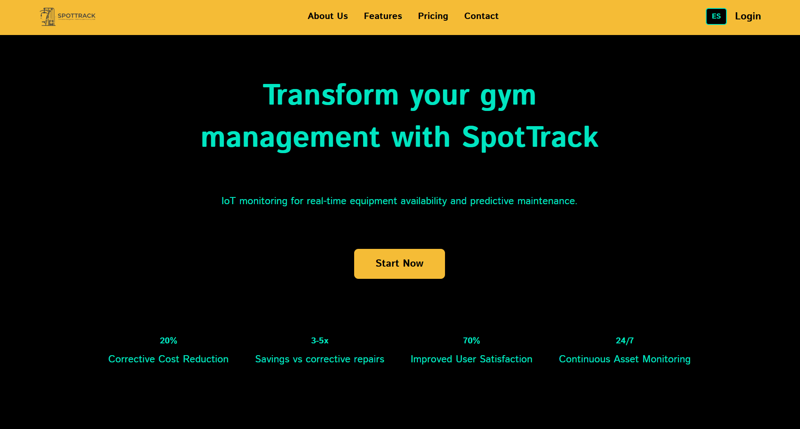
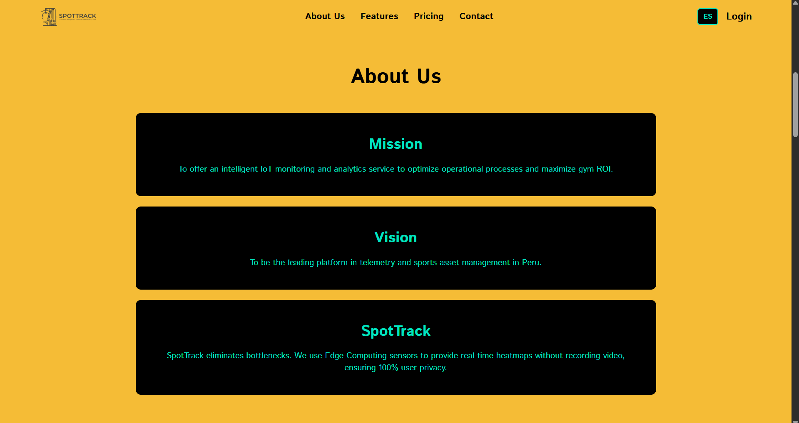
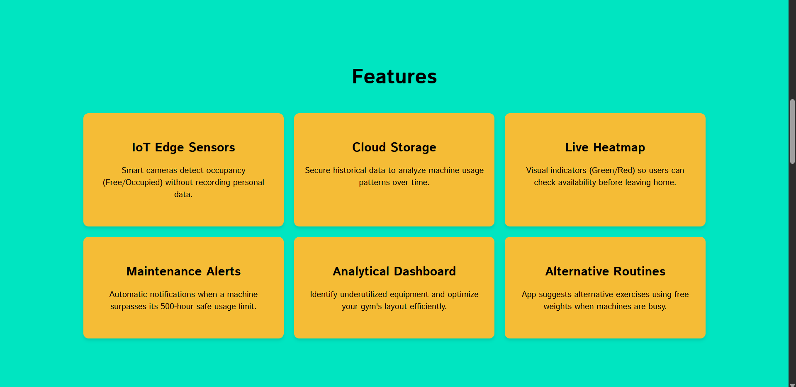
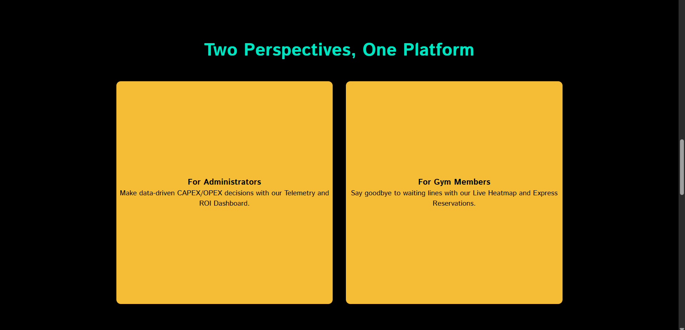
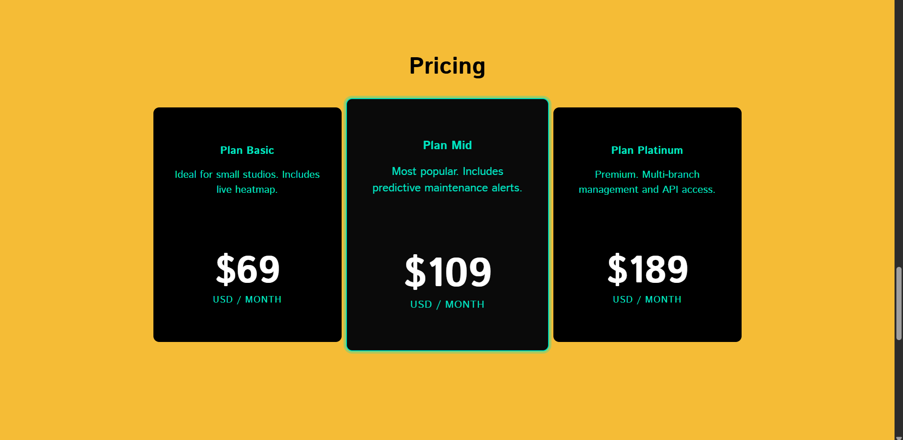
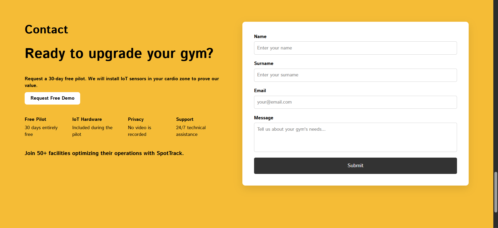

##### 5.2.1.6. Services Documentation Evidence for Sprint Review

Durante el Sprint 1, se llevó a cabo la publicación de la Landing Page de SpotTrack empleando GitHub Pages como servicio de hosting. A continuación, se detallan las acciones realizadas para lograr su despliegue exitoso.

Se creó el repositorio denominado byteguard-website dentro de la organización upc-pre-202610-1asi0730-12144-byteguard en GitHub.

El desarrollo de la Landing Page se realizó en la rama develop, siguiendo el modelo de trabajo GitFlow.

Se verificó el despliegue exitoso accediendo a la URL pública: https://spottrack.github.io/SpotTrack-website/ 

##### 5.2.1.7. Software Deployment Evidence for Sprint Review

Se desplegó la landing page usando el servicio de GitHub Pages. Se configuró para utilizar la rama main como base del proyecto a desplegar.

URL de Landing Page Desplegada: https://spottrack.github.io/SpotTrack-website/ 

##### 5.2.1.8. Team Collaboration Insights during Sprint

A continuación todas las estadisticas que nos proporciona Github, en su apartado de Insights, sobre la colaboración del equipo el reporte.

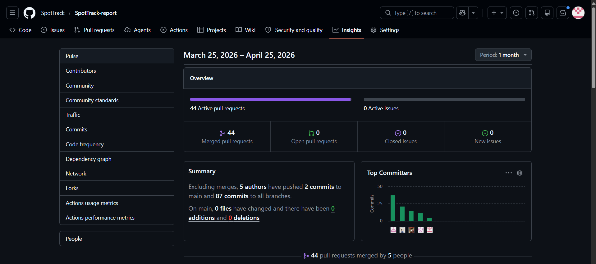

#### 5.2.2. Sprint 2

##### 5.2.2.1 Sprint Planning 2

El presente apartado detalla los acuerdos y objetivos definidos durante el Sprint Planning Meeting de nuestra segunda iteración. Para este Sprint, el equipo se enfocó en dos frentes de trabajo simultáneos: (1) la corrección y completitud de todos los artefactos pendientes del Sprint 1, incluyendo el despliegue completo de la Landing Page; y (2) el inicio del desarrollo frontend de la Web Application principal (Vue.js), empleando una Fake API (JSON Server) como capa de datos simulada para desacoplar el desarrollo frontend del backend real, cuya implementación se reserva para el Sprint 3.

| Aspect | Details |
| :--- | :--- |
| **Sprint #** | Sprint 2 |
| **Date** | 2026-05-08 |
| **Time** | 10:00 AM |
| **Location** | Reunión Virtual (Discord / Microsoft Teams) |
| **Prepared By** | Gallardo, Carla |
| **Attendees (to planning meeting)** | Gamero, Lui / Gallardo, Carla / Cataño Zarate, Jesus Miguel / Espinoza Orrego, Valentino Andre / Fernández Linares, Alvaro Sebastian |
| **Sprint 1 Review Summary** | Sprint 1 entregó los artefactos fundacionales de Lean UX, DDD, diseño UX/UI en Figma y el inicio de la Landing Page (Hero Section y Header). Sin embargo, quedaron pendientes el despliegue, las secciones de módulos, precios y contacto de la Landing Page, así como diversas secciones de documentación del informe. |
| **Sprint 1 Retrospective Summary** | El equipo identificó que la carga de trabajo de documentación y diseño subestimó el tiempo necesario. Para este Sprint 2 se priorizará paralelizar la corrección de Sprint 1 con el inicio del desarrollo de la Web App, asignando responsables claros por cada frente. |
| **Sprint Goal** | Nuestro enfoque es completar todos los artefactos pendientes del Sprint 1 (correcciones de documentación y Landing Page completa) e iniciar el desarrollo frontend de la Web Application de SpotTrack consumiendo una Fake API, implementando las vistas de autenticación, mapa de calor, gestión de activos, alertas de mantenimiento y sugerencias de rutinas. Esto se confirmará cuando la Landing Page esté desplegada y funcional con todas sus secciones, y las vistas frontend de las User Stories priorizadas estén implementadas y navegables en el entorno de desarrollo local. |
| **Sprint 2 Velocity** | 58 Story Points |
| **Sum of Story Points** | 58 |

##### 5.2.2.2 Aspect Leaders and Collaborators

Para este Sprint 2, el equipo adoptó una estructura dual de trabajo: un subequipo dedicado a las correcciones del Sprint 1 (documentación + Landing Page) y otro enfocado en el desarrollo frontend de la Web Application. Esta división permite avanzar en paralelo sin bloqueos entre tareas de distinta naturaleza.

| Team Member (Last Name, First Name) | GitHub Username | Aspect 1: Sprint 1 Corrections Leader (L) / Collaborator (C) | Aspect 2: Vue App Setup & Auth Leader (L) / Collaborator (C) | Aspect 3: Client App Frontend (Heatmap & Routines) Leader (L) / Collaborator (C) | Aspect 4: Admin Dashboard Frontend Leader (L) / Collaborator (C) |
| :--- | :--- | :--- | :--- | :--- | :--- |
| Gallardo, Carla | cgallardo | Corrections (C) | Vue App Setup (L) | Client App (C) | Admin Dashboard (C) |
| Gamero, Lui | lgamero | Corrections (C) | Fake API Config (L) | Client App (C) | Admin Dashboard (C) |
| Cataño Zarate, Jesus Miguel | jcuz1510 | Landing Page Completion (L) | Vue App Setup (C) | Client App (C) | Admin Dashboard (C) |
| Espinoza Orrego, Valentino Andre | valentinoespinoza13 | Corrections (C) | Vue App Setup (C) | Client App (C) | Admin Dashboard (L) |
| Fernández Linares, Alvaro Sebastian | ORION-tech-c | Corrections (L) | Vue App Setup (C) | Client App (L) | Admin Dashboard (C) |

#### 5.2.2.3 Sprint Backlog

> **Nota:** Las filas con prefijo `CORR-` y `SETUP-` son **storyless** — no corresponden a ninguna User Story y no tienen Story Points asignados, pero son obligatorias para subsanar deficiencias del Sprint anterior y preparar el entorno de desarrollo.

| Id | Title | Task Id | Task Title | Description | Estimation (Hours) | Assigned To | Status |
| :--- | :--- | :--- | :--- | :--- | :--- | :--- | :--- |
| - | Corrección Sprint 1 | CORR-01 | Completar sección "The Solution" en Landing Page | Maquetar las seis tarjetas de soluciones del sistema (US-03 pendiente) con HTML/CSS responsivo. | 4 hrs | Cataño | Done |
| - | Corrección Sprint 1 | CORR-02 | Completar Pricing Table en Landing Page | Implementar la tabla comparativa de planes SaaS Basic/Mid/Platinum con CTAs (US-04 pendiente). | 4 hrs | Cataño | Done |
| - | Corrección Sprint 1 | CORR-03 | Completar formulario de Contacto en Landing Page | Codificar el formulario de contacto con validaciones JavaScript (US-05 pendiente). | 4 hrs | Espinoza | Done |
| - | Corrección Sprint 1 | CORR-04 | Completar Navbar y Footer de Landing Page | Implementar la barra de navegación sticky con anchor links y el footer con enlaces institucionales (US-06 pendiente). | 4 hrs | Fernández | Done |
| - | Corrección Sprint 1 | CORR-05 | Despliegue de Landing Page en producción | Configurar y publicar la Landing Page en GitHub Pages (T08 pendiente). Documentar el enlace de producción. | 4 hrs | Gallardo | Done |
| - | Corrección Sprint 1 | CORR-06 | Completar Diagrama ERD y Diagrama de Clases | Finalizar y subir el ERD y el Diagrama de Clases UML al repositorio (T04 pendiente). Actualizar referencias en el informe. | 4 hrs | Gamero / Cataño | Done |
| - | Corrección Sprint 1 | CORR-07 | Completar evidencias del Sprint 1 en el informe | Añadir capturas de pantalla de la Landing Page, commits reales y métricas de GitHub Insights en Development Evidence, Execution Evidence y Team Collaboration Insights. | 4 hrs | Espinoza / Fernández | Done |
| - | Corrección Sprint 1 | CORR-08 | Completar Big Picture Event Storming (Capítulo II) | Elaborar y añadir el Big Picture Event Storming al Capítulo II (sección actualmente vacía). | 4 hrs | Gamero | Done |
| - | Corrección Sprint 1 | CORR-09 | Completar sección Software Deployment Configuration (Capítulo V) | Redactar la descripción del entorno de despliegue, pipelines CI/CD y hosting utilizados. | 4 hrs | Gallardo | Done |
| - | Corrección Sprint 1 | CORR-10 | Completar Project Report Collaboration Insights (Capítulo 0) | Añadir la descripción de la colaboración del equipo en el desarrollo del informe con evidencia de GitHub. | 4 hrs | Espinoza | Done |
| - | Corrección Sprint 1 | CORR-11 | Agregar Student Outcome de Cataño Zárate (Capítulo 0) | Añadir las entradas de "Comunica oralmente" y "Comunica por escrito" para Jesús Miguel Cataño Zárate, actualmente ausentes de la tabla. | 4 hrs | Cataño | Done |
| - | Corrección Sprint 1 | CORR-12 | Estandarizar análisis de entrevistas 4 y 5 | Añadir el campo "Resumen" completo a las entrevistas de Joan Steffano Quispe (Entrevistado 4) y Fabián Suárez (Entrevistado 5), siguiendo el mismo formato de las entrevistas 1–3. | 4 hrs | Fernández | Done |
| - | Corrección Sprint 1 | CORR-13 | Subir fotos faltantes de integrantes del equipo | Agregar al repositorio las imágenes `foto-valentino.jpeg`, `foto-lui.png` y `foto-jesus-c.png`, referenciadas en el Capítulo I pero ausentes en la carpeta assets. | 4 hrs | Gallardo / Cataño | Done |
| - | Corrección Sprint 1 | CORR-14 | Corregir inconsistencia de tech stack (ASP.NET vs Spring Boot) | En el Sprint 1 Backlog, la tarea T05 menciona "ASP.NET Core" como backend, pero el tech stack oficial declara Spring Boot. Corregir la descripción de T05 en el informe. | 4 hrs | Gallardo | Done |
| - | Corrección Sprint 1 | CORR-15 | Corregir nombre de marca en análisis competitivo | La tabla de análisis competitivo usa "SpotTrack" (nombre antiguo) en lugar de "SpotTrack". Actualizar todas las instancias en el Capítulo II. | 4 hrs | Espinoza | Done |
| - | Setup Web App | SETUP-01 | Crear proyecto Vue con estructura por Bounded Contexts | Inicializar el proyecto Vue (`npm create vue@latest spottrack-app`), configurar la estructura de carpetas por bounded context: `auth/`, `heatmap/`, `admin/`, `maintenance/`, `equipment/`, `routines/`, `shared/`, `analytics/`. | 4 hrs | Gallardo | Done |
| - | Setup Web App | SETUP-02 | Configurar JSON Server como Fake API | Instalar y configurar `json-server` con un `db.json` que contenga datos seed para: `users`, `equipments`, `IoT`, `alerts`, `tickets`, `reservations`, `routines/alternatives`, `analytics`. Exponer en `localhost:3000`. | 4 hrs | Gamero | Done |
| - | Setup Web App | SETUP-03 | Documentar Sprint 2 Planning, Backlog y evidencias en el informe | Redactar las secciones de Sprint Planning 2, Aspect Leaders y Sprint Backlog en el Capítulo V. Al finalizar el sprint, completar Development Evidence, Execution Evidence y Team Collaboration Insights. | 4 hrs | Espinoza | Done |
| US26 | Gestión de activos físicos y altas | T01 | Implement equipment registration form | Build the UI form to register new equipment linked to an IoT sensor | 6 | Carla | Done |
| US26 | Gestión de activos físicos y altas | T02 | Implement equipment decommission flow | Add decommission action and confirmation dialog | 4 | Carla | Done |
| US21 | Monitoreo de estado de hardware Edge IoT | T03 | Build IoT node health dashboard view | Display connected/disconnected status per sensor node | 5 | Carla | Done |
| US21 | Monitoreo de estado de hardware Edge IoT | T04 | Implement reconnection status sync | Handle state sync when a node reconnects | 4 | Carla | Done |
| TS12 | Registrar evento de telemetría IoT API | T05 | Implement POST /api/v1/telemetry endpoint | Receive and process IoT sensor state events | 5 | Carla | Done |
| TS12 | Registrar evento de telemetría IoT API | T06 | Validate telemetry payload and auth | Return 400 on malformed or unauthorized payloads | 4 | Carla | Done |
| TS13 | Listar historial de uso general API | T07 | Implement GET /api/v1/telemetry endpoint | Return usage history array filtered by date range | 4 | Carla | Done |
| US08 | Gestión de preferencias y perfil | T08 | Build profile edit view | Allow user to update personal data and language preference | 4 | Jesús | Done |
| US08 | Gestión de preferencias y perfil | T09 | Implement language toggle i18n | Wire language selector to i18n service | 4 | Jesús | Done |
| US12 | Notificaciones push de disponibilidad | T10 | Build availability bell subscription UI | Allow client to subscribe to machine availability alert | 4 | Jesús | Done |
| US12 | Notificaciones push de disponibilidad | T11 | Display push notification on machine release | Show notification when subscribed machine becomes free | 4 | Jesús | Done |
| US13 | Sistema de recompensas Crowdsourcing | T12 | Build manual status report UI | Allow client to report machine status manually | 5 | Jesús | Done |
| US13 | Sistema de recompensas Crowdsourcing | T13 | Display reward points in profile | Show accumulated points after validated report | 4 | Jesús | Done |
| US24 | Notificación de restablecimiento a usuarios | T14 | Show restoration notification to clients | Notify clients when a repaired machine is back online | 4 | Lui | Done |
| US09 | Visualización del mapa de calor en vivo | T15 | Build interactive heatmap component | Render machine availability map with green/red indicators | 8 | Carla | Done |
| US09 | Visualización del mapa de calor en vivo | T16 | Implement real-time status update via polling | Auto-update machine icons without page reload | 6 | Carla | Done |
| US10 | Filtrado del inventario por tipo de máquina | T17 | Implement filter tags component | Add Fuerza/Cardio filter tags to heatmap | 4 | Carla | Done |
| US10 | Filtrado del inventario por tipo de máquina | T18 | Implement clear filters action | Restore full inventory on filter clear | 4 | Carla | Done |
| US11 | Cambio de sucursal para revisión de aforo | T19 | Implement branch selector component | Allow user to switch branches and reload heatmap | 4 | Carla | Done |
| US11 | Cambio de sucursal para revisión de aforo | T20 | Block premium branch for basic plan users | Show upgrade suggestion when branch access is denied | 4 | Carla | Done |
| US14 | Motor de sugerencia de rutinas alternativas | T21 | Build alternative routine suggestion view | Show alternative exercises when selected machine is occupied | 6 | Álvaro | Done |
| US14 | Motor de sugerencia de rutinas alternativas | T22 | Handle no-alternatives scenario | Suggest bodyweight exercises when gym is at full capacity | 4 | Álvaro | Done |
| US15 | Filtrado de alternativas por grupo muscular | T23 | Filter suggestions by target muscle group | Discard exercises from other muscle groups in suggestions | 4 | Álvaro | Done |
| US15 | Filtrado de alternativas por grupo muscular | T24 | Exclude machines with open tickets from suggestions | Filter out equipment in maintenance from suggestions | 4 | Álvaro | Done |
| US16 | Sistema de reserva exprés en horas pico | T25 | Build express reservation button and timer UI | Show yellow status and countdown on reservation | 5 | Álvaro | Done |
| US16 | Sistema de reserva exprés en horas pico | T26 | Implement reservation expiry release flow | Return machine to free state when timer runs out | 4 | Álvaro | Done |
| US25 | Calendario inteligente de bloqueos | T27 | Build smart schedule view with peak-hour warnings | Show warning when client selects high-demand slot | 5 | Álvaro | Done |
| US25 | Calendario inteligente de bloqueos | T28 | Implement valley-hour suggestion on conflict | Suggest off-peak alternative when peak slot is selected | 4 | Álvaro | Done |
| TS18 | Crear reserva exprés API | T29 | Implement POST /api/v1/reservations endpoint | Execute logical machine block during high demand | 5 | Lui | Done |
| TS19 | Cancelar reserva exprés API | T30 | Implement PUT /api/v1/reservations/{id}/cancel endpoint | Release machine block on timer expiry or user abort | 4 | Lui | Done |
| TS20 | Obtener sugerencias de rutinas API | T31 | Implement GET /api/v1/routines/alternatives endpoint | Run replacement algorithm by muscle group and availability | 5 | Lui | Done |
| TS20 | Obtener sugerencias de rutinas API | T32 | Handle bodyweight fallback in suggestions | Return bodyweight alternatives when no machines are free | 4 | Lui | Done |
| TS14 | Obtener picos de afluencia por día API | T33 | Implement GET /api/v1/analytics/peak-hours endpoint | Identify hourly blocks exceeding 90% capacity | 5 | Lui | Done |
| TS15 | Exportar reporte gerencial API | T34 | Implement GET /api/v1/analytics/export/pdf endpoint | Generate binary PDF stream of monthly usage report | 5 | Lui | Done |
| TS16 | Registrar estado manual de máquina API | T35 | Implement POST /api/v1/machines/{id}/manual-reports endpoint | Save crowdsourcing report to validation queue | 4 | Lui | Done |
| TS17 | Sumar puntos de recompensa API | T36 | Implement PUT /api/v1/users/{id}/points endpoint | Increment points when manual report matches IoT reading | 4 | Lui | Done |
| TS21 | Crear ticket de mantenimiento API | T37 | Implement POST /api/v1/tickets endpoint | Register incident and set machine to In Maintenance | 4 | Lui | Done |
| TS22 | Listar tickets activos/históricos API | T38 | Implement GET /api/v1/tickets endpoint | Return filtered ticket backlog by branch or status | 4 | Lui | Done |
| TS23 | Resolver ticket técnico API | T39 | Implement PUT /api/v1/tickets/{id}/resolve endpoint | Close ticket and return machine to free status | 4 | Lui | Done |
| TS24 | Generar alerta predictiva API | T40 | Implement POST /api/v1/alerts endpoint | Auto-generate alert when usage exceeds safe threshold | 5 | Lui | Done |
| TS25 | Programar bloqueo de mantenimiento API | T41 | Implement POST /api/v1/maintenance-blocks endpoint | Validate maintenance schedule against peak-hour conflicts | 5 | Lui | Done |
| TS26 | Calcular impacto financiero API | T42 | Implement GET /api/v1/analytics/financial-impact endpoint | Convert downtime hours to monetary loss estimate | 5 | Lui | Done |
| TS27 | Simular ROI API | T43 | Implement POST /api/v1/analytics/roi-projection endpoint | Run ROI simulation based on stress telemetry | 5 | Lui | Done |
| TS05 | Crear nueva máquina API | T44 | Implement POST /api/v1/machines endpoint | Register new equipment linked to IoT sensor | 4 | Lui | Done |
| TS06 | Listar máquinas por sede API | T45 | Implement GET /api/v1/machines endpoint | Return full inventory filtered by branchId | 4 | Lui | Done |
| TS07 | Mostrar máquina por Id API | T46 | Implement GET /api/v1/machines/{id} endpoint | Return detailed physical and logical machine data | 4 | Lui | Done |
| TS08 | Actualizar/Reubicar máquina API | T47 | Implement PUT /api/v1/machines/{id} endpoint | Allow branch reassignment or attribute update | 4 | Lui | Done |
| TS09 | Dar de baja máquina API | T48 | Implement DELETE /api/v1/machines/{id} endpoint | Apply soft-delete and unlink IoT sensor | 4 | Lui | Done |
| TS10 | Registrar repuesto en inventario API | T49 | Implement POST /api/v1/inventory endpoint | Add new spare part to maintenance stock | 4 | Lui | Done |
| TS11 | Actualizar stock de repuesto API | T50 | Implement PUT /api/v1/inventory/{id}/stock endpoint | Discount materials when a ticket is resolved | 4 | Lui | Done |
| US17 | Acumulación automática de horas de uso | T51 | Build equipment usage hours chart | Display cumulative usage minutes per machine | 5 | Valentino | Done |
| US17 | Acumulación automática de horas de uso | T52 | Implement date range filter on usage chart | Recalculate totals based on selected period | 4 | Valentino | Done |
| US18 | Identificación de equipos subutilizados | T53 | Build underutilized equipment table | Highlight machines below usage threshold | 4 | Valentino | Done |
| US18 | Identificación de equipos subutilizados | T54 | Implement CSV export for underutilized list | Download underutilized equipment data as CSV | 4 | Valentino | Done |
| US19 | Visualización de picos de estrés del local | T55 | Build peak stress hours chart | Mark red hourly blocks exceeding 90% capacity | 5 | Valentino | Done |
| US19 | Visualización de picos de estrés del local | T56 | Implement intersemanal comparison overlay | Superimpose two trend lines for weekly comparison | 4 | Valentino | Done |
| US20 | Exportación de analíticas de uso | T57 | Build PDF export button on dashboard | Trigger formatted PDF download from analytics view | 4 | Valentino | Done |
| US20 | Exportación de analíticas de uso | T58 | Handle export delay with email fallback notice | Show deferred notice when server is under load | 4 | Valentino | Done |
| US22 | Alerta predictiva de mantenimiento | T59 | Build maintenance alert banner component | Display predictive alert when threshold is exceeded | 5 | Lui | Done |
| US22 | Alerta predictiva de mantenimiento | T60 | Implement manual threshold configuration UI | Allow manager to set safe hours limit per machine | 4 | Lui | Done |
| US23 | Despacho automatizado de tickets técnicos | T61 | Build assign-to-support action on alert | Convert alert to ticket and notify technician | 4 | Lui | Done |
| US23 | Despacho automatizado de tickets técnicos | T62 | Update machine status to In Maintenance on ticket creation | Reflect maintenance state on public heatmap | 4 | Lui | Done |
| US27 | Estadísticas de reubicación multisede | T63 | Build cross-branch utilization stats view | Show demand comparison between branches | 6 | Valentino | Done |
| US27 | Estadísticas de reubicación multisede | T64 | Display relocation recommendation card | Show transfer suggestion when demand imbalance is detected | 4 | Valentino | Done |
| US28 | Gestión automatizada de stock de repuestos | T65 | Build spare parts inventory table | Show current stock per part with restock alert indicator | 4 | Lui | Done |
| US28 | Gestión automatizada de stock de repuestos | T66 | Implement restock alert notification display | Show alert when part reaches minimum stock level | 4 | Lui | Done |
| US29 | Calculadora de impacto financiero | T67 | Build financial impact module view | Display estimated monetary loss per machine downtime | 5 | Valentino | Done |
| US29 | Calculadora de impacto financiero | T68 | Show monthly inefficiency cost chart | Render total hidden cost from equipment inactivity | 4 | Valentino | Done |
| US30 | Analítica predictiva de compras e inversión | T69 | Build ROI projection simulation view | Allow manager to input acquisition cost and see ROI estimate | 5 | Valentino | Done |
| US30 | Analítica predictiva de compras e inversión | T70 | Display purchase recommendation on saturation | Show buy suggestion when machine consistently exceeds max capacity | 4 | Valentino | Done |

Jira board: https://sprint-backlog-2.atlassian.net/jira/software/projects/UPA1SJ/list?jql=project%20%3D%20UPA1SJ%20ORDER%20BY%20created%20DESC

Si bien es cierto se solicitó el desarrollo de un Trello board, nuestro equipo principalmente decidió utilizar la plataforma de Jira para la asignación de tareas.
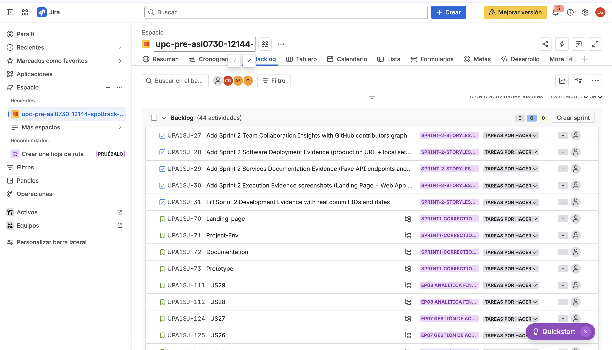

#### 5.2.2.4. Development Evidence for Sprint Review

Frontend Web Applications Commits:

| Repository | Branch | Commit Id | Commit Message | Commit Message Body | Committed on (Date) |
| :--- | :--- | :--- | :--- | :--- | :--- |
| SpotTrack-1ASI0729-2610-11881/SpotTrack-Frontend-Web-Applications | develop | d3a30e2 | Merge pull request #40 from SpotTrack-1ASI0729-2610-11881/fix/mantainance | fix: fix base infrastructure not being used | 2026-05-10 |
| SpotTrack-1ASI0729-2610-11881/SpotTrack-Frontend-Web-Applications | fix/mantainance | 94bb1f9 | fix: fix base infrastructure not being used | - | 2026-05-10 |
| SpotTrack-1ASI0729-2610-11881/SpotTrack-Frontend-Web-Applications | develop | 424a52d | Merge pull request #39 from SpotTrack-1ASI0729-2610-11881/feature/client-booking | added booking section | 2026-05-10 |
| SpotTrack-1ASI0729-2610-11881/SpotTrack-Frontend-Web-Applications | feature/client-booking | 3a88e65 | added booking section | - | 2026-05-10 |
| SpotTrack-1ASI0729-2610-11881/SpotTrack-Frontend-Web-Applications | develop | d16b42b | Merge pull request #38 from SpotTrack-1ASI0729-2610-11881/feature/analytics | chore: analytics context structured | 2026-05-10 |
| SpotTrack-1ASI0729-2610-11881/SpotTrack-Frontend-Web-Applications | feature/analytics | 0f0df28 | chore: analytics context structured | - | 2026-05-10 |
| SpotTrack-1ASI0729-2610-11881/SpotTrack-Frontend-Web-Applications | develop | 9e5e94a | Merge pull request #37 from SpotTrack-1ASI0729-2610-11881/feature/client-map | add map view | 2026-05-10 |
| SpotTrack-1ASI0729-2610-11881/SpotTrack-Frontend-Web-Applications | feature/client-map | 4f093fa | add map view | - | 2026-05-10 |
| SpotTrack-1ASI0729-2610-11881/SpotTrack-Frontend-Web-Applications | develop | e02b3e6 | Merge pull request #36 from SpotTrack-1ASI0729-2610-11881/feature/analytics | feat(analytics): add analytics section | 2026-05-09 |
| SpotTrack-1ASI0729-2610-11881/SpotTrack-Frontend-Web-Applications | feature/analytics | d224048 | feat(analytics): add analytics section | - | 2026-05-09 |
| SpotTrack-1ASI0729-2610-11881/SpotTrack-Frontend-Web-Applications | develop | 139bca7 | Merge pull request #35 from SpotTrack-1ASI0729-2610-11881/feature/client-map | separe bottombar from layout | 2026-05-09 |
| SpotTrack-1ASI0729-2610-11881/SpotTrack-Frontend-Web-Applications | feature/client-map | 9ac8232 | separe bottombar from layout | - | 2026-05-09 |
| SpotTrack-1ASI0729-2610-11881/SpotTrack-Frontend-Web-Applications | develop | 660ba4f | Merge pull request #34 from SpotTrack-1ASI0729-2610-11881/feature/mantainance | feat(mantainance): add mantainace section | 2026-05-09 |
| SpotTrack-1ASI0729-2610-11881/SpotTrack-Frontend-Web-Applications | feature/mantainance | c9a42db | feat(mantainance): add mantainace section | - | 2026-05-09 |
| SpotTrack-1ASI0729-2610-11881/SpotTrack-Frontend-Web-Applications | develop | 50ad787 | Merge pull request #33 from SpotTrack-1ASI0729-2610-11881/fast-hotfix | fixerrors | 2026-05-09 |
| SpotTrack-1ASI0729-2610-11881/SpotTrack-Frontend-Web-Applications | fast-hotfix | dd10791 | fixerrors | - | 2026-05-09 |
| SpotTrack-1ASI0729-2610-11881/SpotTrack-Frontend-Web-Applications | develop | 8bbb3e4 | Merge pull request #32 from SpotTrack-1ASI0729-2610-11881/feature/client-app | Feature/client app | 2026-05-09 |
| SpotTrack-1ASI0729-2610-11881/SpotTrack-Frontend-Web-Applications | feature/client-app | 448b08e | Merge branch 'develop' into feature/client-app | - | 2026-05-09 |
| SpotTrack-1ASI0729-2610-11881/SpotTrack-Frontend-Web-Applications | feature/client-app | 9f45f61 | add new properties client&admin | - | 2026-05-09 |
| SpotTrack-1ASI0729-2610-11881/SpotTrack-Frontend-Web-Applications | feature/client-app | f3e9dc1 | Views adjusted also added proper preview components | - | 2026-05-09 |
| SpotTrack-1ASI0729-2610-11881/SpotTrack-Frontend-Web-Applications | feature/client-app | 87e85ff | added-switch-button-between-client&admin | - | 2026-05-09 |
| SpotTrack-1ASI0729-2610-11881/SpotTrack-Frontend-Web-Applications | develop | 4522b29 | Merge pull request #31 from SpotTrack-1ASI0729-2610-11881/feature/login | fix: build fix | 2026-05-09 |
| SpotTrack-1ASI0729-2610-11881/SpotTrack-Frontend-Web-Applications | feature/login | 0053e96 | fix: build fix | - | 2026-05-09 |
| SpotTrack-1ASI0729-2610-11881/SpotTrack-Frontend-Web-Applications | develop | 7b32797 | Merge pull request #30 from SpotTrack-1ASI0729-2610-11881/feature/login | feat: add login screen | 2026-05-09 |
| SpotTrack-1ASI0729-2610-11881/SpotTrack-Frontend-Web-Applications | feature/login | 68cc54e | feat: add login screen | - | 2026-05-09 |
| SpotTrack-1ASI0729-2610-11881/SpotTrack-Frontend-Web-Applications | develop | 183bc13 | Merge pull request #29 from SpotTrack-1ASI0729-2610-11881/feature/iot-monitoring | fix: translation in iot monitoring section didnt work | 2026-05-09 |
| SpotTrack-1ASI0729-2610-11881/SpotTrack-Frontend-Web-Applications | feature/iot-monitoring | 10c6cd0 | fix: translation in iot monitoring section didnt work | - | 2026-05-09 |
| SpotTrack-1ASI0729-2610-11881/SpotTrack-Frontend-Web-Applications | develop | ae98bd6 | Merge pull request #28 from SpotTrack-1ASI0729-2610-11881/feature/iot-monitoring-2 | feat: IoT monitoring latest version | 2026-05-09 |
| SpotTrack-1ASI0729-2610-11881/SpotTrack-Frontend-Web-Applications | feature/iot-monitoring-2 | 96a0b95 | feat: IoT monitoring latest version | - | 2026-05-09 |
| SpotTrack-1ASI0729-2610-11881/SpotTrack-Frontend-Web-Applications | develop | 76b164c | Merge pull request #27 from SpotTrack-1ASI0729-2610-11881/feature/configuration | Add configuration section | 2026-05-09 |
| SpotTrack-1ASI0729-2610-11881/SpotTrack-Frontend-Web-Applications | feature/configuration | 414aa67 | Add configuration section | - | 2026-05-09 |
| SpotTrack-1ASI0729-2610-11881/SpotTrack-Frontend-Web-Applications | main | 2c1aa9b | Revert "Merge pull request #18 from SpotTrack-1ASI0729-2610-11881/US-24" | - | 2026-05-09 |
| SpotTrack-1ASI0729-2610-11881/SpotTrack-Frontend-Web-Applications | develop | 1c35ac9 | Merge pull request #25 from SpotTrack-1ASI0729-2610-11881/fix/endpoint-equipment | fix: equipents endopoint hardcoded | 2026-05-08 |
| SpotTrack-1ASI0729-2610-11881/SpotTrack-Frontend-Web-Applications | fix/endpoint-equipment | f2e5559 | fix: equipents endopoint hardcoded | - | 2026-05-08 |
| SpotTrack-1ASI0729-2610-11881/SpotTrack-Frontend-Web-Applications | develop | 2695fe5 | Merge pull request #24 from SpotTrack-1ASI0729-2610-11881/fix/endpoints | fix: register new equipment route renamed | 2026-05-08 |
| SpotTrack-1ASI0729-2610-11881/SpotTrack-Frontend-Web-Applications | fix/endpoints | 9e5b897 | fix: register new equipment route renamed | - | 2026-05-08 |
| SpotTrack-1ASI0729-2610-11881/SpotTrack-Frontend-Web-Applications | develop | cb357fc | Merge pull request #23 from SpotTrack-1ASI0729-2610-11881/fix/endpoints | fix: equipents route fixed | 2026-05-08 |
| SpotTrack-1ASI0729-2610-11881/SpotTrack-Frontend-Web-Applications | fix/endpoints | 6172264 | fix: equipents route fixed | - | 2026-05-08 |
| SpotTrack-1ASI0729-2610-11881/SpotTrack-Frontend-Web-Applications | develop | cc80283 | Merge pull request #22 from SpotTrack-1ASI0729-2610-11881/fix/endpoints | fix: rename equipent routes | 2026-05-08 |
| SpotTrack-1ASI0729-2610-11881/SpotTrack-Frontend-Web-Applications | fix/endpoints | ed95636 | fix: rename equipent routes | - | 2026-05-08 |
| SpotTrack-1ASI0729-2610-11881/SpotTrack-Frontend-Web-Applications | develop | 050fb54 | ci: add Azure Static Web Apps workflow file | - | 2026-05-08 |
| SpotTrack-1ASI0729-2610-11881/SpotTrack-Frontend-Web-Applications | develop | 83e0b66 | Merge pull request #21 from SpotTrack-1ASI0729-2610-11881/chore/production | chore: add production api | 2026-05-08 |
| SpotTrack-1ASI0729-2610-11881/SpotTrack-Frontend-Web-Applications | chore/production | 4f820da | chore: add production api | - | 2026-05-08 |
| SpotTrack-1ASI0729-2610-11881/SpotTrack-Frontend-Web-Applications | develop | 760fe04 | Merge pull request #20 from SpotTrack-1ASI0729-2610-11881/chore/production | chore: add dist folder | 2026-05-08 |
| SpotTrack-1ASI0729-2610-11881/SpotTrack-Frontend-Web-Applications | chore/production | b852edf | chore: add dist folder | - | 2026-05-08 |
| SpotTrack-1ASI0729-2610-11881/SpotTrack-Frontend-Web-Applications | develop | 65c1a21 | Merge pull request #19 from SpotTrack-1ASI0729-2610-11881/chore/dist | chore: configure rewrite rule for SPA | 2026-05-08 |
| SpotTrack-1ASI0729-2610-11881/SpotTrack-Frontend-Web-Applications | chore/dist | 75b24fd | chore: configure rewrite rule for SPA | - | 2026-05-08 |
| SpotTrack-1ASI0729-2610-11881/SpotTrack-Frontend-Web-Applications | develop | dbd63df | Merge pull request #18 from SpotTrack-1ASI0729-2610-11881/US-24 | Add initial configurations components | 2026-05-08 |
| SpotTrack-1ASI0729-2610-11881/SpotTrack-Frontend-Web-Applications | US-24 | 82b1833 | Add initial configurations components | - | 2026-05-08 |
| SpotTrack-1ASI0729-2610-11881/SpotTrack-Frontend-Web-Applications | develop | 1ed2967 | Merge pull request #17 from SpotTrack-1ASI0729-2610-11881/feature/iot-monitoring | feat: add monitoring section initial version | 2026-05-05 |
| SpotTrack-1ASI0729-2610-11881/SpotTrack-Frontend-Web-Applications | feature/iot-monitoring | a23eba3 | feat: add monitoring section initial version | - | 2026-05-05 |
| SpotTrack-1ASI0729-2610-11881/SpotTrack-Frontend-Web-Applications | develop | b8a8cf5 | Merge pull request #16 from SpotTrack-1ASI0729-2610-11881/fix/equipment | Fix/equipment | 2026-05-05 |
| SpotTrack-1ASI0729-2610-11881/SpotTrack-Frontend-Web-Applications | fix/equipment | 1dd31ba | fix: fix equipment.entity structure | - | 2026-05-05 |
| SpotTrack-1ASI0729-2610-11881/SpotTrack-Frontend-Web-Applications | fix/equipment | 91555b7 | feat: add IoT entity | - | 2026-05-05 |
| SpotTrack-1ASI0729-2610-11881/SpotTrack-Frontend-Web-Applications | develop | 985f74c | Merge pull request #15 from SpotTrack-1ASI0729-2610-11881/feature/sidebar | feat: add configuration to sidebar | 2026-05-05 |
| SpotTrack-1ASI0729-2610-11881/SpotTrack-Frontend-Web-Applications | feature/sidebar | 456b712 | feat: add configuration to sidebar | - | 2026-05-05 |
| SpotTrack-1ASI0729-2610-11881/SpotTrack-Frontend-Web-Applications | develop | 84d2e87 | Merge pull request #14 from SpotTrack-1ASI0729-2610-11881/feature/sidebar | feat: add dashboard to the sidebar | 2026-05-05 |
| SpotTrack-1ASI0729-2610-11881/SpotTrack-Frontend-Web-Applications | feature/sidebar | bc619c3 | feat: add dashboard to the sidebar | - | 2026-05-05 |
| SpotTrack-1ASI0729-2610-11881/SpotTrack-Frontend-Web-Applications | develop | c9f20a0 | Merge pull request #13 from SpotTrack-1ASI0729-2610-11881/feature/sidebar | feat(sidebar): add sidebar | 2026-05-05 |
| SpotTrack-1ASI0729-2610-11881/SpotTrack-Frontend-Web-Applications | feature/sidebar | a3d59a5 | feat(sidebar): add sidebar | - | 2026-05-05 |
| SpotTrack-1ASI0729-2610-11881/SpotTrack-Frontend-Web-Applications | develop | cd26e26 | Merge pull request #12 from SpotTrack-1ASI0729-2610-11881/feature/equipment | feat(equipment): add register equipment and equipment section | 2026-05-05 |
| SpotTrack-1ASI0729-2610-11881/SpotTrack-Frontend-Web-Applications | feature/equipment | 95f0342 | feat(equipment): add register equipment and equipment section | - | 2026-05-05 |
| SpotTrack-1ASI0729-2610-11881/SpotTrack-Frontend-Web-Applications | develop | d43d059 | Merge pull request #11 from SpotTrack-1ASI0729-2610-11881/feature/equipment | Feature/equipment | 2026-05-05 |
| SpotTrack-1ASI0729-2610-11881/SpotTrack-Frontend-Web-Applications | feature/equipment | ac98a93 | feat: working json server methods for equipment feature | - | 2026-05-05 |
| SpotTrack-1ASI0729-2610-11881/SpotTrack-Frontend-Web-Applications | feature/equipment | 6f70b17 | feat: add equipment store | - | 2026-05-04 |
| SpotTrack-1ASI0729-2610-11881/SpotTrack-Frontend-Web-Applications | develop | e1c2a86 | Merge pull request #10 from SpotTrack-1ASI0729-2610-11881/feature/equipment | feat: add partially working us-26 with json server set up | 2026-05-04 |
| SpotTrack-1ASI0729-2610-11881/SpotTrack-Frontend-Web-Applications | feature/equipment | eabed49 | feat: add partially working us-26 with json server set up | - | 2026-05-04 |
| SpotTrack-1ASI0729-2610-11881/SpotTrack-Frontend-Web-Applications | develop | 9fefd90 | Merge pull request #9 from SpotTrack-1ASI0729-2610-11881/feature/equipment | Feature/equipment | 2026-05-04 |
| SpotTrack-1ASI0729-2610-11881/SpotTrack-Frontend-Web-Applications | feature/equipment | 8ace1b1 | feat: add presentation layer for equipment related user stories | - | 2026-05-04 |
| SpotTrack-1ASI0729-2610-11881/SpotTrack-Frontend-Web-Applications | feature/equipment | c9fe227 | feat: finished equipment APIs, assemblers and reponses | - | 2026-05-04 |
| SpotTrack-1ASI0729-2610-11881/SpotTrack-Frontend-Web-Applications | feature/equipment | f5e6b9e | feat: add equipment infrastructure | - | 2026-05-04 |
| SpotTrack-1ASI0729-2610-11881/SpotTrack-Frontend-Web-Applications | develop | cd8c1a0 | Merge pull request #8 from SpotTrack-1ASI0729-2610-11881/chore/json-local-server | feat: structure equipment infrastructure | 2026-05-04 |
| SpotTrack-1ASI0729-2610-11881/SpotTrack-Frontend-Web-Applications | chore/json-local-server | bcd9596 | feat: structure equipment infrastructure | - | 2026-05-04 |
| SpotTrack-1ASI0729-2610-11881/SpotTrack-Frontend-Web-Applications | develop | cbda4b1 | Merge pull request #7 from SpotTrack-1ASI0729-2610-11881/chore/json-local-server | chore: setup db.json | 2026-05-04 |
| SpotTrack-1ASI0729-2610-11881/SpotTrack-Frontend-Web-Applications | chore/json-local-server | 6164e8c | chore: setup db.json | - | 2026-05-04 |
| SpotTrack-1ASI0729-2610-11881/SpotTrack-Frontend-Web-Applications | develop | 4caee1e | Merge pull request #6 from SpotTrack-1ASI0729-2610-11881/feature/generic-infrastructure | chore: add routing | 2026-05-04 |
| SpotTrack-1ASI0729-2610-11881/SpotTrack-Frontend-Web-Applications | feature/generic-infrastructure | d2fdd81 | chore: add routing | - | 2026-05-04 |
| SpotTrack-1ASI0729-2610-11881/SpotTrack-Frontend-Web-Applications | feature/generic-infrastructure | 13dc0d4 | chore: add routing | - | 2026-05-04 |
| SpotTrack-1ASI0729-2610-11881/SpotTrack-Frontend-Web-Applications | develop | df621bc | Merge pull request #5 from SpotTrack-1ASI0729-2610-11881/feature/generic-infrastructure | Feature/generic infrastructure | 2026-05-04 |
| SpotTrack-1ASI0729-2610-11881/SpotTrack-Frontend-Web-Applications | feature/generic-infrastructure | ec0489d | feat: add equipment bounded context presentation and i18n | - | 2026-05-04 |
| SpotTrack-1ASI0729-2610-11881/SpotTrack-Frontend-Web-Applications | feature/generic-infrastructure | b1d97c7 | docs: add class diagrams frontend | - | 2026-05-04 |
| SpotTrack-1ASI0729-2610-11881/SpotTrack-Frontend-Web-Applications | develop | 67fc548 | Merge pull request #4 from SpotTrack-1ASI0729-2610-11881/feature/generic-infrastructure | feat: add base apis, responses, entities and assembler | 2026-05-04 |
| SpotTrack-1ASI0729-2610-11881/SpotTrack-Frontend-Web-Applications | feature/generic-infrastructure | 03697f5 | feat: add base apis, responses, entities and assembler | - | 2026-05-04 |
| SpotTrack-1ASI0729-2610-11881/SpotTrack-Frontend-Web-Applications | develop | f385091 | Merge pull request #3 from SpotTrack-1ASI0729-2610-11881/feature/generic-infrastructure | feat: setup shared bounded context | 2026-05-04 |
| SpotTrack-1ASI0729-2610-11881/SpotTrack-Frontend-Web-Applications | feature/generic-infrastructure | c6345ac | feat: setup shared bounded context | - | 2026-05-04 |
| SpotTrack-1ASI0729-2610-11881/SpotTrack-Frontend-Web-Applications | develop | 7c2c65d | Merge pull request #2 from SpotTrack-1ASI0729-2610-11881/feature/US-26 | chore: add equipment bounded context | 2026-05-04 |
| SpotTrack-1ASI0729-2610-11881/SpotTrack-Frontend-Web-Applications | feature/US-26 | 8102bfa | chore: add equipment bounded context | - | 2026-05-04 |
| SpotTrack-1ASI0729-2610-11881/SpotTrack-Frontend-Web-Applications | develop | 29dcac5 | Merge pull request #1 from SpotTrack-1ASI0729-2610-11881/feature/class-diagrams | docs: add class diagrams | 2026-04-24 |
| SpotTrack-1ASI0729-2610-11881/SpotTrack-Frontend-Web-Applications | feature/class-diagrams | 1308f7a | docs: add class diagrams | - | 2026-04-24 |
| SpotTrack-1ASI0729-2610-11881/SpotTrack-Frontend-Web-Applications | feature/init-testing | 66d1157 | feat: add initial vue testing program | - | 2026-04-15 |
| SpotTrack-1ASI0729-2610-11881/SpotTrack-Frontend-Web-Applications | main | 5fd40ea | chore: initial commit | - | 2026-04-14 |
| SpotTrack-1ASI0729-2610-11881/SpotTrack-Frontend-Web-Applications | main | 39f083c | chore:second commit | - | 2026-04-06 |
| SpotTrack-1ASI0729-2610-11881/SpotTrack-Frontend-Web-Applications | main | ec1c353 | chore:initial commit | - | 2026-04-06 |
| SpotTrack-1ASI0729-2610-11881/SpotTrack-Frontend-Web-Applications | main | fd32baf | Initial commit | - | 2026-04-06 |

Landing Page Commits

| Repository | Branch | Commit Id | Commit Message | Commit Message Body | Committed on (Date) |
| :--- | :--- | :--- | :--- | :--- | :--- |
| SpotTrack-1ASI0729-2610-11881/SpotTrack-Landing-Page | develop | f6eba3a | Merge pull request #17 from SpotTrack-1ASI0729-2610-11881/feature/contact-email | feat:add-email-sender | 2026-05-09 |
| SpotTrack-1ASI0729-2610-11881/SpotTrack-Landing-Page | feature/contact-email | df0057d | feat:add-email-sender | - | 2026-05-09 |
| SpotTrack-1ASI0729-2610-11881/SpotTrack-Landing-Page | develop | ba302d6 | Merge pull request #16 from SpotTrack-1ASI0729-2610-11881/fix/contact-section-i18n | fixed:i18n contanct and footer | 2026-05-09 |
| SpotTrack-1ASI0729-2610-11881/SpotTrack-Landing-Page | fix/contact-section-i18n | cdb34bc | fixed:i18n contanct and footer | - | 2026-05-09 |
| SpotTrack-1ASI0729-2610-11881/SpotTrack-Landing-Page | develop | 62a2b97 | Merge pull request #15 from SpotTrack-1ASI0729-2610-11881/fix/contact-section | fixed: add-vuetify-components | 2026-05-07 |
| SpotTrack-1ASI0729-2610-11881/SpotTrack-Landing-Page | develop | 9380f51 | Merge pull request #13 from SpotTrack-1ASI0729-2610-11881/landing/hotfix-features | landing-fix | 2026-05-07 |
| SpotTrack-1ASI0729-2610-11881/SpotTrack-Landing-Page | landing/hotfix-features | 7564abb | landing-fix | - | 2026-05-07 |
| SpotTrack-1ASI0729-2610-11881/SpotTrack-Landing-Page | feature/contact-section | a95b603 | Merge branch 'develop' into feature/contact-section | - | 2026-05-07 |
| SpotTrack-1ASI0729-2610-11881/SpotTrack-Landing-Page | feature/contact-section | 248395f | fixed: add-vuetify-components | - | 2026-05-07 |
| SpotTrack-1ASI0729-2610-11881/SpotTrack-Landing-Page | develop | 009da6e | Merge pull request #11 from SpotTrack-1ASI0729-2610-11881/feature/footer-section | feat:add-footer-section | 2026-05-07 |
| SpotTrack-1ASI0729-2610-11881/SpotTrack-Landing-Page | feature/footer-section | 914917c | Merge branch 'develop' into feature/footer-section | - | 2026-05-07 |
| SpotTrack-1ASI0729-2610-11881/SpotTrack-Landing-Page | feature/footer-section | 04fb8c8 | feat:add-footer-section | - | 2026-05-07 |
| SpotTrack-1ASI0729-2610-11881/SpotTrack-Landing-Page | develop | db87823 | Merge pull request #10 from SpotTrack-1ASI0729-2610-11881/landing/features-section | Landing/features section | 2026-05-07 |
| SpotTrack-1ASI0729-2610-11881/SpotTrack-Landing-Page | landing/features-section | ae25905 | landing-feature-implementation-v2 | - | 2026-05-07 |
| SpotTrack-1ASI0729-2610-11881/SpotTrack-Landing-Page | landing/features-section | de4178a | landing-feature-implementation | - | 2026-05-07 |
| SpotTrack-1ASI0729-2610-11881/SpotTrack-Landing-Page | develop | d98b24a | Merge pull request #9 from SpotTrack-1ASI0729-2610-11881/feature/contact-section | Feature/contact section | 2026-05-05 |
| SpotTrack-1ASI0729-2610-11881/SpotTrack-Landing-Page | feature/contact-section | 212b557 | feat:source correction | - | 2026-05-05 |
| SpotTrack-1ASI0729-2610-11881/SpotTrack-Landing-Page | feature/contact-section | f083ae0 | Merge branch 'feature/contact-section' into feature/contact-section | - | 2026-05-05 |
| SpotTrack-1ASI0729-2610-11881/SpotTrack-Landing-Page | feature/contact-section | c5e629f | feat:add-contact | - | 2026-05-05 |
| SpotTrack-1ASI0729-2610-11881/SpotTrack-Landing-Page | develop | 11cb386 | Merge pull request #8 from SpotTrack-1ASI0729-2610-11881/chore/github-pages | fix: github pages only showed readme.md | 2026-05-05 |
| SpotTrack-1ASI0729-2610-11881/SpotTrack-Landing-Page | chore/github-pages | 742612a | fix: github pages only showed readme.md | - | 2026-05-05 |
| SpotTrack-1ASI0729-2610-11881/SpotTrack-Landing-Page | develop | 8c34fe6 | Merge pull request #7 from SpotTrack-1ASI0729-2610-11881/chore/github-pages | Chore/GitHub pages | 2026-05-05 |
| SpotTrack-1ASI0729-2610-11881/SpotTrack-Landing-Page | chore/github-pages | 1fb2b77 | fix: switch deployment branch | - | 2026-05-05 |
| SpotTrack-1ASI0729-2610-11881/SpotTrack-Landing-Page | chore/github-pages | 1831ca2 | chore: add github pages | - | 2026-05-05 |
| SpotTrack-1ASI0729-2610-11881/SpotTrack-Landing-Page | develop | b414365 | Merge pull request #6 from SpotTrack-1ASI0729-2610-11881/fix/stripe | fix: add environments and services | 2026-05-05 |
| SpotTrack-1ASI0729-2610-11881/SpotTrack-Landing-Page | fix/stripe | 7c2a041 | fix: add environments and services | - | 2026-05-05 |
| SpotTrack-1ASI0729-2610-11881/SpotTrack-Landing-Page | develop | cf91d30 | Merge pull request #5 from SpotTrack-1ASI0729-2610-11881/feature/hero-header | fix: fix login button height | 2026-05-03 |
| SpotTrack-1ASI0729-2610-11881/SpotTrack-Landing-Page | feature/hero-header | f3804cb | fix: fix login button height | - | 2026-05-03 |
| SpotTrack-1ASI0729-2610-11881/SpotTrack-Landing-Page | feature/hero-header | d3b9348 | fix: fix login button height | - | 2026-05-03 |
| SpotTrack-1ASI0729-2610-11881/SpotTrack-Landing-Page | develop | 6357640 | Merge pull request #4 from SpotTrack-1ASI0729-2610-11881/feature/hero-header | fix: hero section completed | 2026-05-03 |
| SpotTrack-1ASI0729-2610-11881/SpotTrack-Landing-Page | feature/hero-header | cb21759 | fix: hero section completed | - | 2026-05-03 |
| SpotTrack-1ASI0729-2610-11881/SpotTrack-Landing-Page | develop | ae2957c | Merge pull request #3 from SpotTrack-1ASI0729-2610-11881/feature/niubiz | feat(stripe): add stripe payments | 2026-05-03 |
| SpotTrack-1ASI0729-2610-11881/SpotTrack-Landing-Page | feature/niubiz | 1aa12f4 | feat(stripe): add stripe payments | - | 2026-05-03 |
| SpotTrack-1ASI0729-2610-11881/SpotTrack-Landing-Page | develop | db9a16c | Merge pull request #2 from SpotTrack-1ASI0729-2610-11881/feature/pricing | fix: fix pricing cards organization | 2026-05-03 |
| SpotTrack-1ASI0729-2610-11881/SpotTrack-Landing-Page | feature/pricing | b996a8a | fix: fix pricing cards organization | - | 2026-05-03 |
| SpotTrack-1ASI0729-2610-11881/SpotTrack-Landing-Page | develop | 8b00971 | Merge pull request #1 from SpotTrack-1ASI0729-2610-11881/feature/pricing | Feature/pricing | 2026-05-03 |
| SpotTrack-1ASI0729-2610-11881/SpotTrack-Landing-Page | feature/pricing | d732028 | feat(pricing): add pricing section | - | 2026-05-03 |
| SpotTrack-1ASI0729-2610-11881/SpotTrack-Landing-Page | feature/pricing | 76e113d | feat(en-es): add diciontarios for en and es | - | 2026-05-03 |
| SpotTrack-1ASI0729-2610-11881/SpotTrack-Landing-Page | feature/pricing | 0138b31 | feat(i18n): add language switcher component | - | 2026-05-03 |
| SpotTrack-1ASI0729-2610-11881/SpotTrack-Landing-Page | feature/pricing | 68b1da4 | chore: add translate service | - | 2026-05-03 |
| SpotTrack-1ASI0729-2610-11881/SpotTrack-Landing-Page | develop | e480ef9 | feat(hero-section): add background animations | - | 2026-04-19 |
| SpotTrack-1ASI0729-2610-11881/SpotTrack-Landing-Page | develop | ed84ec5 | feat: add header | - | 2026-04-19 |
| SpotTrack-1ASI0729-2610-11881/SpotTrack-Landing-Page | develop | 6a2919f | chore: project-setup | - | 2026-04-18 |
| SpotTrack-1ASI0729-2610-11881/SpotTrack-Landing-Page | main | 3871093 | Initial commit | - | 2026-04-18 |

#### 5.2.2.5. Execution Evidence for Sprint Review

Se logró desplegar una primera versión de la aplicación web, se reailzaron correcciones en los diagramas C4, diagramas de clase, diagramas de base de datos, calidad de imágenes de figma. Finalmente, se desplegó el landing page completamente funcional con call-to-action.

Execution evidence video: https://upcedupe-my.sharepoint.com/:v:/g/personal/u202413214_upc_edu_pe/IQBQX52QrrC0Q5BvU9mkmvuKAdN-F57suH5kYTvjIZEDCQA?e=cdBXo1&nav=eyJyZWZlcnJhbEluZm8iOnsicmVmZXJyYWxBcHAiOiJTdHJlYW1XZWJBcHAiLCJyZWZlcnJhbFZpZXciOiJTaGFyZURpYWxvZy1MaW5rIiwicmVmZXJyYWxBcHBQbGF0Zm9ybSI6IldlYiIsInJlZmVycmFsTW9kZSI6InZpZXcifX0%3D

#### 5.2.2.6. Services Documentation Evidence for Sprint Review

Para este Sprint, se ha implementado y desplegado con éxito un Mock API utilizando JSON-Server, alojado en Azure App Service. Este servicio proporciona un backend funcional para el proyecto SpotTrack, permitiendo la persistencia de datos y la integración con el frontend. Se configuró un flujo de CI/CD mediante GitHub Actions, integrando el perfil de publicación de Azure como un secreto de organización. La API está configurada con un prefijo /api/v1 y soporta operaciones CRUD completas, facilitando el desarrollo paralelo de las funcionalidades de monitoreo de equipos y gestión de dispositivos IoT.

##### 5.2.2.7. Relación de Endpoints Documentados

| Endpoint | Acción | Verbo HTTP | Sintaxis de Llamada      | Ejemplo de Response | Explicación |
|---|---|---|--------------------------|---|---|
| `/gyms` | Listar / Crear | `GET`, `POST` | `/api/v1/gyms`           | `{ "id": 1, "name": "FitNode Central", "subscription_tier": "Premium", "created_at": "2026-05-01T10:00:00Z" }` | Gestión de la entidad principal del gimnasio. |
| `/branches` | Listar / Crear | `GET`, `POST` | `/api/v1/branches`               | `{ "id": 1, "gym_id": 1, "name": "Main Branch", "address": "123 Main Street", "city": "Lima" }` | Información de sedes físicas. |
| `/zones` | Listar / Crear | `GET`, `POST` | `/api/v1/zones`                 | `{ "id": 1, "branch_id": 1, "name": "Cardio Zone", "capacity_limit": 20 }` | Áreas específicas dentro de una sede (ej. Cardio). |
| `/users` | Listar / Crear | `GET`, `POST` | `/api/v1/users`                 | `{ "id": 1, "gym_id": 1, "name": "Admin User", "email": "admin@fitnode.com", "role": "ADMIN" }` | Gestión de acceso y perfiles de usuario. |
| `/equipments` | Listar / Crear | `GET`, `POST` | `/api/v1/equipments`             | `{ "id": 1, "zone_id": 1, "name": "Treadmill", "brand": "Life Fitness", "model": "T5 Track", "status": "OPERATIONAL" }` | Inventario de máquinas de entrenamiento. |
| `/iot_devices` | Listar / Crear | `GET`, `POST` | `/api/v1/iot_devices`           | `{ "id": 1, "equipment_id": 1, "mac_address": "AA:BB:CC:DD:01", "status": "ACTIVE" }` | Dispositivos de monitoreo vinculados a equipos. |
| `/sensor_data` | Listar / Crear | `GET`, `POST` | `/api/v1/sensor_data`           | `{ "id": 1, "device_id": 1, "timestamp": "2026-05-04T09:00:00Z", "occupancy_detected": true, "vibration_index": 0.75 }` | Captura de telemetría y detección de ocupación. |
| `/usage_sessions` | Listar / Crear | `GET`, `POST` | `/api/v1/usage_sessions`        | `{ "id": 1, "equipment_id": 1, "start_time": "2026-05-04T08:00:00Z", "end_time": "2026-05-04T08:30:00Z", "calories_burned_est": 250.5 }` | Historial de uso de máquinas por sesión. |
| `/equipment_usage_stats` | Listar / Crear | `GET`, `POST` | `/api/v1/equipment_usage_stats` | `{ "id": 1, "equipment_id": 1, "total_usage_hours": 120.5, "usage_count_daily": 8, "estimated_wear_level": 0.35 }` | Estadísticas acumuladas y nivel de desgaste. |
| `/maintenance_tickets` | Listar / Crear | `GET`, `POST` | `/api/v1/maintenance_tickets`   | `{ "id": 1, "equipment_id": 2, "status": "OPEN", "priority": "HIGH", "type": "CORRECTIVE" }` | Registro de fallos y tickets de reparación. |
| `/maintenance_logs` | Listar / Crear | `GET`, `POST` | `/api/v1/maintenance_logs`      | `{ "id": 1, "ticket_id": 1, "action_description": "Replaced internal belt", "cost": 150.0 }` | Bitácora de acciones realizadas en mantenimientos. |
| `/maintenance_schedules` | Listar / Crear | `GET`, `POST` | `/api/v1/maintenance_schedules` | `{ "id": 1, "equipment_id": 1, "scheduled_date": "2026-06-01", "task_type": "LUBRICATION" }` | Planificación de mantenimientos preventivos. |
| `/spare_parts` | Listar / Crear | `GET`, `POST` | `/api/v1/spare_parts`           | `{ "id": 1, "gym_id": 1, "part_name": "Treadmill Belt", "stock_quantity": 5, "unit_cost": 80.0 }` | Inventario de repuestos para equipos. |
| `/alerts` | Listar / Crear | `GET`, `POST` | `/alerts`                | `{ "id": 1, "equipment_id": 4, "severity": "CRITICAL", "message": "Equipment out of order", "is_resolved": false }` | Notificaciones de estado crítico de equipos. |
| `/notifications` | Listar / Crear | `GET`, `POST` | `/api/v1/notifications`         | `{ "id": 1, "user_id": 1, "title": "Critical Alert", "content": "Lat Pulldown Machine is out of order", "is_read": false }` | Mensajes enviados a usuarios finales. |

##### 5.2.2.8. Evidencias de Interacción con la Documentación

###### 5.2.2.8.1 Disponibilidad del Servicio
Validación del endpoint /api/v1/health que confirma el estado "ok" del servidor en Azure.
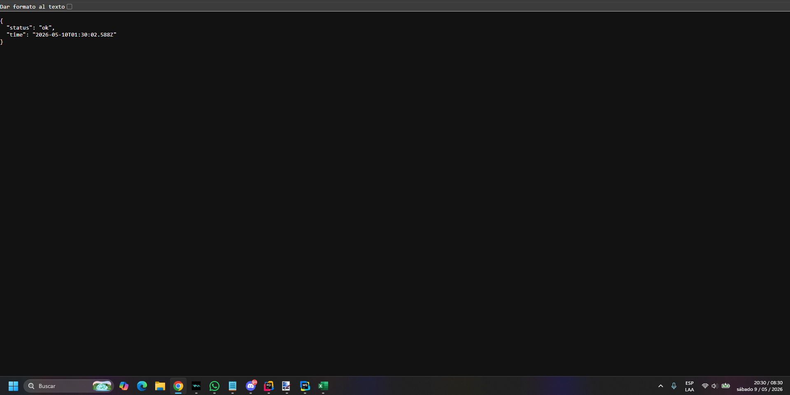

###### 5.2.2.8.2. Interacción con Recurso Equipments
Visualización de los datos de equipos obtenidos directamente desde el App Service de Azure.

##### 5.2.2.9. Repositorio y Trazabilidad de Documentación

Para asegurar la transparencia y el seguimiento de los cambios, se detallan los enlaces a los repositorios de la organización.

URL Repositorio Mock API: https://github.com/SpotTrack-1ASI0729-2610-11881/SpotTrack-Mock-Api

URL Repositorio Frontend: https://lively-ground-08011af0f.7.azurestaticapps.net/login

URL Repositorio Landing Page: https://spottrack.github.io/spottrack-website/

#### 5.2.2.10. Software Deployment Evidence for Sprint Review

Como parte de la tarea **CORR-05**, la Landing Page de SpotTrack fue desplegada exitosamente en **GitHub Pages** durante este Sprint 2. El proceso se automatizó mediante el workflow de GitHub Actions definido en `.github/workflows/deploy.yml`, el cual se activa con cada `push` a la rama `main` del repositorio `SpotTrack-Landing-Page`, asegurando despliegues continuos sin fricción.

| Producto | Entorno | URL de Producción |
| :--- | :--- | :--- |
| SpotTrack Landing Page | GitHub Pages (producción) | https://spottrack.github.io/spottrack-website/ |

La siguiente figura muestra la Landing Page de SpotTrack correctamente desplegada y funcional en el entorno de producción de GitHub Pages:

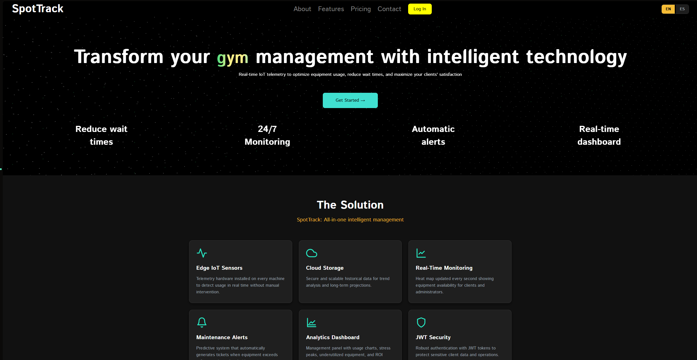

Por parte de la aplicación web (Vue SPA), se utilizó un static web app de Azure para realizar el despliegue. Para ello, simplemente se configura la organización, repositorio y rama deseada en donde se va desplegar la aplicación, esto se vincula a un Github Actions. La activación de este último sucede en cada push a develop.

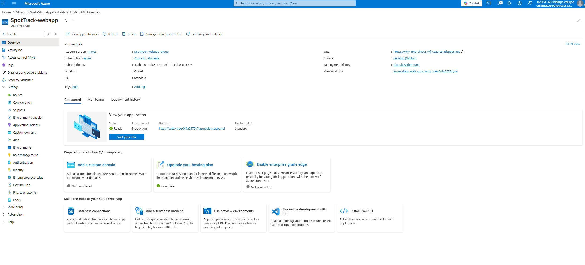
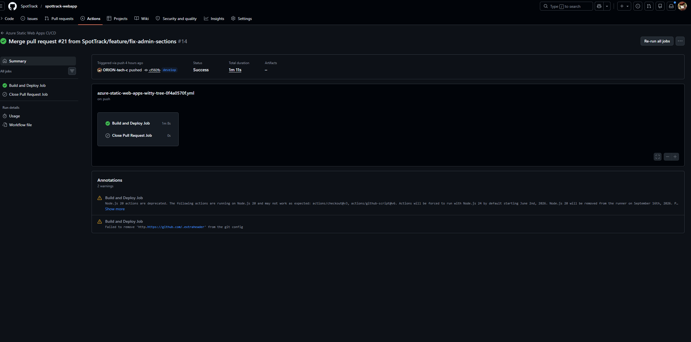

Webapp URL: https://lively-ground-08011af0f.7.azurestaticapps.net/login

#### 5.2.2.11. Team Collaboration Insights during Sprint

A continuación todas las estadisticas que nos proporciona Github, en su apartado de Insights, sobre la colaboración del equipo en los repositorios de webbapp y website:

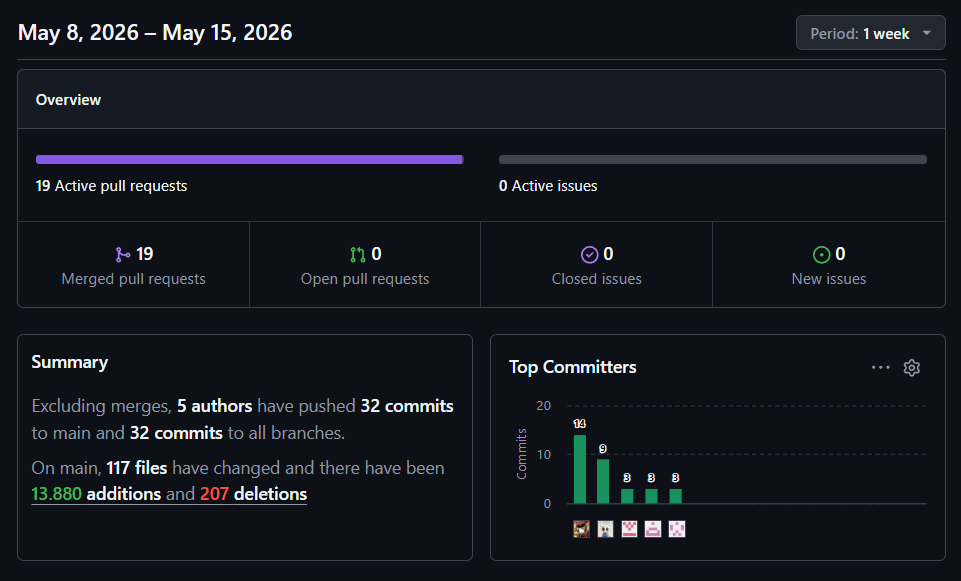

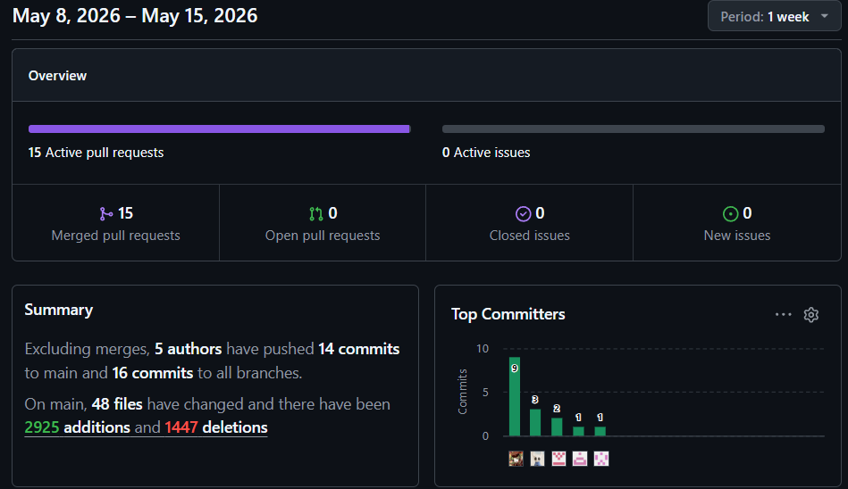

#### 5.2.3. Sprint 3
En esta sección se registra y explica el avance en términos de producto y trabajo
colaborativo para el Sprint 3. Incluye como secciones internas: Sprint Planning 3,
Aspect Leaders and Collaborators, Sprint Backlog 3, Development Evidence for Sprint
Review, Execution Evidence for Sprint Review, Services Documentation Evidence for
Sprint Review, junto con Team Collaboration Insights during Sprint.

#### 5.2.3.1.Spring Planning 3.
En esta sección se especifica los aspectos principales del Sprint Planning Meeting. Se inicia la sección con una introducción y a continuación se coloca el cuadro de
resumen del sprint planning meeting. La estructura a utilizar se presenta a
continuación.

| Sprint 3 | Sprint 3                                                                                                                                                          |
| :--- |:-------------------------------------------------------------------------------------------------------------------------------------------------------------------|
| **Sprint Planning Background** |                                                                                                                                                                    |
| Date | 20-06-2026                                                                                                                                                         |
| Time | 23:59                                                                                                                                                             |
| Location | Reunion Virtual Via Discord                                                                                                                                                        |
| Prepared By | Gallardo Morales, Carla Alejnadra                                                                                                                                   |
| Attendees (to planning meeting) | Gallardo Morales Carla Alejandra, Fernández Linares Alvaro Sebastian, Espinoza Orrego Valentino Andre      |
| Sprint 2 Review Summary | Sprint 2 entregó una primera versión del frontend de la aplicación web desplegada correctamente. Asimismo, se desplegó una versión de la Landing Page culminada en un 90%. Sin embargo, solo se aplicó el 60% de las correcciones indicadas en el Sprint 1, quedando pendiente completar las correcciones restantes.|
| Sprint 2 Retrospective Summary | El equipo identificó la ausencia de un proceso de QA formal como principal área de mejora, originada porque no todo estuvo terminado a tiempo. Se resaltó la necesidad de establecer deadlines claros, rastrear el progreso por capítulo y realizar releases oportunos. Se reconoció una mejora en el equilibrio de la carga de trabajo respecto al Sprint 1, aunque persistieron errores arrastrados del sprint anterior. También se señaló la falta de comunicación en la delegación de tareas y la importancia de que todos los integrantes se mantengan al tanto del avance general del equipo para facilitar un mejor QA colectivo. Como aciertos, se destacaron el cumplimiento de entregas por miembro en su mayoría, la mejora en el uso de GitFlow y el despliegue correcto del frontend con progreso decente.|
| **Sprint Goal & User Stories** |                                                                                                                                                                    |
| Sprint 3 Goal | Nuestro enfoque es habilitar a los administradores de gimnasios para gestionar sus operaciones y a los clientes de gimnasio para registrar su actividad física a través de una plataforma web completamente conectada. Creemos que esto entrega una experiencia integral y sin fricciones —desde la gestión de cuentas hasta el seguimiento de sesiones— a administradores y clientes de gimnasio. Esto se confirmará cuando los participantes de las entrevistas de validación de ambos segmentos puedan completar exitosamente sus tareas principales en la aplicación desplegada sin bloqueos críticos. |
| Sprint 3 Velocity | 45                                                                                                                                                             |
| Sum of Story Points | 45     

#### 5.2.3.2. Aspect Leaders and Collaborators.
Para este Sprint 3, el equipo concentró sus esfuerzos en el desarrollo del backend con Spring Boot. La división de trabajo se organizó por Bounded Contexts del dominio, permitiendo que cada integrante tomara ownership completo sobre uno o varios contextos delimitados.

| Team Member (Last Name, First Name) | GitHub Username | Aspect 1: Backend Gym & Equipment BC Leader (L) / Collaborator (C) | Aspect 2: Backend IAM & Profiles BC Leader (L) / Collaborator (C) | Aspect 3: Validation Interviews Leader (L) / Collaborator (C) | Aspect 4: Sprint 2 Corrections Leader (L) / Collaborator (C) |
| :--- | :--- | :--- | :--- | :--- | :--- |
| Fernández Linares, Alvaro Sebastian | ORION-tech-c | Profiles BC / Routines BC (L) | IAM BC (L) | Segment 2 (L) | C4 Diagram Revision (C) |
| Gallardo Morales, Carla Alejandra| Carlsss28 | Membership/ Maintenance/ Reservation BC (L) | IAM BC (C) | Segment 1 (C) | Corrections (C) |
| Espinoza Orrego, Valentino Andre | valentinoespinoza13 | Analytics BC (C) | (C) | Segment 1 (L) | Figma Documentation (L) |

#### Sprint Backlog 3

| Id | Title | Task Id | Task Title | Assigned To | Status |
| :--- | :--- | :--- | :--- | :--- | :--- |
| UPA1SJ-183 | Web Services | UPA1SJ-184 | Monitoring | ORION10 | En curso |
| UPA1SJ-183 | Web Services | UPA1SJ-185 | Equipment | ORION10 | Finalizada |
| UPA1SJ-183 | Web Services | UPA1SJ-186 | Reservation | Carla Gallardo | Finalizada |
| UPA1SJ-183 | Web Services | UPA1SJ-187 | Maintenance | Carla Gallardo | Finalizada |
| UPA1SJ-183 | Web Services | UPA1SJ-188 | Iot Sensoring Gestion | ORION10 | Tareas por hacer |
| UPA1SJ-183 | Web Services | UPA1SJ-189 | Analytics | Andre Espinoza | Tareas por hacer |
| UPA1SJ-183 | Web Services | UPA1SJ-190 | Membership | Carla Gallardo | Finalizada |
| UPA1SJ-183 | Web Services | UPA1SJ-191 | Routines | ORION10 | Finalizada |
| UPA1SJ-183 | Web Services | UPA1SJ-192 | Profiles | ORION10 | Finalizada |
| UPA1SJ-183 | Web Services | UPA1SJ-193 | Auth(IAM) | ORION10 | En curso |

#### 5.2.3.4.Development Evidence for Sprint Review.

El principal trabajo del Sprint 3 se concentró en el repositorio byteguard-platform, correspondiente al backend desarrollado con Spring Boot. A continuación se presentan los commits más representativo.

Esta tabla resume el avance del repo por bounded context (IAM, Gym, Equipment, Membership, Reservation, Maintenance, Routine, Analytics) hasta el último merge a develop.  

Backend Web Services Commits:

| Repository | Branch | Commit Id | Commit Message | Commit Message Body | Committed on (Date) |
| :--- | :--- | :--- | :--- | :--- | :--- |
| upc-pre-202610-1asi0730-12144-bytesquad/bytesquad-platform | main | 9d1bdf2fa40f06c626567f7c30d209d8de915c3c | chore: remove .idea from tracking | - | 2026-06-11 |
| upc-pre-202610-1asi0730-12144-bytesquad/bytesquad-platform | feature/shared | e233840419d66f69ae6c1babcb49b7bd1874bd82 | shared complete setted | - | 2026-06-12 |
| upc-pre-202610-1asi0730-12144-bytesquad/bytesquad-platform | feature/profiles-bounded | 9e1e86c9b500e31bfbedb82e36648ac0e19d7160 | remove innecesary data, added new ones | - | 2026-06-12 |
| upc-pre-202610-1asi0730-12144-bytesquad/bytesquad-platform | feat/commands-analytics | 53e9b57bde0726fe36b052e2e6f4bd9ad24f95ed | docs: commands added | - | 2026-06-13 |
| upc-pre-202610-1asi0730-12144-bytesquad/bytesquad-platform | feature/create-routine | d162a827ef592650a6f80a19ea871d1c322dab8e | feat(routine): fix comment error | - | 2026-06-14 |
| upc-pre-202610-1asi0730-12144-bytesquad/bytesquad-platform | feature/iam-core | 9ee3c2bb002acce30a974b0b0b2dcffee0c9151e | fix(iam): change length of token secret | - | 2026-06-17 |
| upc-pre-202610-1asi0730-12144-bytesquad/bytesquad-platform | feature/gym-create-branch | f2e5b75b2f6050939913c13cc9bcad886451124c | feat(gym): add migration AddGymBranches creating branches table with FK to gyms | - | 2026-06-17 |
| upc-pre-202610-1asi0730-12144-bytesquad/bytesquad-platform | feature/gym-create-gym | 3e06d3ce90d3958c308b3e3756b0823e95e8c027 | feat(gym): add migration AddGymCreateGym creating gyms table | - | 2026-06-17 |
| upc-pre-202610-1asi0730-12144-bytesquad/bytesquad-platform | feature/membership-activate-membership | e96ac7d7b4055ee46f2d4f38bd3394f4efcad04c | feat(membership): add migration creating memberships table | - | 2026-06-17 |
| upc-pre-202610-1asi0730-12144-bytesquad/bytesquad-platform | feature/start-routine | 0d0bb7cc9a524056495a69a0604d3dca542e32fd | feat(routine): add routine-sessions migration | - | 2026-06-17 |
| upc-pre-202610-1asi0730-12144-bytesquad/bytesquad-platform | feature/add-exercise-block | bdc23ed0011bd22452684fd831ac041f1b27041f | fix(routines): fix null values error | - | 2026-06-17 |
| upc-pre-202610-1asi0730-12144-bytesquad/bytesquad-platform | feature/gym-create-zone | de308923b7b3621b37d73286295b0008d24a37f4 | feat(gym): changes in gym repository | - | 2026-06-18 |
| upc-pre-202610-1asi0730-12144-bytesquad/bytesquad-platform | feature/gym-register-equipment | 951e6dae4761d4127781dbf310056d106048ab45 | feat(gyms): add AddEquipment EF Core migration | - | 2026-06-18 |
| upc-pre-202610-1asi0730-12144-bytesquad/bytesquad-platform | feature/equipment-occupy-release | 55ef38f03fda5f71d98af0083f724d27d68de2e6 | feat(gyms): register IGymContextFacade in DI container | - | 2026-06-18 |
| upc-pre-202610-1asi0730-12144-bytesquad/bytesquad-platform | feature/maintenance-request-maintenance | c1417831e89fcba1813ebaea9e98a8e98fa3e536 | feat(maintenance): add migration AddMaintenanceBoundedContext creating maintenances table | - | 2026-06-19 |
| upc-pre-202610-1asi0730-12144-bytesquad/bytesquad-platform | feature/maintenance-create-technical-ticket | c0e401c3f7699a706a41b93a7cd02968109db6cc | feat(maintenance): add migration creating technical_tickets table | - | 2026-06-19 |
| upc-pre-202610-1asi0730-12144-bytesquad/bytesquad-platform | feature/maintenance-assign-technical-ticket | ade6085b51b00d894d1407f51a7d7435326f85fd | feat(maintenance): add POST assign endpoint to TechnicalTicketController | - | 2026-06-19 |
| upc-pre-202610-1asi0730-12144-bytesquad/bytesquad-platform | feature/maintenance-complete-maintenance | 583412f6e74d6576c26ecba713024c6c662a761e | feat(maintenance): add POST complete endpoint to TechnicalTicketController | - | 2026-06-20 |
| upc-pre-202610-1asi0730-12144-bytesquad/bytesquad-platform | feature/maintenance-update-maintenance-status | cc9c1e721eda50b087f296c03d843f56f3bebca5 | feat(maintenance): add PUT maintenance-status endpoint to TechnicalTicketController | - | 2026-06-20 |
| upc-pre-202610-1asi0730-12144-bytesquad/bytesquad-platform | feature/analytics-request-activity-analysis | e71eb2bba2185d705b04c76db89f5c40e05d0890 | feat(analytics): complete request activity analysis feature with strict DDD tactics | - | 2026-06-21 |
| upc-pre-202610-1asi0730-12144-bytesquad/bytesquad-platform | feature/analytics-generate-roi-projection | cd89c5ba84402a4934ae69dd2952103a2bac2004 | feat(analytics): implement request ROI command feature | - | 2026-06-21 |
| upc-pre-202610-1asi0730-12144-bytesquad/bytesquad-platform | fix/analytics-backend | 18fbe13b5395b58c3f48ee323f7c356e6c970011 | fix(analytics): register analytics services and repositories in DI | - | 2026-06-21 |
| upc-pre-202610-1asi0730-12144-bytesquad/bytesquad-platform | develop | 9b8311275103aee09cb03b439afd4b644dd07ae6 | Merge pull request #59 from fix/analytics-backend | Fix/analytics backend | 2026-06-21 |

#### 5.2.3.5.Execution Evidence for Sprint Review.

Durante el Sprint 3, el equipo concretó la transición de una arquitectura basada en Fake API (JSON Server) a un backend real implementado con Spring Boot. La plataforma `spottrack-platform` fue construida siguiendo los principios de Domain-Driven Design, con Bounded Contexts claramente delimitados: **Gym** (gestión de sedes, zonas y umbral de mantenimiento), **Equipment** (registro, actualización de estado, retiro y reubicación de activos), **Maintenance** (tickets técnicos, trabajos de mantenimiento y bitácora), **Reservation** (reservas exprés con temporizador), **Profiles** (perfiles de administrador y cliente), **IAM** (autenticación JWT, registro, login y desactivación de cuenta) y **Routines** (sesiones de rutina).

Los Bounded Contexts se comunicaron mediante eventos de integración, implementando el patrón de ACL (Anti-Corruption Layer): el evento `TicketCreatedEvent` disparó la política que marcó el equipo como fuera de servicio en el Gym BC, y el evento `TicketResolvedEvent` disparó la política que actualizó el estado del equipo a disponible al completar el mantenimiento.

La integración frontend-backend se logró sin modificaciones a los componentes vue del Sprint 2, al respetar el contrato de API documentado desde la etapa de Fake API. Únicamente fue necesario actualizar la URL base en `environment.ts`.

#### 5.2.3.6.Services Documentation Evidence for Sprint Review.
El backend fue construido con **ASP.NET Core (C#)** y expone una API RESTful versionada bajo `api/v1`, protegida con JWT (Bearer Token). A continuación se detallan los principales endpoints implementados por Bounded Context.

##### Bounded Context: IAM (Identity & Access Management)

| Endpoint | Acción | Verbo HTTP | Sintaxis de Llamada | Ejemplo de Response | Explicación |
| :--- | :--- | :--- | :--- | :--- | :--- |
| `/api/v1/authentication/sign-up` | Registrar usuario | `POST` | `/api/v1/authentication/sign-up` | `201 Created` (sin body) | Crea una nueva cuenta de usuario con username, password y rol. Endpoint anónimo (no requiere token). |
| `/api/v1/authentication/sign-in` | Autenticar usuario | `POST` | `/api/v1/authentication/sign-in` | `{ "id": 1, "username": "admin@gym.com", "role": "Admin", "token": "eyJ..." }` | Valida credenciales y retorna un Bearer Token JWT para autenticación posterior. Endpoint anónimo. |
| `/api/v1/users` | Listar usuarios | `GET` | `/api/v1/users` | `[{ "id": 1, "username": "admin@gym.com", "role": "Admin" }]` | Retorna todos los usuarios registrados. Requiere autenticación. |

##### Bounded Context: Gym (Gestión de Instalaciones)

| Endpoint | Acción | Verbo HTTP | Sintaxis de Llamada | Ejemplo de Response | Explicación |
| :--- | :--- | :--- | :--- | :--- | :--- |
| `/api/v1/gyms` | Crear gimnasio | `POST` | `/api/v1/gyms` | `{ "id": 1, "name": "FitNode Central", "street": "Av. Javier Prado 123", "district": "San Isidro", "city": "Lima" }` | Registra un nuevo gimnasio en el sistema. Requiere autenticación. |
| `/api/v1/gyms/{gymId}/branches` | Agregar sede | `POST` | `/api/v1/gyms/1/branches` | `{ "id": 1, "name": "Main Branch", "street": "...", "district": "...", "city": "..." }` | Añade una sede física al gimnasio indicado. Retorna 404 si el gimnasio no existe. |
| `/api/v1/gyms/{gymId}/branches/{branchId}/zones` | Agregar zona | `POST` | `/api/v1/gyms/1/branches/1/zones` | `{ "id": 1, "name": "Cardio Zone" }` | Crea una zona dentro de una sede. Retorna 404 si el gimnasio o la sede no existen. |
| `/api/v1/equipment` | Registrar equipo | `POST` | `/api/v1/equipment` | `{ "id": 1, "name": "Treadmill T-500", "zoneId": 1, "status": "Available" }` | Registra un nuevo equipo dentro de una zona. Retorna 404 si la zona no existe. |

##### Bounded Context: Profiles (Perfiles de Usuario)

| Endpoint | Acción | Verbo HTTP | Sintaxis de Llamada | Ejemplo de Response | Explicación |
| :--- | :--- | :--- | :--- | :--- | :--- |
| `/api/v1/profiles/admins` | Crear perfil de administrador | `POST` | `/api/v1/profiles/admins` | `{ "id": 1, "userId": 1, "fullName": "Juan Pérez", "email": "juan@gym.com", "phoneNumber": "...", "dni": "..." }` | Crea el perfil de administrador asociado a un usuario. Retorna 409 si el email ya está registrado. |
| `/api/v1/profiles/admins/{adminId}` | Obtener administrador | `GET` | `/api/v1/profiles/admins/1` | `{ "id": 1, "userId": 1, "fullName": "Juan Pérez", ... }` | Retorna el perfil de administrador, o 404 si no existe. |
| `/api/v1/profiles/admins` | Listar administradores | `GET` | `/api/v1/profiles/admins` | `[{ "id": 1, "fullName": "Juan Pérez", ... }]` | Retorna todos los perfiles de administrador registrados. |
| `/api/v1/profiles/admins/{adminId}` | Actualizar administrador | `PUT` | `/api/v1/profiles/admins/1` | `{ "id": 1, "fullName": "Juan Pérez García", ... }` | Actualiza nombre, apellido y teléfono del administrador. |
| `/api/v1/profiles/clients` | Crear perfil de cliente | `POST` | `/api/v1/profiles/clients` | `{ "id": 1, "userId": 2, "fullName": "Ana López", "email": "ana@mail.com", ... }` | Crea el perfil de cliente asociado a un usuario. Retorna 409 si el email ya está registrado. |
| `/api/v1/profiles/clients/{clientId}` | Obtener cliente | `GET` | `/api/v1/profiles/clients/1` | `{ "id": 1, "fullName": "Ana López", ... }` | Retorna el perfil de cliente, o 404 si no existe. |
| `/api/v1/profiles/clients` | Listar clientes | `GET` | `/api/v1/profiles/clients` | `[{ "id": 1, "fullName": "Ana López", ... }]` | Retorna todos los perfiles de cliente registrados. |
| `/api/v1/profiles/clients/{clientId}` | Actualizar cliente | `PUT` | `/api/v1/profiles/clients/1` | `{ "id": 1, "fullName": "Ana López Ruiz", ... }` | Actualiza nombre, apellido y teléfono del cliente. |

##### Bounded Context: Membership (Membresías y Acceso)

| Endpoint | Acción | Verbo HTTP | Sintaxis de Llamada | Ejemplo de Response | Explicación |
| :--- | :--- | :--- | :--- | :--- | :--- |
| `/api/v1/memberships/activate` | Activar membresía | `POST` | `/api/v1/memberships/activate` | `{ "id": 1, "clientId": 1, "plan": "Premium", "startDate": "...", "endDate": "...", "status": "Active" }` | Activa una nueva membresía para un cliente. |
| `/api/v1/memberships/{id}` | Obtener membresía | `GET` | `/api/v1/memberships/1` | `{ "id": 1, "clientId": 1, "plan": "Premium", "status": "Active" }` | Retorna la membresía solicitada, o 404 si no existe. |
| `/api/v1/memberships/by-client/{clientId}` | Listar membresías por cliente | `GET` | `/api/v1/memberships/by-client/1` | `[{ "id": 1, "plan": "Premium", "status": "Active" }]` | Retorna todas las membresías de un cliente. |
| `/api/v1/memberships/{id}/plan` | Actualizar plan | `PUT` | `/api/v1/memberships/1/plan` | `{ "id": 1, "plan": "VIP", "status": "Active" }` | Cambia el plan de una membresía existente. |
| `/api/v1/memberships/{id}/suspend` | Suspender membresía | `POST` | `/api/v1/memberships/1/suspend` | `{ "id": 1, "status": "Suspended" }` | Suspende una membresía activa. |
| `/api/v1/memberships/{id}/renew` | Renovar membresía | `POST` | `/api/v1/memberships/1/renew` | `{ "id": 1, "endDate": "...", "status": "Active" }` | Extiende la fecha de fin de una membresía. |
| `/api/v1/memberships/{id}/cancel` | Cancelar membresía | `DELETE` | `/api/v1/memberships/1/cancel` | `{ "id": 1, "status": "Cancelled" }` | Cancela una membresía. Retorna 400 si ya está cancelada o expirada. |
| `/api/v1/branch-accesses/grant` | Evaluar acceso a sede | `POST` | `/api/v1/branch-accesses/grant` | `{ "id": 1, "membershipId": 1, "branchId": 1, "status": "Granted", "grantedByAdminId": 1 }` | Evalúa la membresía referenciada y registra una decisión de acceso (Granted/Denied). |

##### Bounded Context: Reservations (Reservas de Equipos)

| Endpoint | Acción | Verbo HTTP | Sintaxis de Llamada | Ejemplo de Response | Explicación |
| :--- | :--- | :--- | :--- | :--- | :--- |
| `/api/v1/reservations/express` | Iniciar reserva exprés | `POST` | `/api/v1/reservations/express` | `{ "id": 1, "clientId": 1, "equipmentId": 1, "startDate": "...", "endDate": "...", "status": "Reserved" }` | Crea una reserva exprés de un cliente sobre un equipo, para un periodo dado. |
| `/api/v1/reservations/{id}/cancel` | Cancelar reserva | `DELETE` | `/api/v1/reservations/1/cancel` | `{ "id": 1, "status": "Cancelled" }` | Cancela una reserva existente. Retorna 400 si no puede cancelarse en su estado actual. |
| `/api/v1/reservations/{id}/submit-request` | Solicitar ocupación de equipo | `POST` | `/api/v1/reservations/1/submit-request` | `{ "id": 1, "status": "Pending" }` | Envía la solicitud de ocupación del equipo asociado a la reserva. |
| `/api/v1/reservations/{id}/end` | Finalizar reserva | `POST` | `/api/v1/reservations/1/end` | `{ "id": 1, "status": "Completed" }` | Finaliza una reserva activa. |
| `/api/v1/reservations/{id}/request-equipment-available` | Liberar equipo | `POST` | `/api/v1/reservations/1/request-equipment-available` | `{ "id": 1, "status": "Completed" }` | Señala que el equipo debe liberarse y volver a estar disponible en el contexto Gym. |
| `/api/v1/reservations/{id}` | Obtener reserva | `GET` | `/api/v1/reservations/1` | `{ "id": 1, "clientId": 1, "equipmentId": 1, "status": "Active" }` | Retorna la reserva solicitada, o 404 si no existe. |
| `/api/v1/reservations/by-client/{clientId}` | Listar reservas por cliente | `GET` | `/api/v1/reservations/by-client/1` | `[{ "id": 1, "equipmentId": 1, "status": "Active" }]` | Retorna todas las reservas de un cliente. |
| `/api/v1/reservations/by-equipment/{equipmentId}` | Listar reservas por equipo | `GET` | `/api/v1/reservations/by-equipment/1` | `[{ "id": 1, "clientId": 1, "status": "Active" }]` | Retorna todas las reservas de un equipo. |
| `/api/v1/reservations/{id}/start-timer` | Iniciar temporizador | `POST` | `/api/v1/reservations/1/start-timer` | `{ "id": 1, "status": "Active" }` | Transiciona una reserva de "Reserved" a "Active" y marca el equipo como ocupado. |

##### Bounded Context: Routines (Rutinas de Entrenamiento)

| Endpoint | Acción | Verbo HTTP | Sintaxis de Llamada | Ejemplo de Response | Explicación |
| :--- | :--- | :--- | :--- | :--- | :--- |
| `/api/v1/routines` | Crear rutina | `POST` | `/api/v1/routines` | `{ "id": 1, "routineName": "Full Body", "clientId": 1, "exerciseBlockCount": 0 }` | Crea una nueva rutina para un cliente. |
| `/api/v1/routines/{routineId}/exercise-blocks` | Agregar bloque de ejercicio | `POST` | `/api/v1/routines/1/exercise-blocks` | `{ "id": 1, "exerciseName": "Squat", "exerciseType": "Strength", "order": 1 }` | Añade un bloque de ejercicio a una rutina existente. Retorna 404 si la rutina no existe. |
| `/api/v1/routines/{routineId}` | Obtener rutina | `GET` | `/api/v1/routines/1` | `{ "id": 1, "routineName": "Full Body", "clientId": 1, "exerciseBlockCount": 4 }` | Retorna la rutina solicitada, o 404 si no existe. |
| `/api/v1/routines?clientId={clientId}` | Listar rutinas por cliente | `GET` | `/api/v1/routines?clientId=1` | `[{ "id": 1, "routineName": "Full Body" }]` | Retorna las rutinas pertenecientes a un cliente. |
| `/api/v1/routine-sessions` | Iniciar sesión de rutina | `POST` | `/api/v1/routine-sessions` | `{ "id": 1, "routineId": 1, "clientId": 1, "status": "InProgress", "startedAt": "..." }` | Inicia una nueva sesión de rutina para un cliente. |
| `/api/v1/routine-sessions/{routineSessionId}` | Obtener sesión | `GET` | `/api/v1/routine-sessions/1` | `{ "id": 1, "status": "InProgress", ... }` | Retorna la sesión de rutina solicitada, o 404 si no existe. |
| `/api/v1/routine-sessions/{routineSessionId}/completions` | Completar sesión | `POST` | `/api/v1/routine-sessions/1/completions` | `{ "id": 1, "status": "Completed" }` | Marca una sesión de rutina como completada. |
| `/api/v1/routine-sessions/{routineSessionId}/missed` | Marcar sesión perdida | `POST` | `/api/v1/routine-sessions/1/missed` | `{ "id": 1, "status": "Missed" }` | Marca una sesión de rutina como perdida (no realizada). |
| `/api/v1/routine-sessions?clientId={clientId}` | Listar sesiones por cliente | `GET` | `/api/v1/routine-sessions?clientId=1` | `[{ "id": 1, "status": "Completed" }]` | Retorna las sesiones de rutina pertenecientes a un cliente. |

##### Bounded Context: Maintenance (Mantenimiento de Equipos)

| Endpoint | Acción | Verbo HTTP | Sintaxis de Llamada | Ejemplo de Response | Explicación |
| :--- | :--- | :--- | :--- | :--- | :--- |
| `/api/v1/maintenances/by-equipment/{equipmentId}` | Listar mantenimientos por equipo | `GET` | `/api/v1/maintenances/by-equipment/1` | `[{ "id": 1, "equipmentId": 1, "reason": "Cinta desgastada", "status": "Requested" }]` | Retorna todos los registros de mantenimiento de un equipo. |
| `/api/v1/maintenances/request` | Solicitar mantenimiento | `POST` | `/api/v1/maintenances/request` | `{ "id": 1, "equipmentId": 1, "requestedByAdminId": 1, "reason": "Cinta desgastada", "status": "Requested" }` | Crea una nueva solicitud de mantenimiento para un equipo. |
| `/api/v1/technical-tickets/{id}` | Obtener ticket técnico | `GET` | `/api/v1/technical-tickets/1` | `{ "id": 1, "maintenanceId": 1, "equipmentId": 1, "status": "Created", "maintenanceProgress": "Pending" }` | Retorna el ticket técnico, o 404 si no existe. |
| `/api/v1/technical-tickets` | Crear ticket técnico | `POST` | `/api/v1/technical-tickets` | `{ "id": 1, "status": "Created", ... }` | Crea un ticket técnico a partir de una solicitud de mantenimiento, marcando el equipo fuera de servicio. |
| `/api/v1/technical-tickets/{id}/assign` | Asignar técnico | `POST` | `/api/v1/technical-tickets/1/assign` | `{ "id": 1, "status": "Assigned", "assignedTechnicianId": 5 }` | Asigna el ticket a un técnico, transicionando su estado a "Assigned". |
| `/api/v1/technical-tickets/{id}/request-status-update` | Solicitar actualización de estado | `POST` | `/api/v1/technical-tickets/1/request-status-update` | `{ "id": 1, "maintenanceProgress": "InProgress" }` | Marca el progreso de mantenimiento del ticket como "InProgress". |
| `/api/v1/technical-tickets/{id}/status` | Modificar estado de ticket | `PUT` | `/api/v1/technical-tickets/1/status` | `{ "id": 1, "status": "InProgress" }` | Transiciona el ticket a un nuevo estado (no permite revertir a "Created" ni modificar uno resuelto). |
| `/api/v1/technical-tickets/{id}/maintenance-status` | Actualizar progreso de mantenimiento | `PUT` | `/api/v1/technical-tickets/1/maintenance-status` | `{ "id": 1, "maintenanceProgress": "Completed" }` | Actualiza el progreso (Pending, InProgress o Completed) de un ticket no resuelto. |
| `/api/v1/technical-tickets/{id}/complete` | Completar ticket | `POST` | `/api/v1/technical-tickets/1/complete` | `{ "id": 1, "status": "Resolved" }` | Marca el ticket como resuelto y retorna el equipo a servicio. Requiere que el progreso sea "Completed". |
| `/api/v1/maintenance-jobs/accept` | Aceptar trabajo de mantenimiento | `POST` | `/api/v1/maintenance-jobs/accept` | `{ "id": 1, "technicalTicketId": 1, "technicianId": 5, "status": "Accepted" }` | Crea un trabajo de mantenimiento cuando un técnico acepta un ticket técnico. |
| `/api/v1/maintenance-logs` | Registrar log de finalización | `POST` | `/api/v1/maintenance-logs` | `{ "id": 1, "technicalTicketId": 1, "equipmentId": 1, "completedByAdminId": 1, "completedAt": "...", "notes": "..." }` | Crea un registro inmutable de finalización para un ticket técnico resuelto. |

##### Bounded Context: Analytics (Reportes e Indicadores)

| Endpoint | Acción | Verbo HTTP | Sintaxis de Llamada | Ejemplo de Response | Explicación |
| :--- | :--- | :--- | :--- | :--- | :--- |
| `/api/v1/activityreports` | Crear reporte de actividad | `POST` | `/api/v1/activityreports` | `{ "id": 1, "activityReportId": 1, "totalUsageTime": 0, "downtimeCost": 0, "percentageComparison": 0 }` | Crea un nuevo reporte de actividad a partir del análisis solicitado. |
| `/api/v1/activityreports/total-usage-time` | Calcular tiempo total de uso | `POST` | `/api/v1/activityreports/total-usage-time` | `{ "id": 1, "totalUsageTime": 480, ... }` | Calcula y actualiza el tiempo total de uso del reporte. |
| `/api/v1/activityreports/downtime-cost` | Calcular costo de inactividad | `POST` | `/api/v1/activityreports/downtime-cost` | `{ "id": 1, "downtimeCost": 350.5, ... }` | Calcula y actualiza el costo de inactividad del reporte. |
| `/api/v1/activityreports/percentage-comparison` | Calcular comparación porcentual | `POST` | `/api/v1/activityreports/percentage-comparison` | `{ "id": 1, "percentageComparison": 12.3, ... }` | Calcula y actualiza la comparación porcentual del reporte. |
| `/api/v1/maintenancequotes` | Crear cotización de mantenimiento | `POST` | `/api/v1/maintenancequotes` | `{ "id": 1, "maintenanceQuoteId": 1, "correctiveActionsCost": 0, "sparePartsCost": 0, "preventiveCost": 0, "totalMaintenanceCost": 0 }` | Crea una nueva cotización a partir del costo de acciones correctivas. |
| `/api/v1/maintenancequotes/spare-parts-cost` | Calcular costo de repuestos | `POST` | `/api/v1/maintenancequotes/spare-parts-cost` | `{ "id": 1, "sparePartsCost": 120.0, ... }` | Calcula y actualiza el costo de repuestos de la cotización. |
| `/api/v1/maintenancequotes/preventive-cost` | Calcular costo preventivo | `POST` | `/api/v1/maintenancequotes/preventive-cost` | `{ "id": 1, "preventiveCost": 80.0, ... }` | Calcula y actualiza el costo de mantenimiento preventivo de la cotización. |
| `/api/v1/maintenancequotes/total-cost` | Consolidar costo total | `POST` | `/api/v1/maintenancequotes/total-cost` | `{ "id": 1, "totalMaintenanceCost": 200.0 }` | Consolida y retorna el costo total de mantenimiento de la cotización. |
| `/api/v1/roiprojections` | Crear proyección ROI | `POST` | `/api/v1/roiprojections` | `{ "id": 1, "roiProjectionId": 1, "projectedDowntimeCost": 0, "projectedEarnings": 0, "roiIndex": 0, "demandStatus": "Unknown" }` | Crea una nueva proyección ROI a partir del costo de inactividad proyectado. |
| `/api/v1/roiprojections/projected-earnings` | Calcular ganancias proyectadas | `POST` | `/api/v1/roiprojections/projected-earnings` | `{ "id": 1, "projectedEarnings": 1500.0, ... }` | Calcula y actualiza las ganancias proyectadas. |
| `/api/v1/roiprojections/generate` | Generar índice ROI | `POST` | `/api/v1/roiprojections/generate` | `{ "id": 1, "roiIndex": 1.8, "demandStatus": "High" }` | Genera el índice ROI final y el estado de demanda de la proyección. |

#### 5.2.3.7.Software Deployment Evidence for Sprint Review.

Durante este sprint, el objetivo de despliegue se centró en el **Backend de SpotTrack**, el cual fue desplegado exitosamente y ya se encuentra operativo en el entorno de la nube de **Azure**.

| Componente | Entorno de Despliegue | URL de Producción |
| --- | --- | --- |
| **SpotTrack platform** | Azure Web App |  |

Este despliegue garantiza que la lógica de negocio, las bases de datos y los servicios del backend estén completamente disponibles en la nube para ser consumidos de manera estable y segura.

#### 5.2.3.8.Team Collaboration Insights during Sprint.
A continuación todas las estadisticas que nos proporciona Github, en su apartado de Insights, sobre la colaboración del equipo en los repositorios de platform:

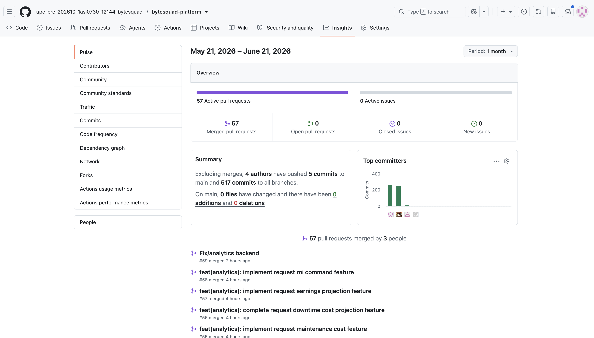

## 5.3. Validation Interviews.
### 5.3.1. Diseño de Entrevistas.

Segmento 1 (Administradores de gimnasio y gerentes de Operaciones) 

1. ¿Qué tan fluido te resultó el proceso de autenticación en la pantalla de Iniciar Sesión y qué fue lo primero que llamó tu atención al entrar al Panel Principal?
2. Observando la gráfica de Uso de Máquinas en el Panel Principal, ¿te resulta evidente identificar su tiempo de uso de las máquinas del gimnasio?
3. En la parte inferior del Panel Principal tienes la tabla de Equipos Infrautilizados. ¿Consideras que esta ubicación es la ideal para detectar rápidamente qué máquinas no están generando valor, o preferirías ver esto en otra sección?
4. En la sección de Equipos, si tuvieras que añadir una nueva cinta de correr al sistema, ¿qué tan intuitivo te parece el flujo empezando por el botón + Registrar Equipo?
5. En la sección de Analítica, enfocándonos en las tarjetas superiores, ¿cómo interpretas la métrica de Horas Totales de Uso frente al Tiempo Inactivo? ¿Te da una idea clara de la eficiencia de tu local?
6. Bajando en esa misma sección de Analítica, encontrarás el panel de Recomendaciones de Reubicación (ej. mover de Sede Miraflores a Sede San Isidro). ¿La interfaz visual con las barras de progreso y el cálculo de "$/mes" extra te resulta convincente para tomar la decisión de trasladar una máquina?
7. En la sección de Mantenimiento en el apartado de Centro de Mantenimiento, ¿el diseño de tarjetas separadas por columnas (Pendiente, En Progreso, Completado) te facilita visualizar el cuello de botella en las reparaciones técnicas?
8. Si navegas en la sección de Configuración, encontrarás el apartado de Umbrales de Mantenimiento. ¿Te resulta claro cómo configure el límite de "Horas de Uso Críticas (500h)" para que el sistema genere un ticket de forma automática antes de que la máquina falle?
9. En la misma sección de Configuración, existe un Buffer de Horas Pico. Como administrador, ¿comprendes cómo esta función bloquea automáticamente la programación de mantenimientos preventivos durante las horas de mayor afluencia?
10. En la sección de Monitoreo IoT, ¿la información sobre el estado de la batería, nivel de señal y desconexiones te da la seguridad de que los sensores están midiendo correctamente sin necesidad de ir a revisarlos físicamente?
11. Al ingresar a la pestaña de Impacto Financiero, la primera tabla muestra la Pérdida por Inactividad de Equipos. ¿Ver el desglose exacto de horas perdidas y su equivalente en dólares te genera un sentido de urgencia para agilizar las reparaciones?
12. En esa misma pantalla, tienes la herramienta Simulador de Retorno de Inversión (ROI). Si ingresas el costo de una máquina nueva y la demanda insatisfecha, ¿el gráfico de barras de "Proyección de ROI" te resulta lo suficientemente claro para justificar una nueva compra a tus socios?
13. Si necesitaras enviar un reporte de estos costos a contabilidad, ¿qué tan fácil te resultó ubicar y utilizar los botones de Generar PDF o Exportar CSV en la parte superior derecha?
14. Como administrador de un gimnasio, ¿la paleta de colores oscuros (Dark Mode), la limpieza de las tablas y la fluidez de la plataforma te transmiten el nivel de profesionalismo esperado para gestionar tus finanzas y activos?
15. Sabiendo que los módulos de monitoreo en las máquinas son sensores pasivos (telemetría y vibración/uso) que no graban video ni comprometen la privacidad de los usuarios, ¿te sentirías tranquilo instalándolos en todo tu local?
16. De todo lo que probaste hoy (Alertas predictivas, Simulador de ROI, Reubicación multisede), ¿cuál herramienta consideras que tendría el impacto más rápido para reducir tus costos operativos (OPEX)?
17. Si finalizaras tu mes de prueba gratuito, ¿estarías dispuesto a pagar una suscripción mensual por SpotTrack basándote en el dinero que la plataforma te demostró que podrías ahorrar en mantenimiento correctivo? ¿Qué mejorarías para que Spottrack te ayude más a gestionar tu gimnasio?
    

Segmento 2 (Clientes frecuentes de gimnasio)

1. ¿Podrías indicarme tu edad, el distrito en el que resides y con qué frecuencia asistes al gimnasio semanalmente?
2. Cuando estás entrenando y encuentras que la máquina que necesitas usar está malograda o en mantenimiento, ¿qué sueles hacer actualmente?
3. Dando un vistazo rápido a esta página principal, ¿qué beneficio principal sientes que SpotTrack te ofrece como asistente regular al gimnasio?
4. ¿Sientes que está claro a dónde debes hacer clic si quieres empezar a usar la plataforma?
5. ¿La información que ves aquí te genera el interés y la confianza suficiente para registrarte en este momento?
6. Al intentar completar estas tareas, ¿te resultó intuitivo encontrar las opciones para reportar y buscar equipos, o tuviste que buscar demasiado en el menú?
7. Si en algún momento presionaste una opción equivocada, ¿sentiste que el sistema te ayudó a regresar o corregir el error fácilmente?
8. Al momento de enviar tu reporte del equipo malogrado, ¿la aplicación te dejó totalmente claro y visible que tu aviso fue enviado con éxito?
9. Imagina que estás a mitad de tu rutina, sudando y quizás con la vista cansada. ¿Sientes que el tamaño de las letras, los colores y el contraste de los botones son fáciles de distinguir desde la pantalla de tu celular?
10. ¿Sientes que esta aplicación web mantiene el mismo estilo y colores que la página de presentación que vimos al inicio?
11. ¿Hay alguna función que te gustaría que SpotTrack tuviera para hacer tus rutinas de entrenamiento mucho más fluidas?

### 5.3.2. Registro de Entrevistas.

 Entrevista #1 
 | Campo | Detalle |
| :--- | :--- |
| **Entrevistado** | Julio Cardenas |
| **Imagen** | {width=80%} |
| **Edad** | 45 |
| **Ocupación** | Administrador de Gimnasio |
| **Link** | [https://upcedupe-my.sharepoint.com/:v:/g/personal/u202410344_upc_edu_pe/IQCU_SowEJDlT6zASGquSEzbAdG2HCa8IVyKY1Vn6YGc77Y?nav=eyJyZWZlcnJhbEluZm8iOnsicmVmZXJyYWxBcHAiOiJTdHJlYW1XZWJBcHAiLCJyZWZlcnJhbFZpZXciOiJTaGFyZURpYWxvZy1MaW5rIiwicmVmZXJyYWxBcHBQbGF0Zm9ybSI6IldlYiIsInJlZmVycmFsTW9kZSI6InZpZXcifX0%3D&e=abQe8g](https://upcedupe-my.sharepoint.com/:v:/g/personal/u202410344_upc_edu_pe/IQCU_SowEJDlT6zASGquSEzbAdG2HCa8IVyKY1Vn6YGc77Y?nav=eyJyZWZlcnJhbEluZm8iOnsicmVmZXJyYWxBcHAiOiJTdHJlYW1XZWJBcHAiLCJyZWZlcnJhbFZpZXciOiJTaGFyZURpYWxvZy1MaW5rIiwicmVmZXJyYWxBcHBQbGF0Zm9ybSI6IldlYiIsInJlZmVycmFsTW9kZSI6InZpZXcifX0%3D&e=abQe8g) |
| **Resumen** |Julio Cárdenas (administrador de gimnasios, 45 años) califica SpotTrack como altamente efectivo por su interfaz intuitiva y valor táctico. Destaca el dashboard y las herramientas de mantenimiento, subrayando la reubicación de máquinas entre sedes como su función estrella para recortar gastos e impulsar ganancias. Además, valora los simuladores de retorno de inversión (ROI) y el control de inactividad para justificar presupuestos. Como mejoras, propone desarrollar una app móvil para técnicos y optimizar los sensores IoT. Finalmente, afirma que pagaría por la suscripción gracias al ahorro y la rentabilidad que la plataforma aporta a su gestión.|

Entrevista #2

| Campo | Detalle |
| :--- | :--- |
| **Entrevistado** | Luis Romero |
| **Imagen** | {width=80%} |
| **Edad** | 51 |
| **Ocupación** | Administrador de Gimnasio |
| **Link** | [https://upcedupe-my.sharepoint.com/:v:/g/personal/u202410344_upc_edu_pe/IQAvIfjFJ2_2TZHgJwbZTOIEAa2axQuKMQdQ2_F9nbOMFhY?nav=eyJyZWZlcnJhbEluZm8iOnsicmVmZXJyYWxBcHAiOiJTdHJlYW1XZWJBcHAiLCJyZWZlcnJhbFZpZXciOiJTaGFyZURpYWxvZy1MaW5rIiwicmVmZXJyYWxBcHBQbGF0Zm9ybSI6IldlYiIsInJlZmVycmFsTW9kZSI6InZpZXcifX0%3D&e=GQm1hz](https://upcedupe-my.sharepoint.com/:v:/g/personal/u202410344_upc_edu_pe/IQAvIfjFJ2_2TZHgJwbZTOIEAa2axQuKMQdQ2_F9nbOMFhY?nav=eyJyZWZlcnJhbEluZm8iOnsicmVmZXJyYWxBcHAiOiJTdHJlYW1XZWJBcHAiLCJyZWZlcnJhbFZpZXciOiJTaGFyZURpYWxvZy1MaW5rIiwicmVmZXJyYWxBcHBQbGF0Zm9ybSI6IldlYiIsInJlZmVycmFsTW9kZSI6InZpZXcifX0%3D&e=GQm1hz) |
| **Resumen** | Luis Romero (entrenador y encargado del gimnasio de Monterrico UPC) resalta que SpotTrack es una herramienta muy fácil de usar y con un diseño claro. Valora el control de datos sobre el uso de máquinas, ocupación y mantenimiento, lo que le permite tomar decisiones reales y dejar atrás las suposiciones. Aunque encuentra gran utilidad en el monitoreo IoT y la reubicación de equipos, destaca el simulador de ROI como la función clave para recortar costos y validar compras. Finalmente, afirma que pagaría la suscripción y propone añadir métricas de asistencia a clases grupales para calificar el éxito de los profesores y sus actividades.
 |

 Entrevista #3

 
| Campo | Detalle |
| :--- | :--- |
| **Entrevistado** | Percy Baraybar |
| **Imagen** | {width=80%} |
| **Edad** | 30 |
| **Ocupación** | Administrador de Gimnasio |
| **Link** | [https://upcedupe-my.sharepoint.com/:v:/g/personal/u202410344_upc_edu_pe/IQB3MRbDyCuwQa58zhF4Fb_SAQntpAinH6v14EjHWiavcIs?nav=eyJyZWZlcnJhbEluZm8iOnsicmVmZXJyYWxBcHAiOiJTdHJlYW1XZWJBcHAiLCJyZWZlcnJhbFZpZXciOiJTaGFyZURpYWxvZy1MaW5rIiwicmVmZXJyYWxBcHBQbGF0Zm9ybSI6IldlYiIsInJlZmVycmFsTW9kZSI6InZpZXcifX0%3D&e=0qoVbU](https://upcedupe-my.sharepoint.com/:v:/g/personal/u202410344_upc_edu_pe/IQB3MRbDyCuwQa58zhF4Fb_SAQntpAinH6v14EjHWiavcIs?nav=eyJyZWZlcnJhbEluZm8iOnsicmVmZXJyYWxBcHAiOiJTdHJlYW1XZWJBcHAiLCJyZWZlcnJhbFZpZXciOiJTaGFyZURpYWxvZy1MaW5rIiwicmVmZXJyYWxBcHBQbGF0Zm9ybSI6IldlYiIsInJlZmVycmFsTW9kZSI6InZpZXcifX0%3D&e=0qoVbU) |
| **Resumen** |Percy Baraybar (administrador de gimnasio, 30 años) elogia la rapidez y el diseño profesional de SpotTrack, herramienta que usa para tomar decisiones rápidas basadas en datos. Para él, las métricas visuales de uso, tiempo inactivo, pérdidas y mantenimiento son clave, pero destaca la reubicación de máquinas y el simulador de ROI como las funciones más valiosas para subir ingresos y justificar gastos. También valora las alertas preventivas, el monitoreo IoT y el cálculo de pérdidas financieras. Finalmente, afirma que pagaría la suscripción porque la plataforma se paga sola con los ahorros que genera, y sugiere arreglar un fallo en las lecturas de batería de los sensores, ya que marcan 0% por error. |

Entrevista # 4

{width=80%}

| Campo | Detalle |
| :--- | :--- |
| **Nombre** | Joan Steffano Quispe Gamez |
| **Edad** | 19 |
| **Distrito** | Los Olivos |
| **Ocupación** | Estudiante universitario (UPC) |
| **Frecuencia** | 3 a 4 veces por semana |
| **Horario** | Nocturno (Post-clases) |
| **Contexto** | Entrena de noche debido a su alta carga académica. |
|**Resumen**| Un participante de 20 años y residente de Los Olivos, quien entrena de 3 a 4 veces por semana, destaca que SpotTrack es muy útil para optimizar tiempos y conocer la disponibilidad de las máquinas. Considera que la interfaz es clara, intuitiva y confiable, ya que logró reportar un equipo averiado y buscar otro libre sin ninguna dificultad. Además, valora la consistencia visual y el uso correcto de los colores, aunque sugiere agrandar el tamaño de algunas letras para mejorar la lectura. Por último, indicó que no tiene nuevas funciones para agregar.|
| **Link** | https://upcedupe-my.sharepoint.com/:v:/g/personal/u202410344_upc_edu_pe/IQC0blHflpPcRI5T5Wg7Cmz_ATdQXtHxHqZ8Ika5zySGiEk?nav=eyJyZWZlcnJhbEluZm8iOnsicmVmZXJyYWxBcHAiOiJTdHJlYW1XZWJBcHAiLCJyZWZlcnJhbFZpZXciOiJTaGFyZURpYWxvZy1MaW5rIiwicmVmZXJyYWxBcHBQbGF0Zm9ybSI6IldlYiIsInJlZmVycmFsTW9kZSI6InZpZXcifX0%3D&e=OjdApr |

Entrevista #5

{width=80%}

| Campo | Detalle |
| :--- | :--- |
| **Nombre** | Diego Quispe |
| **Edad** | 19 |
| **Distrito** | Los Olivos |
| **Ocupación** | Estudiante universitario (U. de Lima) y trabajador a medio tiempo |
| **Frecuencia** | 4 días a la semana (rutina de dos días seguidos y un día de descanso) |
| **Duración** | Variable (afectada por la alta afluencia) |
| **Contexto** | Entrena por las noches por falta de tiempo diurno; el cansancio le ayuda a conciliar el sueño. |
|**Resumen**| Un participante de 20 años y residente de Pueblo Libre, quien va al gimnasio de 2 a 3 veces por semana, considera que SpotTrack es una herramienta útil e intuitiva para reportar máquinas y hallar opciones libres. Destaca que la información de la plataforma genera confianza e interés para registrarse, valorando también la facilidad para corregir errores y la claridad de los avisos. Como puntos a mejorar, sugiere dar más contraste y color a la página de inicio para diferenciar mejor los elementos visuales. Además, propone agregar una sección de notas personales en las rutinas para juntar todo el control de los entrenamientos en un solo lugar.|
| **Link** | https://upcedupe-my.sharepoint.com/:v:/g/personal/u202410344_upc_edu_pe/IQA6VQrDWArUToltdzeeQFvWAXQxMWN_5gEo-Kc6BMJlqBY?nav=eyJyZWZlcnJhbEluZm8iOnsicmVmZXJyYWxBcHAiOiJTdHJlYW1XZWJBcHAiLCJyZWZlcnJhbFZpZXciOiJTaGFyZURpYWxvZy1MaW5rIiwicmVmZXJyYWxBcHBQbGF0Zm9ybSI6IldlYiIsInJlZmVycmFsTW9kZSI6InZpZXcifX0%3D&e=ApuCkZ |

Entrevista #6

| Campo | Detalle |
| :--- | :--- |
| **Nombre** | Fabián Suárez |
| **Edad** | 19 |
| **Distrito** | Pueblo Libre |
| **Ocupación** | Estudiante y trabajador |
| **Frecuencia** | 3 a 4 días a la semana (interdiario) |
| **Duración** | Entre 1 a 2 horas |
| **Contexto** | Adapta sus entrenamientos según su carga laboral y académica. |
|**Resumen**| Un participante de 20 años y residente de Los Olivos, quien entrena de 3 a 4 veces por semana, considera que la plataforma es intuitiva para reportar máquinas averiadas y buscar alternativas libres. Sugiere que la página de inicio debería incluir más imágenes y elementos visuales del rubro para reforzar su identidad con el gimnasio. Aunque valora que los colores ayudan a identificar rápido las acciones, propone agrandar las letras para que se lean mejor. Como mejoras funcionales, propone añadir la opción de cancelar reservas, recibir avisos sobre equipos malogrados y agregar videos con recomendaciones y rutinas más completas y personalizadas. |
| **Link** | [https://upcedupe-my.sharepoint.com/:v:/g/personal/u202410344_upc_edu_pe/IQAsUKfS7M2eRJbheiAoZ6jCASOx3vhzpm__iKgasLZnYxI?nav=eyJyZWZlcnJhbEluZm8iOnsicmVmZXJyYWxBcHAiOiJTdHJlYW1XZWJBcHAiLCJyZWZlcnJhbFZpZXciOiJTaGFyZURpYWxvZy1MaW5rIiwicmVmZXJyYWxBcHBQbGF0Zm9ybSI6IldlYiIsInJlZmVycmFsTW9kZSI6InZpZXcifX0%3D&e=S7tjYl ](https://upcedupe-my.sharepoint.com/:v:/g/personal/u202410344_upc_edu_pe/IQAsUKfS7M2eRJbheiAoZ6jCASOx3vhzpm__iKgasLZnYxI?nav=eyJyZWZlcnJhbEluZm8iOnsicmVmZXJyYWxBcHAiOiJTdHJlYW1XZWJBcHAiLCJyZWZlcnJhbFZpZXciOiJTaGFyZURpYWxvZy1MaW5rIiwicmVmZXJyYWxBcHBQbGF0Zm9ybSI6IldlYiIsInJlZmVycmFsTW9kZSI6InZpZXcifX0%3D&e=S7tjYl)|

#### Video unificado
| Entrevista | Marca de tiempo | Entrevistado |
| :--- | :--- | :--- |
| 1 | 00:00:00 | Luis Romero |
| 2 | 15:53:22 | Julio Cardenas |
| 3 | 27:34:25 | Percy Baraybar | 
| 4 | 46:42:12 | Joan Steffano Quispe Gamez |
| 5 | 54:28:27 | Fabián Suárez |
| 6 | 1:05:30 | Diego Quispe |

| **Link** | [Enlace al video unificado de entrevistas - SpotTrack] (https://upcedupe-my.sharepoint.com/:v:/g/personal/u202410344_upc_edu_pe/IQDljgiFpIHsRKhGcbeP97MvAVBmbOitcyKh9AZ4c7WvKlM?nav=eyJyZWZlcnJhbEluZm8iOnsicmVmZXJyYWxBcHAiOiJTdHJlYW1XZWJBcHAiLCJyZWZlcnJhbFZpZXciOiJTaGFyZURpYWxvZy1MaW5rIiwicmVmZXJyYWxBcHBQbGF0Zm9ybSI6IldlYiIsInJlZmVycmFsTW9kZSI6InZpZXcifX0%3D&e=0rIOF9)|

### 5.3.3. Evaluaciones según heurísticas.

**UX Heuristics & Principles Evaluation**

**Usability – Inclusive Design – Information Architecture**

**CARRERA :** Ingeniería de Software

**CURSO :** Aplicaciones Web

**SECCIÓN :** 12144

**PROFESORES :** Todos

**AUDITOR :**  Alonso Enrique Higa Kohatsu

**CLIENTE(S) :**

- Luis Alexis Bardales Tejada

- Alonso Enrique Higa Kohatsu

- Fabricio Jofred Lozano Quispe

- Kelber Yamir Sandoval Aiquipa

- Rodrigo Matias Vite Celis

## SITE o APP A EVALUAR:

SpotTrack

## TAREAS A EVALUAR:

El alcance de esta evaluación incluye la revisión de la usabilidad de las siguientes tareas:

## Tarea General:

#### a. Login/Registro:

1. Iniciar sesión con credenciales válidas
2. Manejo de error con credenciales inválidas (banner "Invalid email or password")
3. Envío del formulario con campos vacíos (validación de requeridos)
4. Mostrar / ocultar contraseña (ícono de ojo)
5. Uso de credenciales demo (tarjetas autocompletables Admin/Cliente)
6. Cambio de idioma en login (ES / EN)
7. Navegación al registro (link "Sign up")

## Tareas para el  rol de los clientes:

#### a. Mapa de disponibilidad en tiempo real (con filtros y panel de máquina)

1. Lectura del mapa y código de colores (libre / ocupada / por liberarse con timer)
2. Filtrado por categoría (All / Strength / Cardio)
3. Apertura del panel de detalle de una máquina
4. Interpretación del estado y temporizador de la máquina
5. Cierre del panel (X) y selección de otra máquina

#### b. Reservar máquina / Reportar como ocupada / Ver alternativas

1. Reservar una máquina libre (estado=Reserved, timer 10:00, confirmación)
2. Reportar una máquina como ocupada (máquina libre)
3. Reportar una máquina como libre (máquina ocupada)
4. "Notify me when free" (suscripción a aviso de disponibilidad)
5. "See alternatives" ver máquinas alternativas de la misma categoría
6. Reservar desde la lista de alternativas

#### c. Rutinas + crear nueva rutina (modal)

1. Visualizar lista de rutinas y estado en vivo de cada máquina (Available / In Use / Maintenance)
2. Filtrar rutinas por grupo muscular (All / Chest / Legs / Back / Shoulders / Arms)
3. Ver alternativa cuando la máquina de la rutina está ocupada (ícono de intercambio)
4. Abrir modal "New Routine"
5. Completar campos (nombre, objetivo, dificultad, notas) y validación
6. Crear la rutina / Cancelar el modal

#### d. Mis reservas + cancelar reserva (timer)

1. Visualizar reservas activas con temporizador de cuenta regresiva
2. Interpretar la sección "How do reservations work?"
3. Cancelar una reserva (botón X)
4. Crear una reserva nueva desde "New Reservation"

#### e. Perfil: plan, puntos, notificaciones, idioma, seguridad

1. Visualizar datos del usuario y puntos acumulados
2. Consultar plan actual e iniciar "Upgrade Plan"
3. Activar / desactivar toggles de notificaciones (disponibilidad, mantenimiento, puntos)
4. Cambiar idioma de la interfaz (Español / English)
5. Cambiar contraseña (Change Password)
6. Cerrar sesión (Log Out)

## Tareas para el rol de los  administradores:

#### a. Dashboard (KPIs + kanban de mantenimiento)

1. Lectura de KPIs principales (Operational / In Maintenance / Out of Service / Total Tickets)
2. Interpretación del gráfico "Peak Capacity Hours"
3. Interpretación del gráfico "Machine Usage"
4. Lectura de la tabla "Underutilized Equipment" (con indicador ROI High/Medium)
5. Lectura del "Maintenance Center" tipo kanban resumido (Pending / In Progress / Completed)
6. Navegación entre secciones desde el menú lateral

#### b. Equipment Management (CRUD: registrar/editar/eliminar)

1. Lectura de la tabla de equipos (ID, nombre, marca, modelo, zona, precio, estado)
2. Búsqueda por nombre / marca / modelo
3. Filtrado por estado (All statuses / Operational / Maintenance / Out of order)
4. Registrar nuevo equipo (formulario: nombre, marca, modelo, Zone ID, precio, status)
5. Validación del formulario de registro (campos vacíos, Zone ID numérico, precio)
6. Editar un equipo existente (ícono lápiz)
7. Eliminar un equipo (ícono basurero) y confirmación

#### c. IoT Monitoring (tabla de sensores)

1. Lectura de la tabla de sensores (ID, ubicación, estado, batería, señal, firmware, último ping)
2. Interpretación de estados (Online / Disconnected / Warning) y umbrales de batería
3. Búsqueda por sensor / máquina / zona
4. Filtrado por estado
5. Refrescar datos (botón Refresh)

#### d. Maintenance Center (kanban de tickets)

1. Lectura del tablero kanban (Pending / In Progress / Completed) y conteos
2. Interpretación de prioridad de tickets (Urgent / High / Medium / Low)
3. Búsqueda por ID / máquina / descripción
4. Filtrado por estado y por prioridad
5. Crear nuevo ticket (formulario: equipo, prioridad, tipo, hora programada, descripción)
6. Validación del formulario de ticket (equipo sin valor por defecto)
7. Avanzar un ticket de estado (Start,Complete)

#### e. Reports & Analytics (gráficos + export)

1. Lectura de KPIs (Total Usage Hours, Occupancy Rate, Peak Usage, Inactive Time)
2. Filtrado por periodo / sucursal / rango personalizado
3. Interpretación de gráficos (Weekly Usage vs Capacity, Distribution by Machine Type, Stress Peaks)
4. Activar comparación ("Show Comparison")
5. Exportar a CSV
6. Generar PDF

#### f. Financial Impact & ROI

1. Lectura de KPIs financieros (Inactivity Loss, Maintenance Cost, Potential Savings, Average ROI)
2. Lectura de la tabla "Equipment Inactivity Loss"
3. Interpretación del "Maintenance Cost Breakdown" (pie chart)
4. Interpretación de la "ROI Projection – New Machine"
5. Exportar CSV / Generar PDF

#### g. Configuration (parámetros del sistema)

1. Ajustar "Maintenance Thresholds" (sliders: Critical Usage Hours, Max Inactive Time, Peak Hours Buffer)
2. Activar / desactivar "Smart Scheduler"
3. Ajustar "IoT Configuration" (Low Battery Threshold, Ping Interval, Offline Grace Period)
4. Configurar "Notifications" (email y destinatarios)
5. Configurar "Financial Configuration" (parámetros de ROI)
6. Guardar / Cancelar cambios (Save Changes / Cancel)

## ESCALA DE SEVERIDAD:

Los errores serán puntuados tomando en cuenta la siguiente escala de severidad

| Nivel | Descripción |
|---|---|
| 1 | Problema superficial: puede ser fácilmente superador por el usuario ó ocurre con muy poco frecuencia. No necesita ser arreglado a no ser que exista disponibilidad de tiempo. |
| 2 | Problema menor: puede ocurrir un poco más frecuentemente o es un poco más difícil de superar para el usuario. Se le debería asignar una prioridad baja resolverlo de cara al siguiente reléase |
| 3 | Problema mayor: ocurre frecuentemente o los usuarios no son capaces de resolverlos. Es importante que sean corregidos y se les debe asignar una prioridad alta. |
| 4 | Problema muy grave: un error de gran impacto que impide al usuario continuar con el uso de la herramienta. Es imperativo que sea corregido antes del lanzamiento. |

## TABLA RESUMEN:

| # | Problema | Escala de severidad | Heurística/Principio violada(o) |
|---|---|---|---|
| 1 | Clave de traducción sin resolver visible al usuario | 3 | Usability: Consistencia y estándares |
| 2 | Mezcla de idiomas EN/ES en la misma pantalla | 3 | Usability: Consistencia y estándares |
| 3 | Estado de las máquinas en el mapa comunicado solo por color (verde/rojo/amarillo), sin texto/forma redundante: usuarios con daltonismo no distinguen libre de ocupada | 3 | Inclusive Design: Proporciona experiencias comparables |
| 4 | Formularios sin marcar campos obligatorios | 2 | Usability: Visibilidad del estado del sistema |
| 5 | Categorización de datos incorrecta: "Rowing" (cardio) aparece etiquetada como "Back" en el panel de máquina | 3 | Usability: Concordancia entre el sistema y el mundo real |
| 6 | "Zone ID" en registro de equipo pide un número (1) mientras la tabla muestra zonas como letras (A/B/C/D): incoherencia que induce a error | 3 | Usability: Concordancia entre el sistema y el mundo real |
| 7 | Dashboard del cliente con gran cantidad de espacio vacío bajo dos tarjetas: desaprovecha el área y resta jerarquía/contenido útil | 1 | Information Architecture: Is it usable? |
| 8 | Eliminar equipo se ofrece con un ícono de basurero por fila sin (verificar) confirmación clara; acción destructiva de alto riesgo | 3 | Usability: Prevención de errores |
| 9 | Reserva de máquina se ejecuta con un solo clic sin paso de confirmación: fácil reservar por error | 1 | Usability: Libertad y control del usuario |

## DESCRIPCIÓN DE PROBLEMAS:

**PROBLEMA #1:** Clave de traducción sin resolver visible al usuario
  **Severidad:** 3
  **Heurística violada:** Usabilidad - Consistencia y estándares.

- Problema:
En la sección Configuration (Admin), el desplegable “Ping Interval (seconds)” muestra la opción con la clave de internacionalización (i18n) sin resolver: aparece el texto crudo “10 configuration.configurationIoT.seconds (recommended)” en lugar de un valor legible como “10 segundos (recomendado)”. Esto expone detalles internos del sistema al usuario, genera desconfianza y dificulta entender la opción que se está seleccionando.

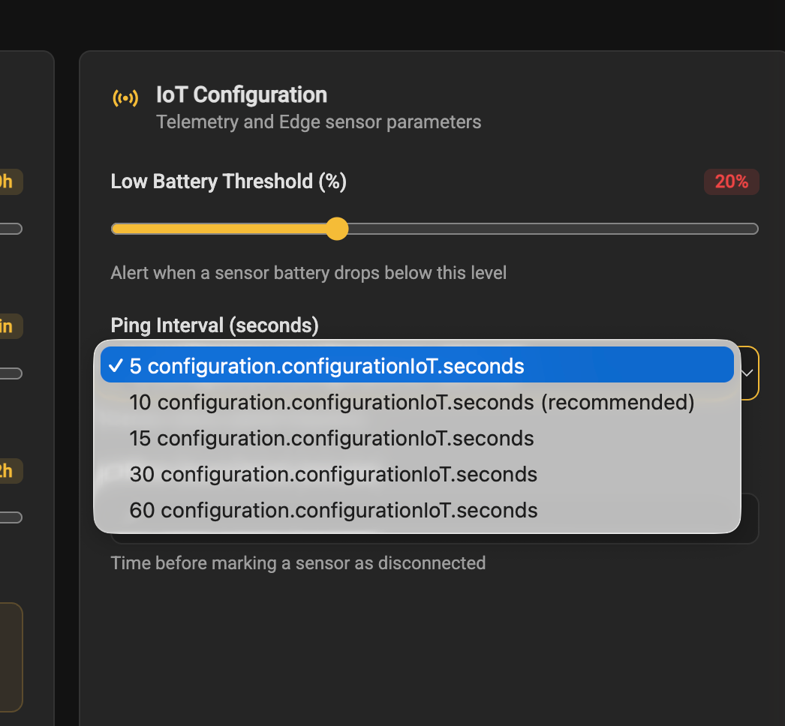

- Recomendación:
Corregir la clave de traducción faltante en los archivos de internacionalización (tanto en inglés como en español) para que la opción muestre un texto legible. Añadir además una verificación que evite renderizar claves i18n sin resolver, mostrando un valor por defecto cuando una traducción no exista.

**PROBLEMA #2:** Mezcla de idiomas EN/ES en la misma pantalla
  **Severidad:** 3
 **Heurística violada:** Usabilidad - Consistencia y estándares

- Problema:

Con el idioma de la interfaz configurado en inglés, varias pantallas muestran textos en español mezclados con la UI en inglés. Por ejemplo, el panel de inicio del Cliente combina “Welcome, Cliente!” y “Track machines, book equipment...” (inglés) con las tarjetas “Máquinas Libres” y “Reservadas” (español). Lo mismo ocurre en Analytics (leyendas “Cardio/Fuerza/Funcional” y días “Lun/Mar/Mié”) y en Financial Impact (nombres de máquinas como “Cinta #3”, “Elíptica Pro”, “Rack Sentadilla”). Esta inconsistencia rompe la coherencia del idioma y confunde al usuario.

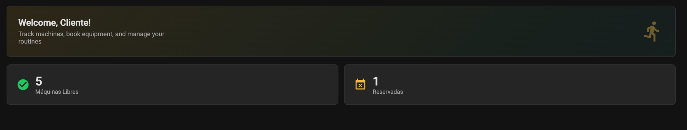

- Recomendación:

Externalizar todos los textos a los archivos de traducción y asegurar que el contenido (incluidas leyendas de gráficos, días de la semana y nombres de elementos) respete el idioma seleccionado. Evitar textos “quemados” (hardcoded) en un solo idioma.

**PROBLEMA #3:** Estado de las máquinas comunicado solo por color

  **Severidad:**  3

 **Heurística violada:**  Diseño Inclusivo - Proporciona experiencias comparables

- Problema:

En el Mapa de disponibilidad en tiempo real, el estado de cada máquina (libre, ocupada, por liberarse) se comunica únicamente mediante el color del ícono (verde, rojo, amarillo). No existe un texto, etiqueta o forma redundante que acompañe al color. Las personas con daltonismo (especialmente deuteranopia/protanopia, que afecta la distinción rojo-verde) no pueden diferenciar una máquina libre de una ocupada, perdiendo la función principal de la pantalla.

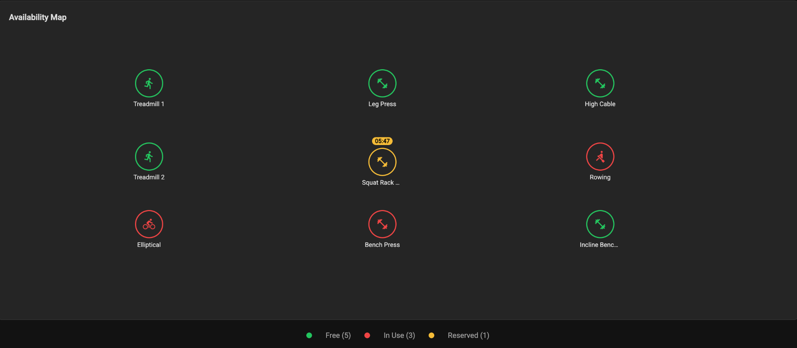

- Recomendación:

No depender exclusivamente del color para transmitir información. Añadir una señal redundante: una etiqueta de texto (“Libre” / “Ocupada”), un ícono distintivo por estado o un patrón/forma diferente. Garantizar además contraste suficiente y un texto alternativo accesible para lectores de pantalla.

**PROBLEMA #4:**  Formularios sin marcar campos obligatorios

  **Severidad:**  2

 **Heurística violada:**  Usabilidad - Visibilidad del estado del sistema

- Problems:

Los formularios de la aplicación (por ejemplo, New Maintenance Ticket y Register Equipment) no indican qué campos son obligatorios: no usan asteriscos, etiquetas “requerido” ni ninguna marca previa. Cuando un campo obligatorio queda vacío (como “Equipment” en el ticket), solo se resalta con un borde de color al enviar, sin un mensaje de texto que explique el problema. El usuario no sabe de antemano qué información es indispensable.

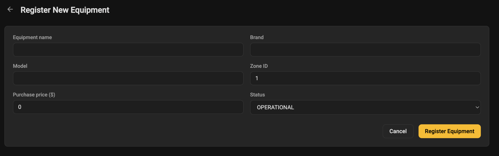

- Recomendación:

Indicar visualmente los campos obligatorios antes del envío (asterisco y/o la palabra “requerido”) y acompañar la validación con un mensaje de texto descriptivo bajo cada campo. Mantener consistencia en el patrón de validación en todos los formularios.

**PROBLEMA #5:**  Categorización de datos incorrecta (Rowing como “Back”)

  **Severidad:**  3

 **Heurística violada:**  Usabilidad - Concordancia entre el sistema y el mundo real

- Problema:

En el panel de detalle del Mapa, la máquina “Rowing” (remo), que es un equipo de cardio, aparece clasificada bajo la categoría “Back” (espalda). La categorización no corresponde con la realidad del equipo, lo que confunde al usuario y afecta funciones que dependen de la categoría, como el filtrado y la sugerencia de alternativas.

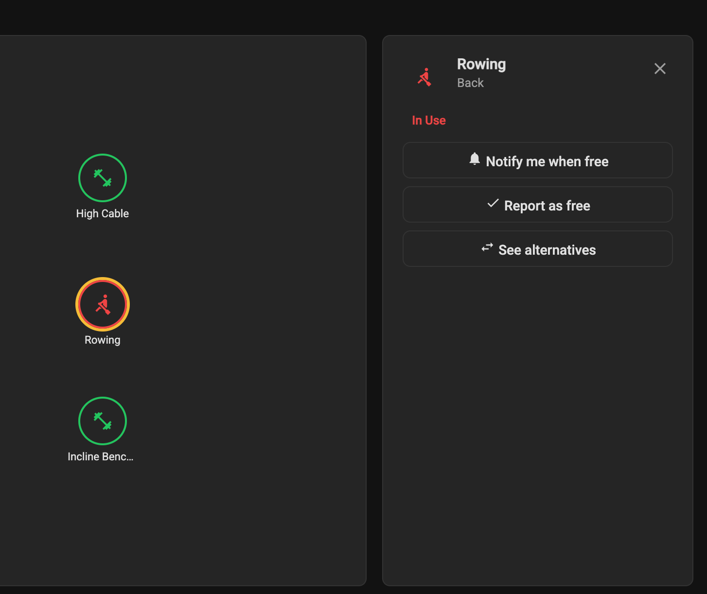

- Recomendación:

Revisar y corregir los datos de categorización de las máquinas para que reflejen su tipo real (cardio, fuerza, etc.). Validar la consistencia entre la categoría asignada y los filtros disponibles (Strength / Cardio).

**PROBLEMA #6:** “Zone ID” pide un número mientras la tabla muestra letras

  **Severidad:**  3

 **Heurística violada:**  Usabilidad - Concordancia entre el sistema y el mundo real

- Problema:

En el formulario de registro/edición de equipo, el campo “Zone ID” solicita un valor numérico (por ejemplo, 1), mientras que la tabla de Equipment Management muestra las zonas como letras (A, B, C, D). Esta incoherencia entre el identificador interno (número) y la representación visible (letra) induce a error al registrar o editar un equipo, ya que el usuario no sabe qué valor corresponde a cada zona. Además, al editar un equipo existente, el campo “Zone ID” se carga vacío aunque el equipo ya tiene una zona asignada, con riesgo de perder ese dato al guardar.

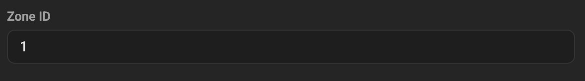

- Recomendación:

Reemplazar el campo numérico por un selector (dropdown) que muestre las zonas con la misma nomenclatura que la tabla (A, B, C, D). Precargar la zona actual del equipo al editar, para no perder información existente.

**PROBLEMA #7:**  Dashboard del cliente con gran cantidad de espacio vacío

  **Severidad:** 1

 **Heurística violada:**  Arquitectura de Información - Is it usable?

- Problema:

El panel de inicio del Cliente presenta únicamente un mensaje de bienvenida y dos tarjetas (“Máquinas Libres” y “Reservadas”) en la parte superior, dejando la mayor parte de la pantalla vacía. Se desaprovecha el área disponible y se pierde la oportunidad de mostrar contenido útil (accesos directos, reservas activas, recomendaciones), restando jerarquía y valor a la pantalla principal.

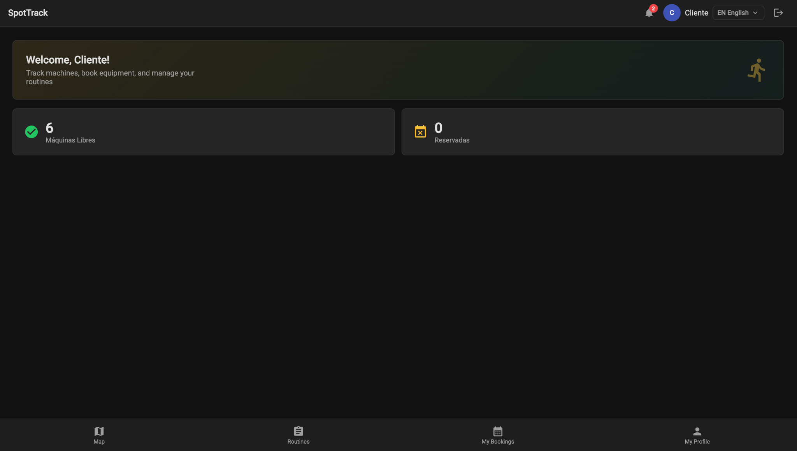

- Recomendación:

Aprovechar el espacio mostrando contenido relevante para el usuario: resumen de sus reservas activas con temporizador, accesos rápidos al mapa o a sus rutinas, o sugerencias personalizadas. Equilibrar la composición visual para evitar grandes vacíos.

**PROBLEMA #8:**  Eliminar equipo: confirmación con diálogo nativo del navegador

  **Severidad:**  3

 **Heurística violada:**  Usabilidad - Prevención de errores

- Problema:

La acción de eliminar un equipo se ofrece mediante un ícono de basurero por cada fila, una acción destructiva de alto riesgo. Aunque existe un paso de confirmación, este se implementa con el diálogo nativo del navegador (window.confirm), que rompe la consistencia visual con el resto de la interfaz, no se traduce al idioma seleccionado y no se integra con el diseño ni con los patrones de accesibilidad de la aplicación.

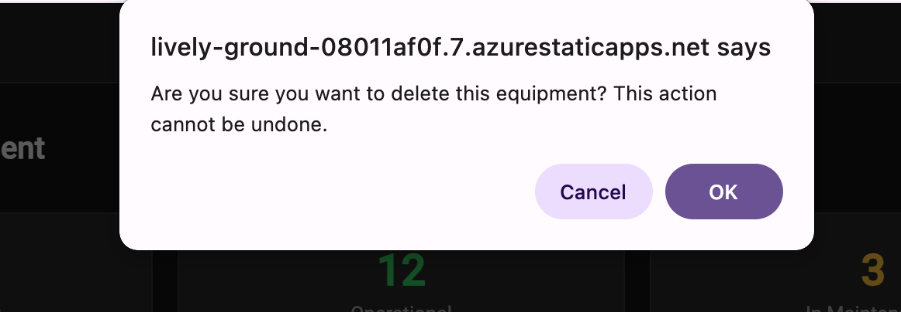

- Recomendación:

Sustituir el diálogo nativo por un modal de confirmación propio, coherente con el diseño de la app, que indique claramente el nombre del equipo a eliminar y diferencie visualmente la acción destructiva (por ejemplo, botón “Eliminar” en rojo y “Cancelar” como acción segura por defecto). Idealmente ofrecer la posibilidad de deshacer.

**PROBLEMA #9:**  Reserva de máquina sin paso de confirmación

  **Severidad:** 1

 **Heurística violada:**  Usabilidad - Libertad y control del usuario

- Problema:

En el Mapa, al pulsar “Reserve” sobre una máquina libre, la reserva se ejecuta de inmediato con un solo clic, sin un paso de confirmación previo. Esto facilita reservar una máquina por error, lo que consume el cupo del usuario y bloquea el equipo para otros durante el tiempo de reserva.

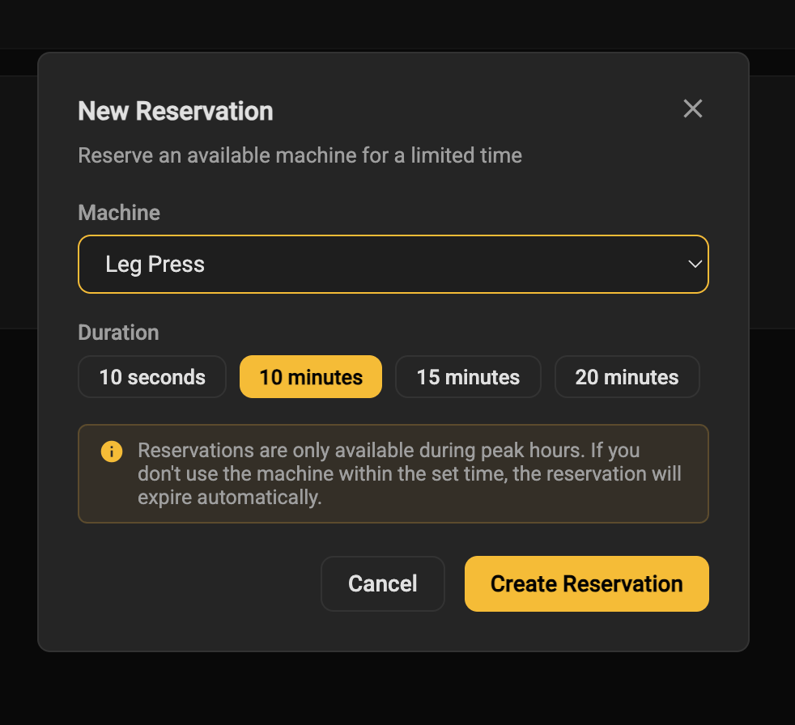

- Recomendación:

Añadir una confirmación ligera antes de concretar la reserva (por ejemplo, un mensaje “¿Reservar Treadmill 1 por 10 minutos?”) o, como mínimo, ofrecer una opción de deshacer inmediatamente después de reservar, dando al usuario control sobre la acción.

## 5.4. Video About-the-Product.